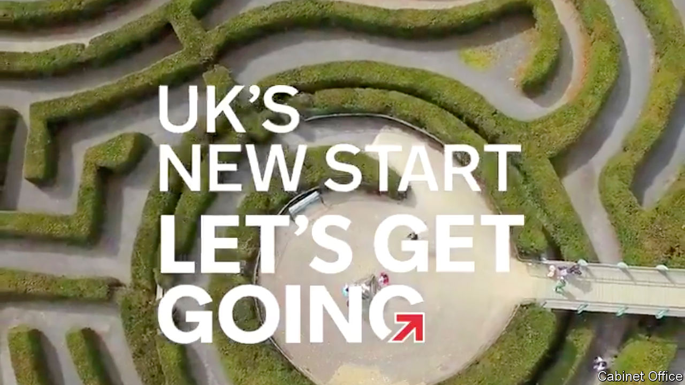

###### Leaving the EU

# The Brexit poster campaign 

##### And why it can’t say the dreadful word 

 

> Jul 18th 2020 

BORIS JOHNSON’S government excels at punchy slogans: “Get Brexit Done”, “Stay Home” and “Build Build Build”. Its latest offering is uncharacteristically ambiguous. “UK’s new start: let’s get going,” runs the slogan in a big poster campaign unveiled on July 13th, with the strapline: “Check, change, go.”

But where? The answer, revealed via the advertised web address (gov.uk/transition) is: out of the European Union’s single market and customs union on December 31st. For holidaymakers, the changes will mean buying travel insurance, checking whether they will be stung for mobile-phone roaming bills, and possibly leaving the family dog at home. For companies, they will mean reams of new forms, hiring customs agents and possibly a major restructuring of their business. Michael Gove, the Cabinet Office minister who has taken charge of Brexit preparations, published plans for the processing of freight travelling between Britain and continental Europe. The government will spend £705m ($890m) on new inspection sites, IT systems and customs officers.


One of the government’s biggest worries is that traders crossing the English Channel, especially small businesses, won’t be ready. If lorry drivers fail to produce the correct paperwork they will swiftly clog up the ports, bring ferry traffic to a halt and create miles-long tailbacks on the motorways. Officials anticipated hauliers dumping their cargos of gone-off food around Kent. Industry groups complain they still don’t know what rules to prepare for, and say covid-19 has squeezed the money and attention they need to get ready.

But getting the public’s attention may be tricky. The government ran two major Brexit readiness campaigns last year, but both scheduled exits were aborted after MPs forced extensions to the negotiating timetable. (The National Audit Office, the spending watchdog, wasn’t convinced the public paid much attention anyway.) Knowing the public’s weariness, Mr Johnson declared Brexit was “done” on January 31st when Britain formally left the bloc and entered a transition period. The government’s campaign video strenuously avoids the B-word, like a big-budget round of Articulate, a synonym-based board game. Evidence from focus groups suggests that many voters think that issue has been indeed dealt with, says Will Jennings, a political scientist at Southampton university. The trade negotiations rumble on but barely feature on the television news. Mr Gove must now convince voters that a major dislocation is back on, and can’t be moved.

Mr Johnson has succeeded in cooling the political strife, but this political landscape carries risks. Some disruption is likely, whatever deal he secures and regardless of how well firms prepare. Sir Keir Starmer, the Labour leader, who favoured a second referendum, once presented Brexit as an ideological question but now frames it purely as a test of Mr Johnson’s grip and ability to deliver. The prime minister is vulnerable, as coronavirus has battered his standing, with some polls suggesting voters think him less competent than Sir Keir. Queues of trucks at the border would never be good for a prime minister, but last October voters might have accepted them as a side-effect of Mr Johnson’s inflexibility towards Brussels. He will suffer if they become a symbol of his ineptitude.■

