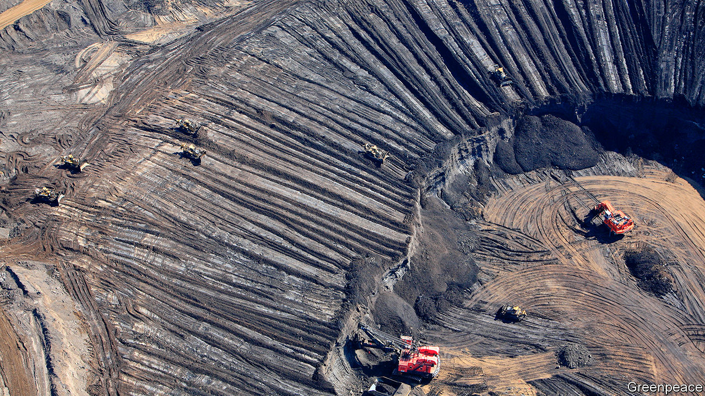
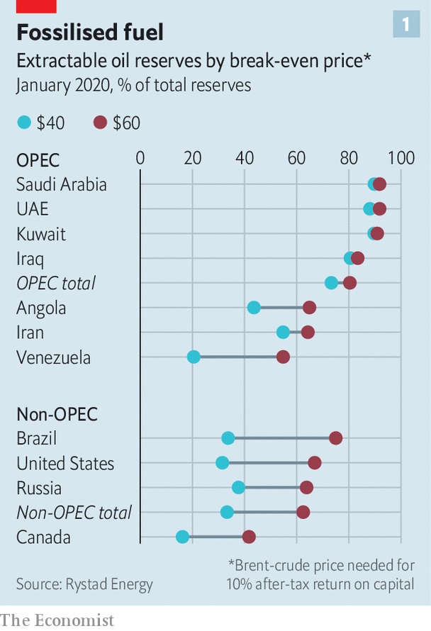
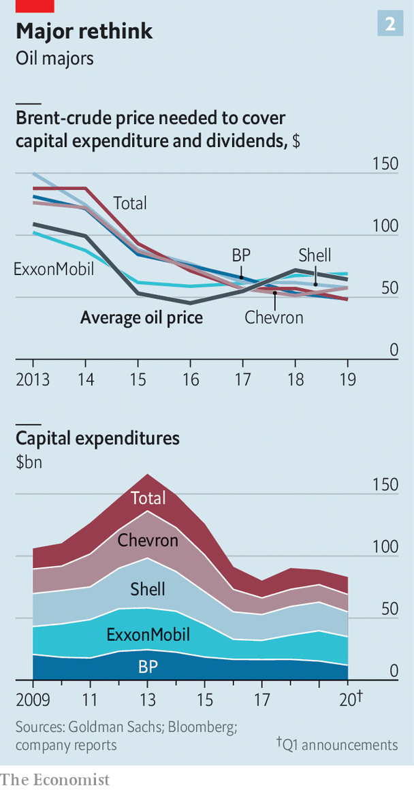

###### The bottom of the barrel

# Oil giants want to own only the cheapest, cleanest hydrocarbons 

##### What to do with the cruddiest crude 

 

> Jul 18th 2020 

LONG BEFORE oilmen fracked the Permian basin, they came to Prudhoe Bay. Spanning more than 800 square kilometres of Alaska’s North Slope—an area the size of New York City—it remains one of the most productive oilfields in American history. In 1977 BP began pumping the black stuff from Prudhoe Bay, whence a new pipeline transported it over 1,300km of frigid wilderness to the port of Valdez. The project was a triumph of engineering and a testament to BP’s ambition. This month the British giant achieved a different feat: it sold its stake in Prudhoe Bay and other Alaskan oilfields to Hilcorp, a smaller firm. When, in April, it looked as if the $5.6bn sale might be at risk, BP said it would extend a loan to Hilcorp to help close the deal.

BP’s eagerness to sell its Alaskan business reflects a broader shift. Oil and gas firms, which report second-quarter earnings in the coming weeks, are cutting investment and trying to sell billions of dollars’ worth of resources. Even before covid-19 lockdowns hit energy demand and oil firms’ profits, investors were wary of big projects. Now the risk of costly stranded assets has grown more obvious. Last month BP and Royal Dutch Shell, an Anglo-Dutch rival, said they would take write-downs of up to $17.5bn and $22bn, respectively, on assets. The oil majors are ever keener to own only the cheapest, cleanest reserves. Getting there will be tough.


The oil industry faces a basic problem. If the price of Brent crude, the global benchmark, surpassed $100 a barrel, about 90% of the world’s oil could be extracted with a return on capital of at least 10%, according to Rystad Energy, an energy-research firm. Today Brent fetches just over $40 a barrel, making about half the world’s oil reserves too costly to produce (see chart 1). Oil prices are expected to rebound as post-pandemic demand picks up, but by how much is fiercely debated.

 


ExxonMobil, an American behemoth that remains bullish on future fossil-fuel demand, has declined to write down its shale assets. The impairments announced by BP and Shell last month accompanied revisions to their forecasts for the price of Brent. Shell now expects a barrel to cost $40 in 2021 and $50 in 2022, down from the $60 it assumed in its most recent annual report. BP forecasts that Brent will average $55 from 2021 until 2050. Just a few months ago its central assumption for prices over the next 20 years was $70. BP’s outlook for gas prices at Henry Hub, a benchmark for that commodity, has darkened, too, from a long-term average of $4 to $2.90 per million British thermal units.

For some petrostate-owned oil firms, current prices are high enough to keep drilling profitably but too low to balance national budgets (see ). Elsewhere high costs mean oil may simply remain below ground. In Canada only 42% of reserves can be produced with Brent at $60 a barrel, a share that falls to 16% at $40. The energy needed to extract and refine Canada’s thick bitumen makes its oil sands even less appealing. Angola in recent years passed tax incentives to promote offshore drilling, but Rystad now estimates that low prices and Angola’s relatively high costs will deter investment.

The supermajors understandably desire resources that are resilient to price swings and to climate regulations being considered in many countries to discourage the use of the dirtiest fuels. They have worked to cut costs. Last year the average oil price needed to cover capital spending and dividends for the five biggest—ExxonMobil, Shell, Total, Chevron and BP—was less than half what it was in 2013, according to Goldman Sachs, a bank (see chart 2). The pandemic hit to demand has prompted further cuts to capital budgets. For some giants this coincides with a slow shift to cleaner energy. “We’re not about volume,” Bernard Looney, BP’s chief executive declared recently. “We’re about value.”

 


Still, the switch to top-quality assets will be messy. Projects that seem safe one minute can look imperilled the next. In April Shell said it would postpone a final investment decision on its Whale oilfield in the Gulf of Mexico, considered one of its most promising finds of the past decade. Even American shale, where big oil poured money, lured by its flexibility, falling costs and low geopolitical risk, is looking riskier. Last year shale gas was a big reason why Chevron wrote down $10.4bn. Some frackers fear potential environmental restrictions from Joe Biden, were the presumptive Democratic nominee to become president, and the courts. This month a federal judge ordered a pipeline from North Dakota to be emptied of oil by August 5th.

As firms seek winning projects, many are struggling to offload mediocre ones. BP is the sole supermajor to meet its divestment target, of $15bn—in part thanks to the decision in June to sell its petrochemicals unit, a business that rivals view as having brighter prospects than drilling. Rystad reckons reserves equivalent to 12.5bn barrels of oil were for sale in June, excluding shale and oil sands. Of that, the majors accounted for over two-thirds of liquids like oil and propane, and half the gas.

In the past finding a buyer for an oil- or gasfield was not that difficult. Greig Aitken of Wood Mackenzie, an energy consultancy, recalls “a widespread view that prices would get up to $80 or $100” after the price crash of 2014. Even before covid-19, however, buyers were turning more cautious.

In China a crackdown on corruption has made state-owned oil companies less acquisitive amid closer scrutiny of foreign deals. Companies which focus on exploration and production have faced their own pressure to boost profits now rather than growth later, given uncertainty over future demand. Private-equity (PE) firms no longer have an easy exit strategy for energy investments because uncertain regulation and demand make it hard to envision a successful listing or sale to an oil major in a few years’ time. One PE investor in Houston says it has become increasingly difficult to estimate shale companies’ long-term value, making financiers more reticent to back them in the first place.

As a result willing buyers are getting ever harder to find. Chevron is trying to sell its stake in offshore blocks in Nigeria, which it first attempted to sell five years ago. Sellers are sweetening deals. In May Total announced a loan similar to the one BP extended to Hilcorp, to help close the sale of its North Sea fields to a PE-backed company called NEO Energy. In May Shell said it would sell its gas assets and pipelines in Pennsylvania to National Fuel Gas Company, a regional business. Wood Mackenzie reckons that the $541m transaction implied a fair value for Shell’s producing gasfields but valued the company’s undeveloped gas acreage at close to nothing.

Some acquirers will emerge for the same reasons others stay away: the transition to cleaner energy is uncertain and markets will remain volatile for a while. Opportunistic buyers may purchase resources as they would an option, which could pay out if demand picks up and prices rise. It is a credible strategy, but a risky one. In recent months Saudi Arabia has shown it can unleash millions of barrels of crude to win market share. “Companies will be able to find buyers for difficult resources,” says Per Magnus Nysveen of Rystad. “It’s all a question of the price.” Right now, buyers drive a hard bargain. ■

For more coverage of climate change, register for The Climate Issue, our fortnightly , or visit our 

