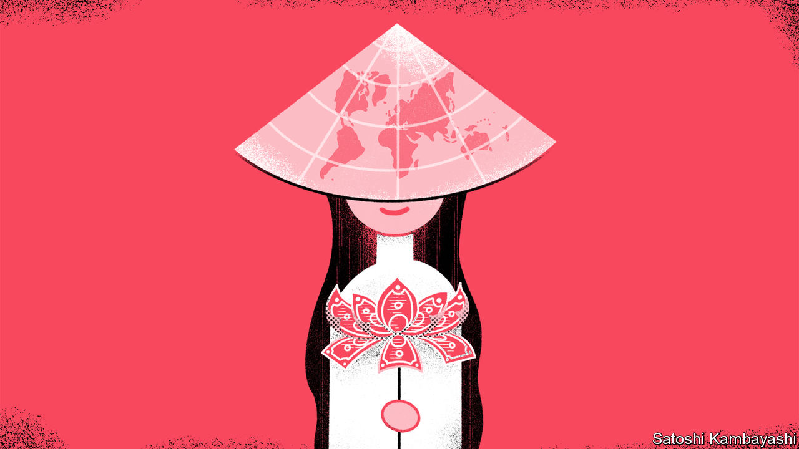

###### Buttonwood

# Why globalists and frontier-market investors love Vietnam 

##### It is cheap, and a refuge from the Sino-American trade-and-technology war 

 

> Jul 18th 2020 

AT THE START of February, as the spread of a deadly virus in China became more threatening, Vietnam closed the border. Truckers could no longer ferry components and raw materials from China to local factories. This was a problem for Samsung, a South Korean hardware giant, which manufactures most of its handsets in Vietnam. It had just unveiled two new smartphones in America. It did not want to delay production. So it began to airlift vital parts from China.

The story is telling on two counts. Vietnam was swift in containing the spread of covid-19, with a fairly intrusive track-and-isolate strategy—the kind that only a one-party state may be able to implement. Its economy suffered, but has bounced back more sharply than most. It is one of just a few dozen countries where GDP is likely to grow this year. The story also underscores Vietnam’s status as a favoured venue for foreign direct investment (FDI). It is an established place for clothesmakers to set up. More recently it has become a key link in technology supply chains.


Vietnam is not just a darling of multinational firms. It is also beloved of investors in “frontier markets”, at the farthest edge of the equity universe. Such investors have few rags-to-riches economic stories to buy into. Vietnam looks like one of the more reliable ones. Indeed it is proving to be something of an each-way bet on globalisation. A big winner from the growth of world trade in recent decades, it is now a beneficiary from the geopolitical fallout from that growth.

Not so long ago Vietnam was one of the world’s poorest countries. In 1986 it launched its doi moi (“renovation”) reforms, which allowed for a greater role for market forces and the private ownership of enterprises. The economy was opened up to foreign trade and capital. Its low wage costs were an advantage, but hardly a unique one. So Vietnam also offered generous tax breaks to foreign companies that went there.

More recently a stable economy has added to its appeal, says Luong Hoang of Viet Capital Securities in Hanoi. The central bank has kept the dong fairly steady against the dollar. Stricter limits have been imposed on bank credit. Inflation has settled in the low single digits. Vietnam has further opened up to trade. It joined the World Trade Organisation in 2007. It has since signed deals with Japan and South Korea, two of the bigger investors in Vietnam. Last month it ratified one with the EU. And the FDI keeps rolling in. There have been biggish investments from China, Hong Kong and Singapore this year. It is the go-to place for the sort of production that has become too costly in China. It is also a refuge for companies that want to limit their entanglement in the Sino-American trade-and-tech battle.

There is an irony here. Vietnam’s economic strategy looks much as China’s once did: a lot of FDI; export-led growth; a steady climb up the value chain from textiles to tech. It is also prone to some of China’s vices, including a nexus of corruption, real-estate deals and bad debts. Still, Vietnam has attributes that once made investing in emerging markets so enticing and globalisation such a persuasive creed: a fast-growing economy, rapid urbanisation, improving infrastructure and an expanding middle class. Its array of listed companies—from banks and logistics firms to retailers and steelmakers—allows investors to gain exposure to these trends.

All this sounds lovely. But there is a catch. Vietnam imposes foreign-ownership limits on many home-grown companies. This is in large part why it is classed by MSCI, an index provider, as a “frontier” market, not an “emerging” one. A foreign investor who wants a stock that has reached the limit must buy from another foreigner. These off-exchange trades can take weeks to be arranged and approved, says Andrew Brudenell of Ashmore, a fund manager. A handful of stocks attract hefty price premiums. Shares in Mobile World, an electronics-cum-grocery retailer, recently changed hands among foreigners at a 51% premium to the on-exchange price, according to Viet Capital Securities.

The trade-oriented nature of Vietnam’s model means it is at the mercy of events elsewhere. However well it has handled the pandemic, there will be nerves about rising infections in America, its biggest export market. The government has dusted off infrastructure plans and relaxed land-use rules. Last month it approved a new $9.3bn tourist resort. Foreign investors, naturally, have a piece of that. ■

