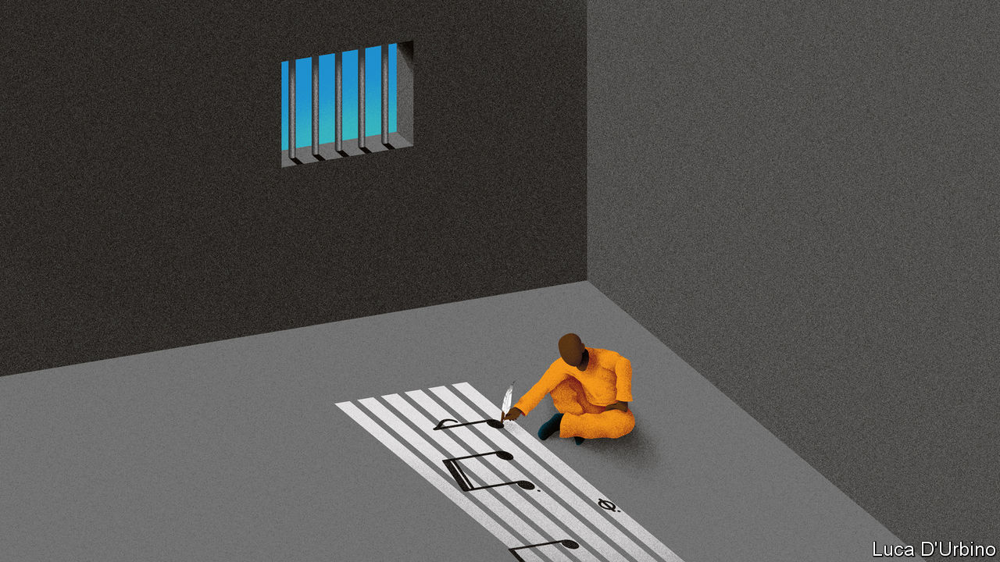

###### Rhyme and punishment

# A charity in Burkina Faso teaches criminals to sing 

##### Finding rehabilitation, and stardom, behind bars 

 

> Jul 18th 2020 

WHEN ROLAND TAPSOBA went to prison in 2015 he never dreamed he’d emerge a rock star. The 31-year-old former estate agent was convicted of fraud in Burkina Faso’s capital, Ouagadougou, and sentenced to five years behind bars.

He had sung hip-hop for fun in high school. In jail, music became his salvation. Mr Tapsoba learned to play the guitar, huddled with ten inmates over one instrument. His favourite song was “Wata Beogo” (“I’m coming tomorrow”, in Mossi, a local language). It made him think about seeing his family. “In jail you might feel hungry or have needs, but those are physical needs. In your mind the main priority is to get free, to go beyond the gates,” he says.


Almost three years into his sentence he entered a music competition run by African Culture, a local charity that tries to rehabilitate prisoners through the arts. Mr Tapsoba competed against six inmates and won an album deal and a music video, which he produced in jail. Since his release last year, fame has helped Mr Tapsoba (who now goes by the stage name Rolby) chart a new course in life. His lyrics thrum out over the airwaves and in concerts.

Even at the best of times Burkina Faso’s prisons are overcrowded and dangerous. Almost 8,000 inmates languish in them. Many have not been convicted of anything, since suspects can wait for more than a year before they are tried. And overcrowding is getting worse because the government is rounding up young men suspected of supporting jihadists. Human-rights groups say that some prisoners are tortured. Many are depressed or traumatised and get no treatment, either for their psychological problems or for HIV or TB.

Freeman Tapily, the founder of African Culture, has spent a decade trying to support prisoners through song and dance and to reduce the stigma they face when they are released. The group, which is funded by the French government, runs an annual music festival, during which it hosts concerts in prisons. This year inmates will have the opportunity to write a play, which they will perform in venues around the capital. The arts give “inmates the opportunity to express themselves, to help build resilience and trust,” says Melodie Safieddine, a psychologist who has worked in several conflict zones.

It is not just Mr Tapsoba’s ascent from cell to concert hall that offers hope, but his lyrics, too. One of his winning songs goes: “After effort there is comfort. After sweat there is happiness. If life doesn’t end, there is no despair. Take courage.”

