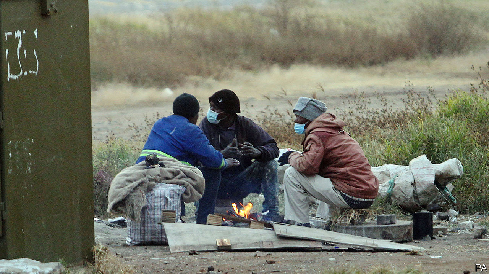
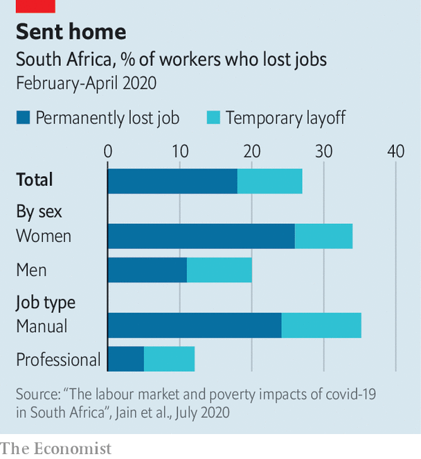

###### Measuring the poverty pandemic

# Covid-19 has throttled South Africa’s economy 

##### A groundbreaking study reveals how many people have been tossed back into penury 

 

> Jul 18th 2020 

CHRISTINA MOTHIBA had always wanted to return home, but not like this. In 2006 she left Laaste Hoop, her village in Limpopo, South Africa’s most rural province, and moved in with her sister in Johannesburg, the country’s economic hub. It took four years but eventually she found a job, as a tea-lady in an office. In 2015 she was promoted to administrator. Her salary supported four others: a brother, her mother and two children. There was enough spare cash for a plot in Laaste Hoop. Ms Mothiba, who is 49, hoped to build a house on the land before she retired.

Then came covid-19. “With this pandemic life is not what it was before,” says Ms Mothiba. She was laid off shortly after South Africa’s lockdown began on March 27th. There were no prospects and rent was due, so she went back to her mother’s house in Laaste Hoop. She has shelved her retirement plans and is focused solely on ensuring her family eats. “You can’t understand how stressed I am right now.”


Before covid-19 South Africa was in its second recession in two years. That dire situation has turned into a disaster. A sense of the scale is given by groundbreaking research from an academic consortium, which used data from a mobile-phone survey to produce one of the first detailed analyses of the economic effects of covid-19 in a developing country. The reports, published on July 15th, show how the pandemic has impoverished South Africa—and made one of the world’s most unequal countries even more so.

According to the research, one in three people who earned an income in February did not do so in April. About half of the erstwhile earners were permanently laid off, rather than furloughed, suggesting that the effects of the pandemic will be long-lasting. South Africa’s eye-wateringly high unemployment rate—30% as of the first quarter of 2020—is set to rise further.

The studies show the uneven effects of economic restrictions (see chart). Researchers reckon that women account for 2m of the 3m net jobs lost. Manual workers were nearly three times as likely to have been laid off as professionals.

 


The lockdown also led to mass internal migration. Between late March and the end of May, 5m-6m people (15% of adults) changed their residence. Urbanisation has gone into reverse, as people like Ms Mothiba left townships and went back to their home villages to reunite with their families (in her case, her mother and 12-year-old daughter). So far the vast majority of movers have not gone back to cities.

Jobless returnees have put pressure on families. Of the households that received people in May, most reported that they ran out of money for food. Overall nearly half (47%) of respondents said they could not afford enough food in April—more than twice the share of households saying they could not do so at any point during 2017, according to a comparable survey.

South Africa’s social-security system should have cushioned the blow. But it has been woefully mismanaged. A dedicated grant meant for the unemployed who are ineligible for other support was supposed to help 15m people. By early June just 600,000 had been paid. The government has admitted that 60% of rejected applicants were in fact eligible.

President Cyril Ramaphosa hopes that the economy will soon recover. But there are ample reasons to worry. For a start the virus is surging; South Africa is the fourth-most affected country in the world, according to the five-day moving averages of case totals collated by Johns Hopkins University. Hospitals are increasingly overwhelmed. Epidemiological models used by the government suggest cases will peak between late this month and the end of September, depending on the province.

South Africa is trying to balance surging caseloads with rekindling economic activity (see ). It is a huge task. In June a benchmark measure of business confidence plunged to its lowest level since it began in 1975. The South African Chamber of Commerce and Industry worries that the unemployment rate could reach 50%. Eskom, the state-run power utility, has reintroduced rolling blackouts. The public finances, already damaged by years of corruption, wasteful spending and low growth, are perilous. The treasury’s forecast for the budget deficit for 2020/21 has been revised from 6.8% of GDP to 15.7%. More than a fifth of the budget will be spent on servicing debt.

Tito Mboweni, the finance minister, warns that more public spending is not the answer. On July 15th he argued that higher spending will only crowd out private investment and further raise the cost of borrowing. He reiterated his proposals for structural reform first published a year ago.

Mr Mboweni is, however, the lone reformist in the cabinet and the upper echelons of the African National Congress (ANC). There is seemingly no problem for which the ANC does not see the state as the solution. A paper by the party’s “economic transformation committee”, published this month, proposes, among other things, a state bank, a state pharmaceutical company and a national health-insurance scheme. Others in the ANC want a policy of “prescribed assets”, whereby the government dictates where pension funds and other investors put their money (a policy also used by the apartheid regime).

Mr Ramaphosa seems to be siding with the statists. This may be tactical: he needs to shore up his position within the party ahead of the ANC’s National General Council meeting, which has been postponed from June. But it is also because, unlike Mr Mboweni, he sees the state as a driver of—rather than a brake on—growth. In May he echoed the party’s left wing, saying that “radical economic transformation must underpin the economic future.”

Ms Mothiba has more prosaic concerns. She worries that there may be no point in trying her luck again in Johannesburg, even if the pandemic subsides. She is thinking of setting up a fruit and vegetable stand to make ends meet. It was not the return to the land she envisaged. “But I can’t just sit here and fold my arms.” ■

Editor’s note: Some of our covid-19 coverage is free for readers of The Economist Today, our daily . For more stories and our pandemic tracker, see our 

