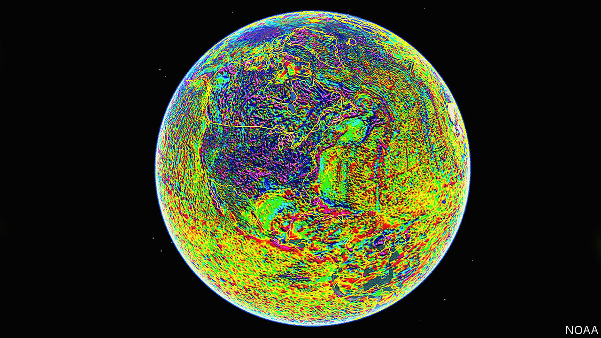

###### Aircraft navigation

# Magnetometers based on diamonds will make navigation easier 

##### Unlike GPS, they cannot be jammed by enemy action 

 

> Jul 18th 2020 

MAGNETIC COMPASSES have guided sailors for centuries, but a compass tells you only in which direction you are pointing, not whereabouts you are. A new form of magnetic navigation being developed by the United States Air Force Research Laboratory (AFRL) can do better. It employs magnetometers made from tiny diamonds to indicate an aircraft’s precise location over Earth’s surface. It is so accurate that it might supersede GPS for aerial navigation.

A conventional compass aligns with the magnetic field generated by convection currents within Earth’s liquid-iron core. This field is, itself, approximately aligned with the planet’s axis of spin, and thus with the geographical poles. But there are fainter terrestrial magnetic fields around as well. These are embedded in the rocks of Earth’s crust and have a pattern sufficiently elaborate and distinctive as to be unique from place to place. In principle, therefore, they can tell you where you are. The trick is to reduce that principle to practice.


Until recently, the only magnetometers sensitive enough to be useful for this task have been costly and bulky. Some also require cooling with either liquid helium or liquid nitrogen. None of these things is true of a diamond magnetometer.

The diamond in question has an atomic lattice containing anomalous places called nitrogen-vacancy defects. Diamonds are crystals of carbon and these vacancies are places where a carbon atom in the crystal lattice has been replaced by a nitrogen atom, and an adjacent carbon is missing. When exposed to green laser light such vacancies fluoresce. The pattern of fluorescence changes in a magnetic field in a way which allows that field’s strength and alignment to be determined.

Diamond magnetometers are not, in truth, as sensitive as the alternatives. But in addition to their cheapness, lack of bulk and ability to function at room temperature they also have one further advantage. As Michael Slocum, a researcher at AFRL who is working on the project, observes, other sorts of magnetometers need careful calibration—and any system that depends on calibration is likely to suffer from measurement drift over the course of time. Since the nitrogen defects in a diamond do not move around, no calibration is needed.

Magnetometer-based navigation does require accurate maps of Earth’s surface magnetic fields. The best such are made by flying an aircraft over the area in question, but if that is not possible then (as the picture shows) a satellite can do a reasonable job. Tests suggest that navigation of this sort can locate an aircraft’s position to within 13 metres. And, crucially for military applications (and unlike GPS-based systems), it is unjammable by the enemy.■

