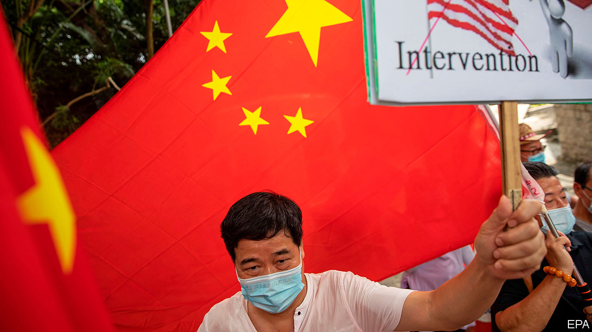
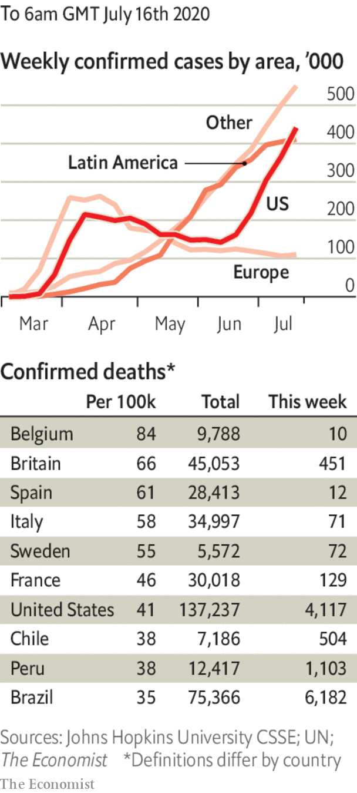

###### 

# Politics this week 

#####  

 

> Jul 18th 2020 

Donald Trump signed an executive order ending Hong Kong’s privileged trading status with America, in response to China’s imposition of a crushing national-security law. Under new legislation, banks aiding officials who implement the law may face sanctions, as may the officials. See .

Separately, China announced sanctions against American officials, including Marco Rubio and Ted Cruz, two Republican senators. The move was in retaliation against American penalties on Chinese politicians for abusing the human rights of China’s Uighur citizens.


Jeff Sessions was clobbered in Alabama’s Republican Senate primary by Tommy Tuberville. Mr Sessions, a senator for 20 years until 2017, was an early supporter of Donald Trump, who made him attorney-general. His decision to recuse himself from investigations into Russian interference in the 2016 election made the president turn on him. See .

Chinese officials accused pro-democracy politicians in Hong Kong of harbouring “evil intentions” by staging informal primary elections in preparation for Legislative Council polls in September. They said the democrats wanted to turn Hong Kong into a base for “subversion”—a crime under the new national-security law.

Floods continued to cause massive disruption across central and southern China. The deluges have killed more than 140 people, destroyed about 28,000 homes and caused more than $11bn-worth of damage. See .

China accused America of stoking tensions in the South China Sea by declaring that China’s claims there are “completely unlawful”.

Brazil’s space agency, INPE, reported that 3,069 square kilometres (1,185 square miles) of the Amazon was cut or burned down from January to June, an increase of 25% from the same period last year. After the announcement, the head of the department responsible for monitoring deforestation was moved to another job. Last year the government sacked INPE’s chief after the agency reported an increase in deforestation.

Martín Vizcarra, Peru’s president, replaced more than half of his cabinet after his approval ratings fell. Pedro Cateriano, a previous prime minister, has taken the job again. The recession caused by the pandemic has led Mr Vizcarra’s popularity to drop from 87% in March to a still-impressive 65%.

Poland’s president, Andrzej Duda, was narrowly re-elected, surviving a fierce challenge from the mayor of Warsaw. Mr Duda’s campaign involved deriding gay people and Jews. See .

Protests erupted across Belarus after opposition candidates were barred from standing in next month’s presidential election. Meanwhile in Khabarovsk, in Russia’s Far East, crowds demonstrated after the local governor was arrested on a 15-year-old murder allegation. Protesters said his real crime was being more popular than the president, Vladimir Putin. See .

Temperatures in the Siberian Arctic were up to 10°C hotter during January to June than the average between 1981 and 2010. Climate scientists say greenhouse gases made this 600 times more likely, making it one of only two extreme weather events to be firmly pinned on climate change. See .

Boris Johnson, Britain’s prime minister, pledged to hold an independent inquiry into the country’s handling of the coronavirus pandemic. He said the country needed to “learn the lessons” of the outbreak. See .

The Philippine Congress decided not to renew the broadcasting franchise of ABS-CBN, the country’s biggest television network, in effect putting an end to its efforts to remain on air. The company says it is being persecuted for critical reporting on the government of President Rodrigo Duterte.

Park Won-soon, the mayor of Seoul, committed suicide after police began investigating allegations that he had sexually harassed a secretary.

The ruling People’s Action Party (PAP) won Singapore’s general election, as it has every election since independence in 1965. The opposition won ten out of 93 seats—its best showing ever. The PAP’s share of the vote fell from 70% to 61%. See .

Libya’s eastern-based parliament said it would “welcome” Egyptian military intervention in the country’s civil war to counter Turkish support for the internationally recognised Government of National Accord (GNA), based in Tripoli. The assembly in the east is aligned with Khalifa Haftar, a general who is trying to overthrow the GNA.

At least seven boats caught fire at Iran’s Bushehr port, state media reported. It was the latest in a series of mysterious fires and explosions in the country, some at sensitive sites, leading to speculation about a campaign of sabotage. 

Yemen’s Houthi rebels agreed to give a team of UN inspectors access to an abandoned oil tanker off the country’s Red Sea coast. The vessel, which is leaking, holds over 1m barrels of oil.

Talks between Ethiopia and Egypt over the filling of a controversial dam on the Nile river broke down. Ethiopia has begun filling the dam.

Coronavirus briefs

 


Infections continued to soar in America, to over 60,000 cases a day. Florida reported the largest daily increase of any state since the start of the pandemic. California reimposed many of the curbs it had only recently lifted. See .

The death toll in Latin America surpassed 145,000, overtaking that in the United States. Only Europe has suffered more deaths—over 200,000.

The regional government in Catalonia put in place restrictions on areas where the disease has flared up again. A judge said only the Spanish government in Madrid could impose lockdowns.

Masks are to be compulsory in shops in England from July 24th. Boris Johnson wore a mask in public for the first time, as did Donald Trump.

South Africa banned sales of alcohol, to free up intensive-care beds for covid-19 patients. See .

