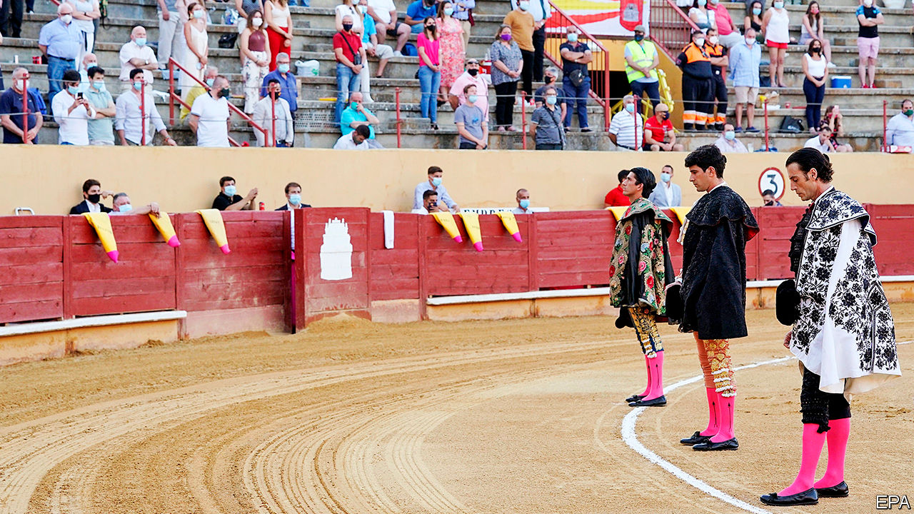

###### The cape and the masks

# Bullfighting in the era of covid-19 

##### Gore and pageantry on the sand, social distancing in the stands 

 

> Jul 22nd 2020 

Editor’s note: Some of our covid-19 coverage is free for readers of The Economist Today, our daily . For more stories and our pandemic tracker, see our 

IN HIS STRIKING lime-green costume, Octavio Chacón, a journeyman matador, enticed a bull to charge around him, alternately drawing it forward by the left horn and the right. Several beasts showed remarkable strength to shrug off mounted picadors, remaining on their feet and winning applause even as death in the sand approached. Meanwhile in the stands, security teams ensured that a distance of one and a half metres was maintained between all spectators. Loudspeakers broadcast frequent reminders that, following an edict from the regional government of Castile and León, masks were compulsory.

Live entertainment of all kinds is struggling to adapt to covid-19, not only because of the financial blows it has dealt. The electricity of performance risks being defused by the hygiene measures now required to host even diminished audiences. Amid the gore and pageantry of the first bullfights in Spain of the covid era, held in Ávila on July 18th and 19th, the contradiction between drama and health precautions was especially stark. “At least the toilets here have sinks,” reflected one enthusiast. “Salamanca has a much prettier ring but there is nowhere to wash your hands.”


Bullfighting was already struggling before the pandemic, as ticket sales and subsidies dwindled and audiences aged. The virus had seemed an even bigger threat to its future than the perennial campaigns by animal-rights activists. The trouble isn’t only that the largely elderly fans sit cheek by jowl to enjoy the bloody spectacle. The upkeep of fighting bulls is expensive—and in the absence of corridas, the slaughterhouse is a more cost-efficient option than the bullring. The bullfighting season runs from March to October; as the first four months of this year’s were lost, breeders cut costs by replacing their bulls’ diet of fodder with grass. Some animals have lost weight. Some matadors have put it on.

The crowd in Ávila was keen to see the bulls’ return and clamoured for the liberal award of trophies (matadors can be awarded one or both of a bull’s ears and, exceptionally, its tail). But there were sombre notes amid the excitement. Social-distancing rules meant the arena’s capacity was reduced from just over 8,000 to 2,000. Even then, in these nervy times some tickets went unsold. Death may be matadors’ stock-in-trade, but it can ambush even them—some relatives of Alberto López Simón, the weekend’s star turn, are among Spain’s almost 30,000 coronavirus fatalities. The event began with a minute’s silence in their honour; it was followed by the national anthem and cries of “Viva España”, politically charged gestures against the backdrop of separatist claims in Catalonia, which banned bullfighting in 2010.

If the opening was muted, so were the climaxes. The audience was told that the tradition of showering triumphant matadors with flowers (or other tokens of appreciation, such as chickens) was prohibited. Police intervened when one bullfighter, Finito de Córdoba, threw cash at a loudmouth who felt short-changed by his kill. Combining classical moves with crowd-pleasing tricks, Mr López Simón gave the best-received performance. But new rules forbade his colleagues from carrying him away on their shoulders, and he had to make do with a victory lap of the ring. ■

Editor’s note: Some of our covid-19 coverage is free for readers of The Economist Today, our daily . For more stories and our pandemic tracker, see our 

