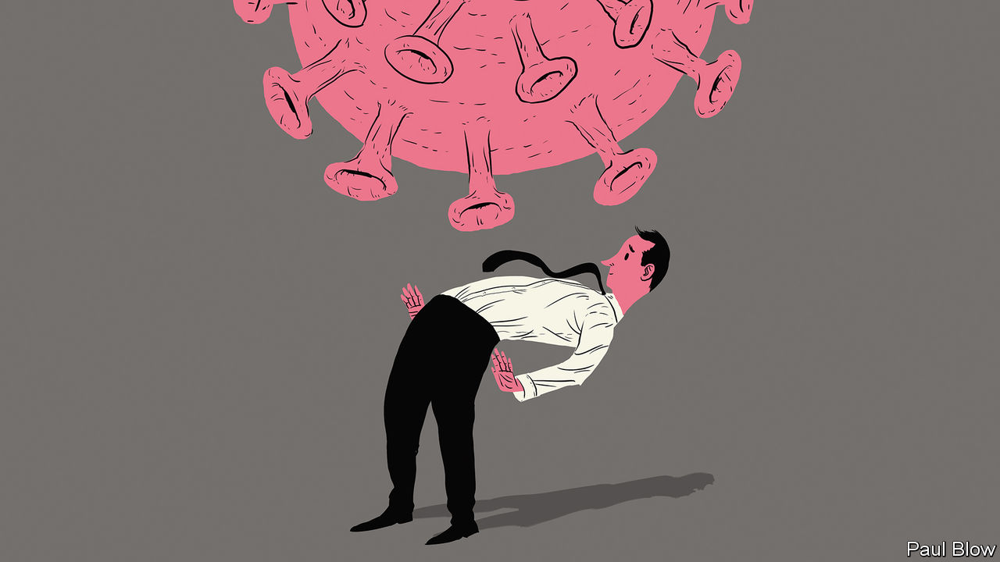

###### Bartleby

# How small businesses have dealt with the crisis 

##### Pandemic veterans 

 

> Jul 23rd 2020 

Editor’s note: Some of our covid-19 coverage is free for readers of The Economist Today, our daily . For more stories and our pandemic tracker, see our 

AS A SPECIAL-OPERATIONS pilot in the American air force, Joe Shamess was used to handling some tricky situations. But the sudden arrival of the coronavirus pandemic this year meant he faced an unexpected challenge. Together with another pilot, Brian Steorts, Mr Shamess had founded Flags of Valor, a company that focused on employing veterans to make products such as flags and gifts for employee-recognition programmes. When the pandemic hit, the company quickly lost two-thirds of its revenue.

Smaller companies like Flags of Valor have been the most vulnerable to the pandemic and its economic turbulence. Most have little in the way of financial reserves and sell a limited range of products. Tom Sullivan, vice-president of small-business policy at the US Chamber of Commerce, points to data showing that 20% of small businesses (those with fewer than 500 employees) in America have closed since the virus hit. Things are worse for black-owned businesses, which often find it more difficult to get bank loans; 40% of such firms have shut.


Government support for American small businesses has been in the form of loans under the Paycheck Protection Programme (PPP). Mr Sullivan says 72% of small firms have received a PPP loan. But, Mr Shamess reports, “even though we were one of the very first applicants, we did not receive funds in the first round.” He feels his bank failed to give the application the attention it deserved.

With the help of a different bank, the company managed to get funds in the second round of PPP loans. But it still took almost a month from the initial application to receipt of the money. Mr Shamess says that the scale of the programme was so great and the time needed to distribute it was so short that it was rather like trying to build a parachute while falling to the ground.

The management therefore had to act without waiting for the feds. The work week went from 40 hours to 20. Some of the firm’s 24 workers were furloughed. The main problem was not manufacturing; the factory was big enough to keep staff socially distanced. It was distribution. Mr Shamess had to close the showroom; trade shows, which brought in a lot of business, were cancelled.

So the firm had to innovate. The showroom is now closed for good and most business is online; one of the firm’s biggest sellers is a newly launched crafts kit for kids, to keep little ones occupied during the long break from school. All of the craftsmen are now back working full time. Still, Mr Shamess says that “we are a different company from four months ago.”

Another firm that has had to transform itself during the pandemic is VetCor, which also happens to employ military veterans but operates in the service sector. Its main business was the restoration of buildings damaged by floods and damp, a common risk in Florida, where it is based. The pandemic forced the company to close one of its offices, lay off some of its 31 workers and apply for a PPP loan (which it received). But Paul Huszar, a former army lieutenant-colonel who runs VetCor, realised the crisis created a business opportunity.

Part of the firm’s work involved dealing with the mould spores associated with damp conditions. The same processes could be used to disinfect buildings to eliminate the coronavirus; the company already had the right chemicals, air scrubbers and personal-protection equipment. This has proved a popular service with restaurants in the area.

VetCor also operates a franchising business, but four conferences where it was due to recruit franchisees were cancelled. So it signed up for a virtual career conference aimed at veterans from Annapolis and West Point (America’s naval and military academies, respectively). Mr Huszar expects several franchisees to sign up as a result.

This flexibility reflects some of the rules Mr Huszar developed when serving in Iraq: don’t be wedded to the plan and recognise when conditions change. And that is one of the advantages of running a small company; it is easier to change direction quickly than at a big firm.

The 20% pandemic closure rate among small businesses in America, bad though it is, could be read as showing that most soldier on. A survey from the National Federation of Independent Business shows that optimism among small firms rose for the second consecutive month in June. This month’s spike in infections might temper it again. But then small-business managers like Messrs Shamess and Huszar will once again adapt. They have the skills to do so.

Editor’s note: Some of our covid-19 coverage is free for readers of The Economist Today, our daily . For more stories and our pandemic tracker, see our 

