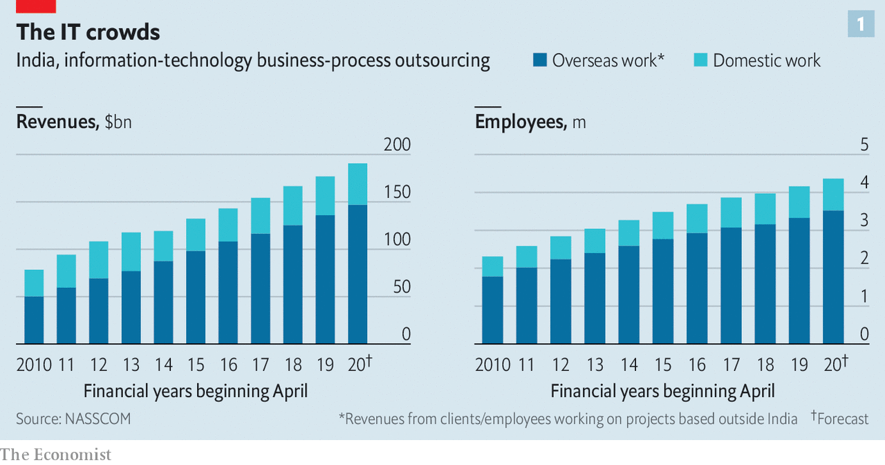
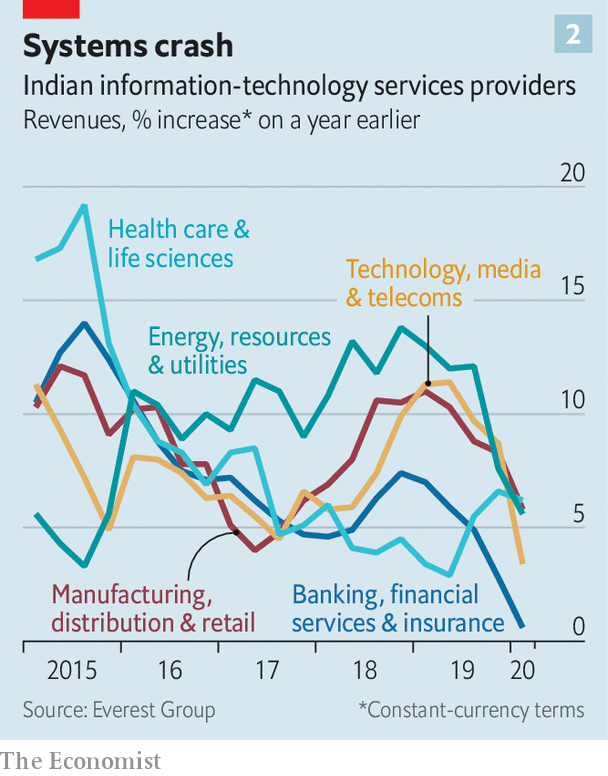

###### In need of a software update

# Indian IT consultancies struggle against technological obsolescence 

##### The subcontinent’s successful tech giants risk being left behind 

 

> Jul 23rd 2020 

MANY OF THE world’s multinationals claim to be technology companies. In fact, their increasingly digitised operations often rely on a handful of Indian firms. Few people outside their home country have heard of Tata Consultancy Services (TCS), Infosys, Wipro, HCL Technologies or Tech Mahindra, India’s five biggest information technology (IT) consultancies. Yet even when enterprise software to manage marketing, production, inventory and the like comes from Oracle of America or Germany’s SAP, it is often the Indian companies that install and maintain software for clients. They create the ledgers, transaction platforms and risk controls that enable financial firms to operate. They build and run websites. When Rajesh Gopinathan, TCS’s chief executive, noted recently that his firm helps manage the world’s big banks, retailers, manufacturers and telecoms companies, it was not an empty boast. 

The IT consultancies have been India Inc’s rare global success story. Except Infosys, which was born as an IT consultancy in 1981, all of the big firms were spun out of their parent conglomerates, beginning with TCS in the 1960s, which was hived off to work out how to optimise electrical output for Tata’s power companies. They won acclaim after patching the “Y2K” bug, which threatened to crash the world’s computer systems flummoxed by the zeroes in the new century’s dates. That brought them to the attention of big Western firms, which realised they could hire talented Indian programmers at a quarter of the going rate in their home markets. Some firms outsourced their entire IT departments.


The upshot has been spectacular growth for India’s IT firms. The big five’s combined market capitalisation surpassed $200bn in 2019. The biggest, TCS, has 285 offices in 46 countries and as many workers as Microsoft, Apple, Alphabet and Facebook put together. The industry which has grown up around TCS and the other IT titans comprises 16,000 companies, employing 4.4m people. The sector’s revenues soared from $8bn in 2000 to $180bn last year, according to NASSCOM, a trade body. That is equivalent to 6% of India’s GDP. 

As in the previous downturn after the financial crisis of 2007-09, the coronavirus-induced recession has caused corporate clients to tighten the purse-strings on all manner of expenses, including IT. Sales of the big firms barely grew year on year in the latest quarter, down from an annual growth rate of over 20% throughout the 1990s and 2000s. Lockdowns have put their plush campuses—the Infosys one in Mysore has a bowling alley and a climbing wall, as well as roaming peacocks—mostly out of bounds. Other countries are erecting barriers to foreign employees. America, a crucial market, has suspended visas for skilled temporary workers, 70% of which typically went to Indians.

 


If the pandemic were their only problem, the IT firms would shrug it off. Being technologically adept, they quickly shifted their employees to home-working. Within days, 95% or more of their staff were toiling remotely—quite a feat in a country with patchy broadband and countless bureaucratic obstacles to sudden changes in workplace practices. The impact of having fewer Indians in foreign offices will be mitigated by greater acceptance of videoconferencing and longstanding efforts to recruit workers directly in their foreign markets; Infosys has 17,500 employees in Europe and 22,200 in America. 

However, covid-19 hit at a time when growth was already sputtering. The industry’s revenues rose by 6% in 2019, around a quarter of the historic rate. The Indian model has been widely aped by global consulting firms such as Accenture, IBM, Deloitte and EY, all of which now run vast facilities in India and have dispatched employees to work directly with global clients around the world. 

For all their tech nous, the Indian giants have also been unable to keep pace with technological change. Corporate software is becoming easier to use, reducing demand for their services. The lucrative legacy business of running mainframes is evaporating. Helping clients shift to the cloud makes money but not nearly as much. Despite some interesting pilot projects—such as Tech Mahindra’s use of artificial intelligence to tell apart 1,645 Indian languages or Infosys’s covid-19 contact-tracing in Rhode Island—the consultancies have not come up with a killer app, let alone powerful platforms like those of America’s big tech firms.

Worse still, multinationals are increasingly reluctant to outsource their IT. Rather than hire the consultants, many are creating subsidiaries in India to do the job in-house—sucking away both custom and workers from the consultancies. Before the pandemic India hosted more than 1,400 of these so-called “captive centres”, employing a total of more than 1m people, according to an analysis by the Ken, an Indian news website; around 70% of them were owned by big American firms. Walmart Labs India, owned by the American supermarket chain, is reportedly on course to double its staff numbers to 7,000 in the next year or two.

 


The popularity of such in-house operations has to do with the changing economics of technology. This once required armies of people, so spreading costs among many clients made sense. With falling prices of hardware and software, and more skilled workers around, a captive centre can pay for itself with just 50 employees, says Peter Bendor Samuel of the Everest Group, a research firm. Firms in industries from energy to entertainment are discovering the value of developing their own technology. Their pace of spending with the consultants has slowed (see chart 2).

The Indian IT consultancies are not going away. They retain the ability to solve common problems at a modest cost. This month Infosys signed a new ten-year deal, the biggest in its history, to help Vanguard, a huge American asset manager, keep records and run its website. A new generation of bosses may shake things up. On July 17th HCL’s founder became the last of the industry’s grandees to step aside, leaving his daughter in charge. In May Wipro named Thierry Delaporte, a former executive at Capgemini, a smaller French consultancy, as its CEO. The new guard have their work cut out if the Indian champions, having helped engineer one profound change in the nature of the modern corporation, are not to be left behind by another. ■

