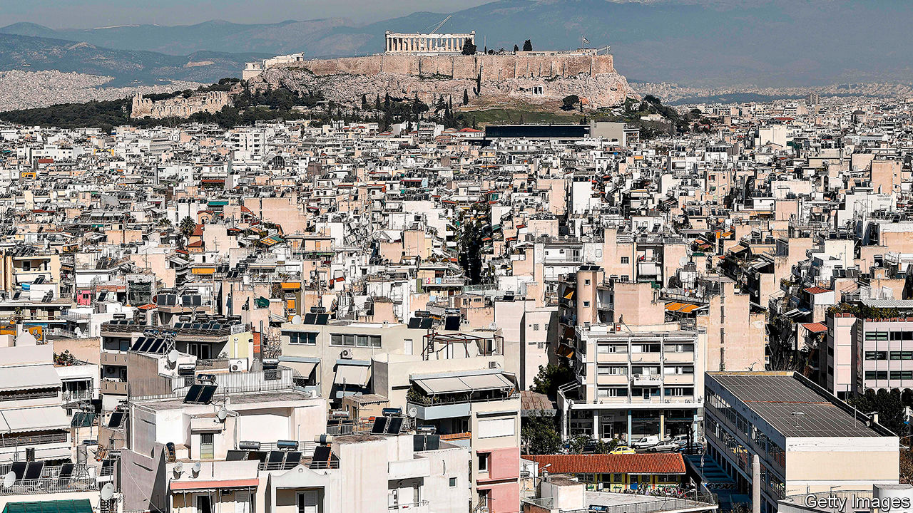

###### Attic views

# A hotel developer in Athens obstructs the Acropolis 

##### Locals are protesting, and the government has taken their side 

 

> Jul 23rd 2020 

WITHOUT HE Acropolis, the rocky hilltop crowned by the gleaming pillars of the 2,500-year-old Parthenon, Athens would be just another down-at-heel city in southern Europe. This summer, because of covid-19, fewer tourists than usual have shown up to admire its painstakingly restored marble temples, built to celebrate the ancient Greeks’ victories over invading Persians and revered as symbols of western civilisation. But the absence of crowds has made it easier to spot an emerging threat to the distinctive Acropolis skyline.

A few hundred metres south of the hill, in a neighbourhood called Makriyanni, an illegally constructed ten-storey hotel looms over scores of four- and five-storey apartment blocks. From some angles the hotel shuts out the view of the Parthenon, and is distinctly less attractive. Coco-Mat, a hotel company controlled by Libra, a Greek-American shipping group, built it in 2018 under a law passed during Greece’s financial crisis that lets buildings exceed height codes if they include a “green” roof. But in place of the luxuriant Mediterranean garden the company promised, it built a rooftop swimming pool and restaurant.


Angry Makriyanni residents sued the company. An online petition attracted nearly 50,000 signatures. In April the powerful Central Archaeological Council (KAS), which advises the culture ministry, ruled that two floors should be lopped off the hotel, cutting its height from 37m to 24m. The culture minister backed KAS; now Athens’ city authority must approve the two floors’ demolition. The Council of State, Greece’s highest legal body, weighed in, too, setting a height limit of 21m (six floors) for new buildings in Makriyanni. A presidential decree confirming the ruling is expected in September.

But more needs to be done to protect the Acropolis from greedy property developers, says Irini Frezadou, a Swiss-trained architect and local activist. Half a dozen companies have applied for planning permission to build hotels in Makriyanni. Even if the height limit is respected, new hotels could spread horizontally. One project that has got permission includes several underground parking lots, which opponents say would create congestion and annoy pedestrians.

Dimitris Pandermalis, an archaeologist who runs the nearby Acropolis museum, home to sculptures from the temples and other treasures, notes that the ancient Athenians used a simple formula to prevent overbuilding. Less than a century after the Parthenon was completed, a decree was passed making it illegal for a private building to stand higher than a public one. Perhaps today’s rules would be better respected if developers had to worry about being presented with a cup of hemlock. ■

