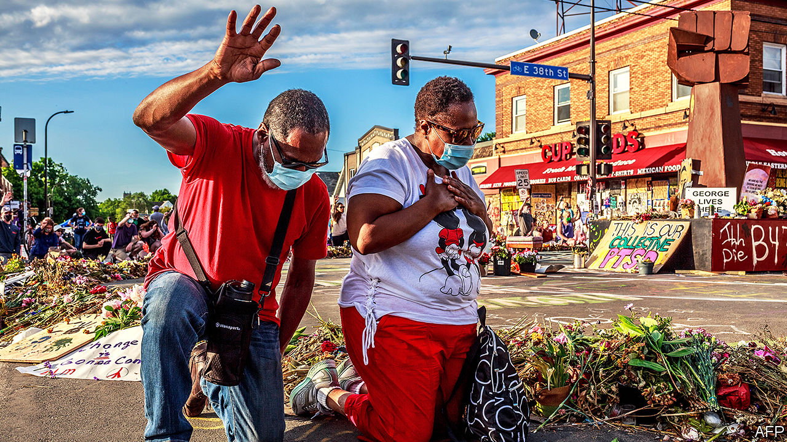
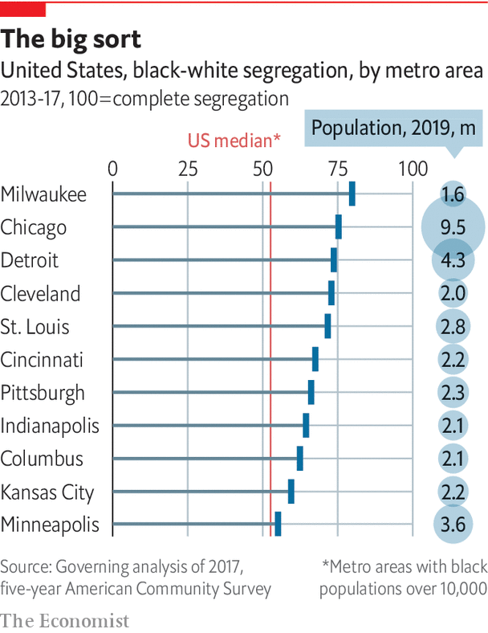

###### Race and the city

# Separate, downtrodden 

##### The region has particular problems with segregation and policing 

 

> Jul 23rd 2020 

TO WALK IN a Midwestern city is to get an education. Outsiders learn of invisible lines that are blindingly clear to locals. Head south from central Chicago on Martin Luther King Drive, and you enter an area that is just getting by. Bronzeville in the mid-20th century was crammed with 110,000 African-Americans; Duke Ellington played there. Today it is gentrifying. After public-housing towers were toppled, people moved into low-rise places.

Farther south, Englewood is depopulating. In one of the two census tracts here, 94% of residents are African-American. Median household income is under $20,000 (one-third of the county average). Less than 10% of residents own their homes, and 75% of children are in poverty. Average life expectancy, at 60 years, is decades less than in richer places. Violence is partly to blame. On May 31st 18 people were murdered in Chicago, its bloodiest day in six decades. Yet Melvin, a barber, won’t blame those in Englewood. “Once you got torn down neighbourhoods, abandoned buildings, drug infested, guns, then you know these kids, they’re vulnerable.” Many homes, shops and churches have been boarded up for years. A Whole Foods supermarket opened in 2016, but is mostly used by commuters who pull in from a motorway.


The common story of Bronzeville and Englewood is of slow-motion ejection of African-Americans. The mostly white, Hispanic and Asian populations north of Chicago are flourishing. But black residents are flocking out. The black population in the city has shrunk by nearly 290,000 this century. People go to suburbs, to Indiana or, in a “reverse great migration”, back south. The census this year is likely to show, for the first time, more Hispanics than African-Americans in Chicago.

Chicago can feel almost as segregated as South Africa just after apartheid. Only part of the problem is policing. Protests erupted across America this summer after the killing of George Floyd. People were furious because jittery or callous police have long killed black Americans with so few consequences. Minneapolis was pressed to disband its police department. Chicago was convulsed in 2014 when video showed a policeman shooting a teenager, Laquan McDonald, 16 times. The officer’s trial ended with the first murder conviction for an on-duty Chicago policeman in almost half a century. Now its police operate under a “consent decree”, in which the Justice Department oversees reform.

The bigger concerns are inequality and segregation. Carmelo Barbaro, at the University of Chicago, says too many people are born in neighbourhoods that limit their prospects. Historical problems are known: black students kept out of white schools; black people denied mortgages; violent attacks by white residents who corralled African-Americans into a few areas of cities. Formally such restrictions no longer exist. De facto many do.

History matters

Until a century ago, the Midwest was mainly settled by white immigrants, especially farmers, craftsmen and traders who had come from central and northern Europe. As Isabel Wilkerson has written, the subsequent influx of black southerners coming north to escape Jim Crow was dramatic, disruptive and ill-managed. For six decades after 1915 millions of people flocked to the industrial Midwest. Chicago’s black population rocketed from less than 3% (44,000 people) to more than 33% (or 1m). Northern, Germanic whites were “brittle” in their response, says John Gurda, a historian of Milwaukee. Poorer white people often saw newcomers as gate-crashers competing for jobs and housing.

African-Americans were forced into a few places, creating a housing pattern discernible today. Of the 25 cities with the worst racial segregation in America, 15 are in the Midwest. Myron Orfield of the University of Minnesota Law School says that racial divisions have increased in Minneapolis-St Paul this century. Poverty and race are closely aligned. In Madison, Wisconsin’s capital, 42% of the black population live in poverty, against 10.5% of white residents. Julie Moore Wolfe, mayor of Decatur, Illinois, says decades of white flight and racial sorting has left the town more divided than ever. She foresees more problems because of a “horrific” high-school drop-out rate of over 50% for black boys.

 


James Loewen has documented how residents in small towns in Illinois, even in the late 20th century, excluded African-Americans. Their method was blunt: signs on roadsides threatened to kill black people present after dark. He began research into “sundown towns” in 1999 and expected to discover ten historical examples in the state. Instead by 2018 he described finding 507. Many remain overwhelmingly white. Activists such as Jamala Rogers and Tef Poe, in St. Louis, Missouri, say nobody should be surprised. And when black people are no longer forcibly excluded, wealthy white folk often go.

After many went to leafy Clayton county beyond St. Louis’s airport, poorer black people moved into Ferguson on the edge of the city. As its fiscal base collapsed, police were ordered to raise revenue from fines for driving offences. They mostly targeted black drivers. These and other local fines brought in 20% of Ferguson’s city budget by 2013, just before a policeman, in 2014, killed Michael Brown, a black teenager, sparking big protests. Don’t just focus on police, says Walter Johnson, author of a history of St. Louis. Look at structures that foster racism, such as how the still white-run city farmed “its poor and working-class black population for revenue”.

The notorious eight-mile line in Detroit divides rich, mostly white, suburbs from the 80%-black city. Detroit’s (white) mayor, Michael Duggan, talks of forming ten commercial corridors to spread the wealth. But success depends on breaching that line. Without public transport, stymied by suburban officials, city residents cannot travel for jobs.

Milwaukee is the most racially segregated of America’s 51 large metro areas. Almost 80% of its black residents would have to move to be distributed similarly to whites. Instead, most have been clumped for decades near the defunct site of a car-parts maker. Some places are vibrant, but most are not. In one area 42% of households are in poverty, six times more than in nearby suburbs. Walk around the north side and you see why so many of the 7m black Midwesterners feel trapped. Chris Arnade, a writer who spent two years documenting “back-row towns”, says desperate people end up seeking salvation through the church, guns or drugs. Mandela Barnes, Wisconsin’s first black lieutenant-governor, said the summer protests call for actions to reduce “systemic inequity and injustice”.

Lori Lightfoot, Chicago’s mayor, says the answer is to tackle poverty, while facing up to “the original sin of slavery” and 400 years of repression. She would like to redirect city spending on the police to stricken neighbourhoods. A paper for the Brookings Institution two years ago by Benjamin Austin, Edward Glaeser and Lawrence Summers, points to the importance of jobs. It noted that many of America’s worst social and economic problems are in the Midwest. In Flint, a mostly black city in Michigan, the male jobless rate was over 35% even when America had near full employment.

Cities that don’t grow, notes Mr Glaeser, can’t change the “housing patterns established in the 1950s to 1970s”. Those that do, like Portland and Seattle in the west, are better at integrating schools and housing. Without growth, gains for one racial group often make another feel it is losing. Yet the Midwest has examples of progress. John Cranley, mayor of Cincinnati, says that in race riots in 2001 “we hit rock bottom”. But his city has managed to cut poverty, improve troubled neighbourhoods and reform the police. Cincinnati is trying to spread entrepreneurial activity by getting more black businesses as suppliers to its biggest companies, Procter &amp; Gamble and Kroger.

Darrin Redus, a local business accelerator, says that 67 black-owned firms now do business worth $1.2bn in annual revenues, employing some 3,500 people. His goal, pre-pandemic, was to double those figures by 2023. Such efforts to spread prosperity are essential for overall urban success, he insists. Others say that only when black residents of cities are helped to accumulate wealth will the economy of the whole city benefit. Mr Barnes is blunter. Not tackling structural problems on race is like ignoring internal bleeding, he says. “You may not see it, but the outcome will be catastrophic if left untreated.”■

Dig deeper:Sign up and listen to Checks and Balance, our  and  on American politics, and explore our 

