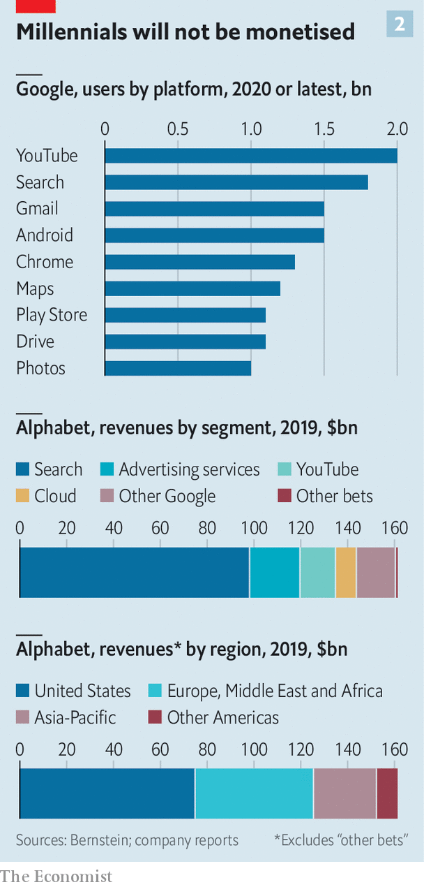
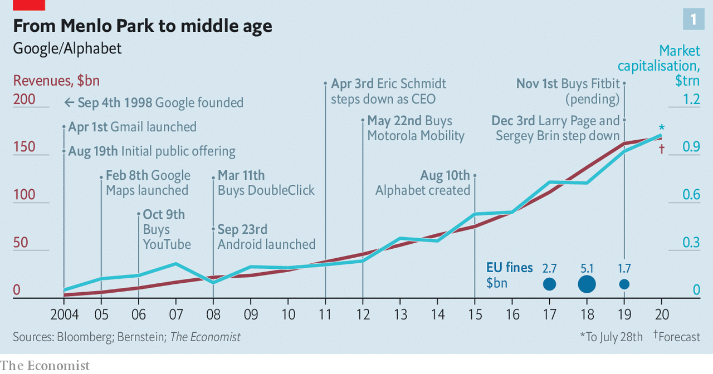
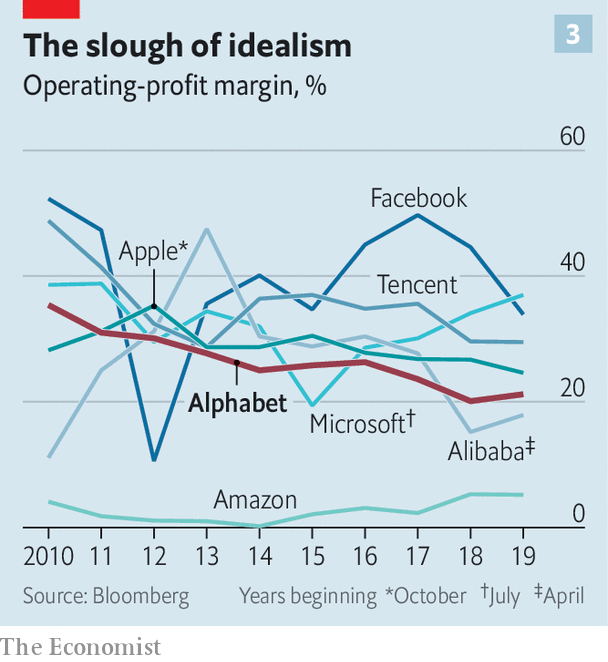
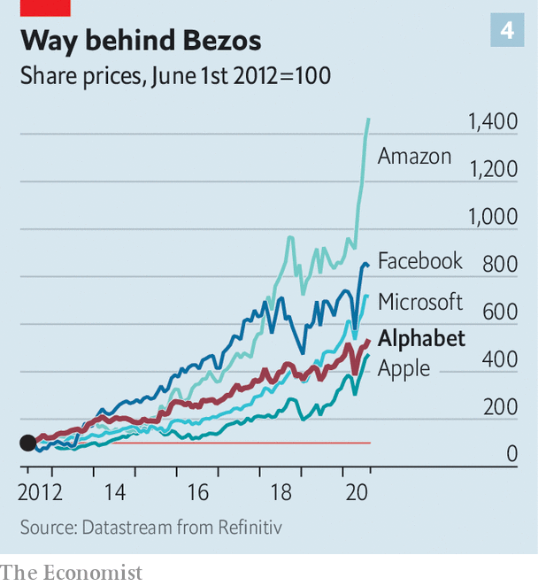

###### Alphabet grows up

# Google’s problems are bigger than just the antitrust case 

##### As the computing conglomerate has grown, so too have the risks that it becomes more like a conventional company 

 

> Jul 30th 2020 

TO GET A good look at Google, climb a barren hill in front of the online giant’s Silicon Valley headquarters—or rather, both of them. To the right lies the old HQ, a clump of low-slung office buildings ringed by dozens of similar boxes. To the left a brand-new corporate centre is rising. From outside it resembles an oversized circus tent, but the inside is still undetermined: pillars, wooden panelling and hardly any walls. The bare-bones structure is meant to provide architectural flexibility. This will come in handy in a post-pandemic world in which offices will look quite different. “We’ll get a chance to reimagine it,” says Sundar Pichai, the boss of both Google and its parent company, Alphabet. And just as the bricks-and-mortar structure is changing, the organisation is in transition, too.

When Mr Pichai took over as chief executive of Google in August 2015, after it became the core of the newly formed Alphabet, the online-search-and-advertising business had annual revenues of $66bn and net income of $14bn. By the time Sergey Brin and Larry Page, Google’s founders, handed him the reins of Google’s parent company last December his division was raking in profits of $34bn on sales of $161bn—and Alphabet was worth almost twice as much as four years earlier.


This enviable track record justifies Mr Pichai’s rich compensation package over several years, of $2m annual salary plus $240m in shares and stock options (depending on performance targets). It would also justify a degree of complacency. Far from it. Mr Pichai realises he inherited an organisation in the middle of momentous change. That is not just because of the founders’ departure or the move next year into the new HQ, but for a deeper reason. As Alphabet has grown—more than 4bn people are thought to use at least one of its products or services—so has the tug of economic and political forces on it.

From the outside, lawmakers and trustbusters are pressing it for explanations over alleged abuses of its market dominance in online-search-and-advertising technology. On July 29th Mr Pichai joined his opposite numbers at Amazon, Apple and Facebook to field angry questions from a congressional committee investigating Big Tech’s alleged anticompetitive practices (see ). On the inside, Google’s core businesses are maturing. After The Economist went to press Alphabet was expected to report the first year-on-year decline in quarterly revenues in its history, hurt by the pandemic-induced tightening of marketing budgets. And the company’s famously freewheeling culture is becoming harder to sustain.

Mr Pichai’s foremost challenge is to prevent Alphabet from becoming what Mr Brin and Mr Page were so bent on avoiding—a “conventional company” that dies a slow death from lack of innovation and declining growth. The task is as delicate as the technology giant is gargantuan.

Today Alphabet is a conglomerate of businesses that sometimes appear to have little in common—a corporate planetary system or Googleverse, if you will. Commercially, its centre of gravity is Google itself, and particularly its online-advertising business. This generates 83% of the group’s revenue and all its profits. It is a constellation unto itself, featuring a plethora of products that together form what is called the “online ad stack”: services to sell, buy and serve ads, and measure their effectiveness, all automatically. In all of these areas, Google is as globally dominant as it is in online search. Its market share in some parts of the ad-serving stack exceeds 90%.

On the surface this might suggest that Alphabet, like most big tech firms, is a “one-trick pony”, in the words of Michael Cusumano of MIT Sloan School of Management. In fact, it is a herd of ponies, some of which look rather more like full-grown Shires. Nine have more than a billion users globally (see chart 2). Every day people make an estimated 6bn search queries on Google and upload more than 49 years’ worth of video to YouTube. More than 300bn emails are said to be sent every day and if only one-third originate on Gmail—a conservative estimate—then a stack of print-outs would be 10,000km high.

 


And there is more. “Other bets”, as Alphabet’s financial statements refer to its non-core businesses, now number 11, each with its own capital structure. These include Access (offering fibre-optic broadband), GV (which invests in startups), Verily (a health-care firm), Waymo (a developer of autonomous cars) and X (a secretive skunk works engaged in all manner of moonshots). Commercially these ventures seem only loosely connected with the core. What links them to the main business is information processing—and specifically these days artificial intelligence (AI), which powers everything from search to Waymo’s self-driving cars.

Early on, the founders decided that to enable the company to grow with startup-like speed regardless of its actual size, they would create a singular organisational mix of institutions they knew best: the internet, the open-source-software movement and Stanford’s post-graduate programme, where the duo came up with Google’s original search algorithm in 1996.

Like the internet, Google was envisaged as an ever-expanding collection of groups of engineers linked by a common language and common goals, most prominently to “organise all the world’s information”. Alphabet, too, is a network of networks held together by technical standards. It grows horizontally by adding yet more networks.

 


To keep hierarchies flat, Mr Brin and Mr Page briefly went so far as to abolish managers altogether, though the experiment had to be dialled back. A compromise was to give managers a minimum of seven direct reports to limit the time they have to loom over each underling. They also had limited time to accost the two bosses, who at one point got rid of their personal assistants to make it harder to book time with them, forcing executives to ambush them whenever they appeared in public to get a sign-off on decisions.

Cosmic ambitions

Google resembled a big open-source project by being an open book, at least internally. Any employee could freely access all internal information except for sensitive user data or company finances. All code, project documents, even a colleague’s calendar, were fair game. Workers were encouraged to use one of Google’s plethora of messaging tools, such as mailing lists (of which there are now more than a million). They were also expected to ask tough questions at weekly company-wide town-hall meetings with the founders, called TGIF, for “Thank God It’s Friday” (now held on Thursdays to allow Googlers around the world to participate without having to get up on Saturday morning). Grievances were to be kept within the company’s walls. Leaking, particularly to the press, was a sackable offence. But the place was also meant to be playful; hence the playground-like offices, ping-pong tables and the like.

From Stanford Mr Brin and Mr Page borrowed the idea of letting people follow their passions. Google employees were allowed to spend 20% of their time working on what they thought would most benefit the firm, even if that often led to them working 120%. They also often set their own quarterly goals. Recruiting and promotion were similar to academia, too. Candidates were graded like PhD students and decisions about who should move up the corporate ladder were taken by a committee of peers from across the company, rather than individual managers, who often promote people they like rather than those who would do the best job.

Having created most of this unique structure in 2001 the founders recruited Eric Schmidt, a Silicon Valley veteran who understood both managers and technologists, to help implement it—or, as they themselves put it, to provide “adult supervision”. To shield the setup from potential shareholder pressure, the three of them built a legal moat around it. Google was one of the first Big Tech companies to opt for dual-class shares, which gave the original shareholders ten times the voting power. Although Messrs Page, Brin and Schmidt together held only a small stake, they retained an outsized 38% of voting rights. The founders warned in “An Owner’s Manual” for Google’s shareholders, published before the firm’s initial public offering in 2004, that new investors “will have little ability to influence its strategic decisions through their voting rights”.

Mr Page took over from Mr Schmidt as Google’s CEO in 2011 (though Mr Schmidt remained Alphabet’s executive chairman until 2018), before handing over to Mr Pichai four years later. Since then Mr Pichai has managed Google in much the same way that previously he ran Chrome, Google’s web browser, and other projects. Rather than getting bogged down in details, he put trusted people in charge, giving them resources and nudging them along.

The result is a collection of semi-independent firms with powerful bosses sitting atop each of them: Thomas Kurian at Google Cloud, Susan Wojcicki at YouTube, Rick Osterloh at Google’s hardware division and Hiroshi Lockheimer at the Android operation. In early June Mr Pichai put Prabhakar Raghavan, who already headed Google’s ad business, in charge of search as well, making him Google’s de facto deputy CEO. (Mustafa Suleyman, vice-president of AI policy at Google, sits on the board of The Economist’s parent company.) A company of Alphabet’s breadth would fail if it depended solely on one man’s judgment, Mr Pichai explains. “People have to be able to make their own decisions.”

These decisions are becoming harder. Googlers have always prided themselves on solving the toughest problems in computer science—less so on making money. This may be one reason why some of the company’s hit services generate smaller revenues than they might, like YouTube, or barely any at all, like Maps. Monetisation from the “other bets” has scarcely begun. They racked up more than $5bn in losses in the four quarters to March. Only Access and Verily bring in material revenues. Some could one day turn into huge businesses: Waymo was valued at about $30bn when it raised outside capital this spring. But even that impressive figure is much less than earlier estimates, which valued the autonomous-driving unit at more than $100bn.

 


None of this used to matter much, as long as Google’s ad products were “a gold-threaded safety net underneath every daring innovation”, as Steven Levy, one of Silicon Valley’s scribes, put it in 2011. It becomes a problem when it translates into lower margins and weaker stockmarket performance than rival tech giants (see chart 3 and chart 4).

 


Online advertising overall is far from a mature market, but growth in search ads, which continue to generate about 60% of Alphabet’s revenues, has slowed. In 2019 sales expanded by 15%, a healthy clip but considerably lower than the 22% a year earlier. General online search is also being “hollowed out” by specialised searches, says Mark Shmulik of Bernstein, a research firm. Mr Shmulik estimates that about 60% of product searches now start on Amazon (whose fast-growing online-ad business is already the world’s third-biggest behind Google and Facebook).

Spaced out

Alphabet’s engineer-driven bottom-up culture is also showing signs of age. It can be hit and miss. “You can paper over a lot of problems by throwing money at it and hiring more bodies,” says a long-time Googler, who previously worked for Microsoft, which was regularly scooped by Google when it came to new products. “I thought they must have really clever strategists,” he recalls, only to discover on joining the firm that it “had hundreds of things happening in parallel”. Alphabet executives often liken their firm’s structure to a “slime mould”—organisms that survive as single cells, but must aggregate to reproduce.

 


Innovation can indeed mushroom in such a corporate ecosystem. But it may hinder the development of more structured products, which require more sustained co-operation and a strategic vision. This is particularly true of lucrative enterprise offerings, where corporate clients expect providers to be both consistent and responsive to their needs. Google has a reputation for being neither.

Over the years Google has churned out new messaging tools, from Allo and Buzz to Hangouts and Meet, only recently starting to develop a unified communications offering for corporations, similar to Slack or Microsoft Teams. Google’s cloud business has often been criticised for “not having a customer-service bone in its body”, says Brent Thill of Jefferies, a bank. As a result it lags behind Amazon Web Services and Microsoft’s Azure, where customer service verges on an obsession.

It is also becoming increasingly apparent that Alphabet’s organisational setup does not scale well. Even with a workforce of a few tens of thousands Google felt small, notes an employee who left a few years ago and later returned. With the firms’ 120,000 permanent workers complemented by an even more numerous (and less-well-paid) temporary or contract staff, the founders’ original idiosyncratic rules are becoming a drag. Executives grumble that internal promotion by committee is often a time-consuming political exercise. Letting a thousand flowers bloom is leading to an awful lot of compost.

Size creates political tensions, too. After 2016 the firm’s mostly woke workforce began using internal messaging tools to organise and press management to take action on everything from President Donald Trump’s harsh immigration policy to boycotting meat in its cafeterias. As Alphabet has hired engineers at breakneck speed, it is no longer “a country where everybody politically agrees” with the once-dominant liberal bent, says an insider.

Tensions came to a head in 2017 when James Damore, a Google software engineer, published a memo on an internal mailing list arguing that the lack of gender diversity in tech could partly be explained by biological differences. After it was leaked to the press he was fired, but many insiders felt that management, including Mr Pichai, had let the debate fester and did not do enough to help the activist employees who had been “doxxed” (having their personal details published online) by other staffers.

Things went downhill from there. Once unthinkable leaks multiplied. So did internal petitions. In 2018 activist employees forced Google not to renew an AI contract with the Pentagon and to abandon plans for a censored Chinese version of its search engine. Tensions culminated later that year when it emerged that high-performing executives accused of sexual harassment had been sent off with multi-million exit packages. More than 20,000 employees globally staged a walkout in protest.

“The walkout broke Larry’s heart,” says one Googler. It suggested that the goal of creating an engineers’ commune had failed. After that the two founders put more distance between themselves and their creation. They stopped attending the TGIF meetings. In many ways Mr Pichai’s ascent to the top job last year was a formality.

Although Mr Brin, Mr Page and Mr Schmidt remain Alphabet’s biggest individual shareholders—with 13.1% of shares and 56.7% of voting rights—a former senior executive says that the company is now run by a different triumvirate. Besides Mr Pichai it includes Kent Walker, senior vice-president of global affairs, and Ruth Porat, the finance chief poached from Morgan Stanley, an investment bank. Where Mr Brin and Mr Page were technologists and Mr Schmidt a technologist-manager, the new team are simply managers.

This transformation was apparent at Mr Pichai’s first quarterly earnings call as the boss of Alphabet in February, when he delighted analysts by at long last breaking out YouTube’s revenues ($15bn in 2019, up by more than a third from the previous year). He has also accelerated share buy-backs, from $6.1bn in the last quarter of 2019 to $8.5bn in the three months to March. “They are no longer the most hated big tech company from a shareholder perspective,” says Mr Thill of Jefferies.

Alphabet is also becoming shareholder-friendlier in how it manages its other bets. Some of the subsidiaries, like Waymo, have wooed outside investors, suggesting that they will one day be spun off. Others, such as Chronicle, which hoped to revolutionise cyber-security, and Jigsaw, a think-tank, have been folded back into Google. Yet others, like Makani, which is developing flying wind turbines to generate energy, are likely to be shut down or sold.

To infinity and beyond

Mr Pichai’s shakeup of management is on starkest display at Google Cloud. After he became Google’s boss five years ago it was becoming apparent that cloud-computing was something more than a passing fad. He ramped up investment in the division and in 2018 hired Mr Kurian, a former senior executive at Oracle, a big maker of corporate software, to run it. In keeping with Mr Pichai’s evolving management philosophy, Mr Kurian was granted far more autonomy than his predecessor, Diane Greene, and turned the unit into a more top-down organisation, hiring people from his former employer as well as SAP, its German rival.

It seems to be working. Google’s cloud business, which includes G Suite, its package of professional online services, is growing at more than 50% a year. Revenues are expected to reach $13bn this year, contributing 8% to Alphabet’s total.

However, Mr Kurian’s financial success carries a risk. Insiders report a mini-exodus from the cloud unit to other parts of Alphabet. Plenty of employees worry that the top-down-approach from Google’s cloud business will spread throughout the organisation. Many are beginning to grumble about getting tasks handed down from above with a deadline.

That hints at a bigger unsolved problem with Google’s culture. After the walkouts, management made some tweaks. “When we were smaller, we all worked as one team, on one product, and everyone understood how business decisions were made. It’s harder to give a company of over 100,000 people the full context on everything,” Mr Walker reportedly wrote in November in an internal newsletter. The TGIF meetings are now held only once a month and limited to business-related questions. The largest internal mailing lists are moderated and postings deemed too political are allegedly being taken down. These days employees are being told to access sensitive documents only if they “need to know”. Some staff talk of creating if not a labour union, then at least a group to defend their interests.

In the wake of the killing of George Floyd many Googlers criticised their top management for doing too little, too late to make the company more diverse; after a couple of weeks the firm vowed to raise the “leadership representation of underrepresented groups” by 30% over the next five years. In June more than 2,000 employees signed an open letter to Mr Pichai demanding that the company stop selling its technology to police forces across America.

 


Over the past few weeks things have seemed to calm down internally. But the respite may be superficial. Many workers are keeping their mouths shut for fear of being laid off, one Googler reports. Few relish the thought of losing a cushy job in a recession. Activists now shun the firm’s communication tools and organise elsewhere online.

All this fuels murmurings and speculation, both inside and outside Alphabet, over whether Mr Pichai is the right person for the job. Some Google executives and engineers describe him as “too checked out” and his leadership as “uninspired”. He is also accused of excessive risk aversion. “I’ve never shied away from making big bets and following my instincts,” Mr Pichai insists. But it is hard to argue that he has shown the vision of Amazon’s Jeff Bezos or Microsoft’s Satya Nadella.

Mr Pichai has an opportunity to prove the sceptics wrong. The covid-19 pandemic offers a convenient pretext to get rid of inefficiencies, such as overlapping products, and cut through Alphabet’s internal red tape. It could result in a new balance being struck between Google’s innovative culture and more systematic exploitation of its products’ and services’ money-making potential. Even the antitrust probes have a silver lining for Mr Pichai. “In some ways, I’m looking for clarity,” he says.

To be a leader in the mould of Mr Nadella, however, he would have to be more daring. One idea is to charge for some of its services. Another is for Google to become more of a data fiduciary that manages people’s information for them—a bit like a bank does with money. The firm has already started developing tools necessary for this, such as software that can mine encrypted data. If Mr Pichai could pull this off, that would be truly inspirational. And it would help keep Alphabet unconventional for a while yet. ■

