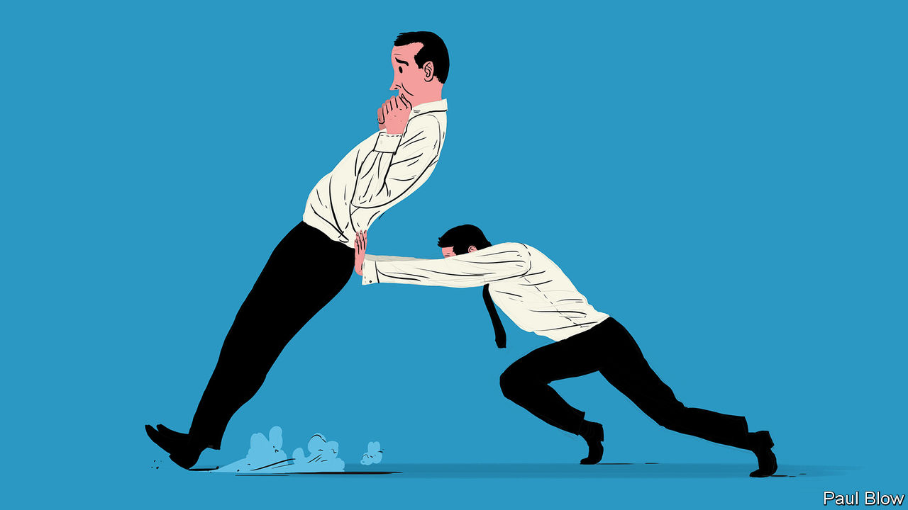

###### Bartleby

# Employees and employers both face trade-offs as offices reopen 

##### Back on the chain gang 

 

> Aug 1st 2020 

REMEMBER THE 7am alarm? The rushed goodbye with spouse and children as you dash out of the house? The nervous patting of pockets to check for keys, season ticket, security pass and phone? And the clogged traffic or crowded train carriage?

Most office workers have escaped those familiar rituals for the past four months. But offices are slowly reopening again. And governments are keen to lure workers into the cities, where they can spend their money and help to revive battered economies.


A group of academics led by Ethan Bernstein of Harvard Business School has been surveying American workers during the crisis*. It found that many felt they could be just as productive at home as they had been at the office. In terms of job satisfaction, a small wobble in the first few weeks of lockdown eased as workers adjusted to new routines. But once that adjustment was made, satisfaction increased. Stress levels have fallen by more than 10%. That despite the fact that workers toil for longer: an analysis of one technology company showed that working hours have increased by 10-20% during the pandemic.

That contrasts with less positive results of previous case studies of home-working. Mr Bernstein and his colleagues suggest that the main difference this time is that all employees have been forced into the same situation. In the past, those who worked at home were in the minority, often felt excluded from the group, and so were less likely to identify with the company.

If they were right, then this problem may reassert itself when office work resumes. At the moment, those who have returned to the office are in a minority, comprising those who find it most difficult to work at home. But the balance may shift as time goes on, perhaps because people become more relaxed about the virus, or because people will miss the fellowship of their colleagues. At that point those who remain at home may start to feel isolated.

The emotion that is most likely to lure workers back to the office is paranoia. The pandemic may have caused managers to realise who is indispensable and who isn’t. Bartleby realises he is entirely dispensable: an amuse bouche between the meaty stuff of structural reform and vaccines. Fail to amuse enough bouches and he will be shuffled into retirement. Millions may reason the same way. When the number of those back at work reaches a critical mass, the rest may be obliged to follow suit.

The trade-off for employers is rather different. Most companies will be thinking about whether they need all that expensive office space. If they do want to lure back their employees, they may have to spend a lot on contactless, socially distant office design to keep their workers safe, such as doors that open automatically.

Some firms may be worried about security. On July 27th a British standard-setting board issued guidance for financial firms about the security risks of fixed-income and currency traders working at home. Other companies may worry about the long-term impact of home working on productivity. One missing element may be the casual interaction that occurs between employees outside formal meetings—those chats by the fridge may spark ideas or suggest new ways of co-operating. Indeed, employees may find it more difficult to build relationships throughout the company without meeting colleagues in person.

This will be particularly difficult for new employees. It is not always easy even for those who have been doing their job for a while to perform the same tasks at home. And newcomers must adjust to a firm’s culture, which usually happens by picking up subtle cues from the people around them. Companies may bombard them with training modules and video chats—“onboarding”, in the jargon of human-resources departments. But that may be no more useful than reading a manual as your only preparation for trying to ride the winning horse in the Kentucky Derby.

Given the state of the global economy it will take time before most companies hire a lot more employees or lower employee interaction weighs on corporate performance. With many employees happy to work from home, that may mean no great rush to repopulate the office. You may not have to resume your morning routine until 2021.

* “The implications of working without an office” by Ethan Bernstein, Hayley Blunden, Andrew Brodsky, Wonbin Sohn and Ben Waber, Harvard Business Review, June 2020

Editor’s note: Some of our covid-19 coverage is free for readers of The Economist Today, our daily . For more stories and our pandemic tracker, see our 

