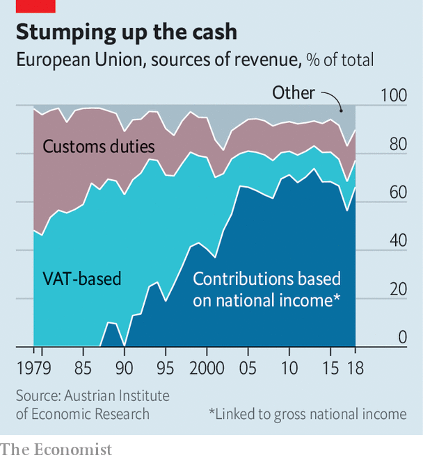

###### Filling the coffers

# The EU’s recovery fund revives a debate on common taxes 

##### But for every tax proposed, there is a national veto 

 

> Aug 1st 2020 

NOTHING IN THIS world is certain, mused Benjamin Franklin, except death and taxes. He never had to contend with the European Union’s unanimity rule. Eurocrats have long sought to bolster the EU’s budget with “own resources”—ie, revenues that accrue to it, rather than cash handed over by member countries on the basis of national income. But almost every attempt to centralise taxation has fallen foul of a national veto. The last big reform to EU revenues was over three decades ago.

Some think the club’s coming borrowing splurge will revive the debate. On July 21st the EU’s 27 national leaders agreed to allow the European Commission to borrow up to €750bn ($880bn) and dish out the proceeds, more than half in the form of grants, to help countries recover from the covid-19 recession. Repayment will start in 2028; new “own resources”, the leaders said, should contribute. Once-sceptical members are now keener. “Countries see more concretely that taxes will either have to be collected by the EU or included in national contributions,” says Mario Monti, a former Italian prime minister who led an inquiry into own resources in 2017. For fans of “more Europe”, common taxes on top of common debt would mark a decisive step towards fiscal union.


An EU levy on plastic waste may funnel €7bn a year towards the budget from 2021. But beyond that, the commitment is thin. The logic of vetoes has not changed, notes Eulalia Rubio at the Jacques Delors Institute, a think-tank. Every proposal is opposed by one government or another. One idea is to direct revenues from the EU’s carbon-trading scheme to Brussels. But that might deprive national treasuries of income; Germany and Poland are sceptical. Another idea is a “single-market” tax on companies. But the Dutch and the Irish are reluctant to squeeze firms. Some members have long pledged a tax on financial transactions. But as James Tobin, its intellectual godfather, supposedly said, the levy is like the Loch Ness Monster: the idea occasionally pops up then disappears for years.

National vetoes might make taxing foreigners look attractive. Leaders said they would try to implement two such levies by 2023: a “carbon border-adjustment mechanism” (a tariff on climate-unfriendly imports), which could raise €5bn-14bn a year, and a less lucrative levy on (mainly American) tech firms. Yet these face problems too. The border mechanism is devilish to design and will be challenged at the World Trade Organisation. America’s opposition to a digital tax has stalled a parallel process at the OECD, and given pause to governments trying to impose national versions.

 


Contributions from members based on national income have long made up the bulk of the EU’s budget (see chart). Every seven years countries grapple over minor adjustments to it; the summits are bruising, but governments retain control. Introducing fresh own resources would jolt them out of such zero-sum thinking, says Valérie Hayer, a French member of the European Parliament, and give heft to common priorities, such as climate. The parliament, which must approve last week’s deal, will seek to ensure that governments’ vows on own resources are not “empty”, she adds. Yet it cannot force their hands.

If the own-resources discussion flops, countries could simply pay more into the next budget to repay the recovery-fund debt. But history shows that governments under fiscal pressure prefer to cut the EU’s spending, says Ms Rubio; common endeavours such as research were slashed to preserve the recovery fund last week. Still, a lot can happen before 2028. For the EU to borrow and redistribute hundreds of billions of euros would have seemed unimaginable a year ago. The topic of own resources “was never sexy”, says Mr Monti. “Now it is beginning to become so.” ■

Editor’s note: Some of our covid-19 coverage is free for readers of The Economist Today, our daily . For more stories and our pandemic tracker, see our 

