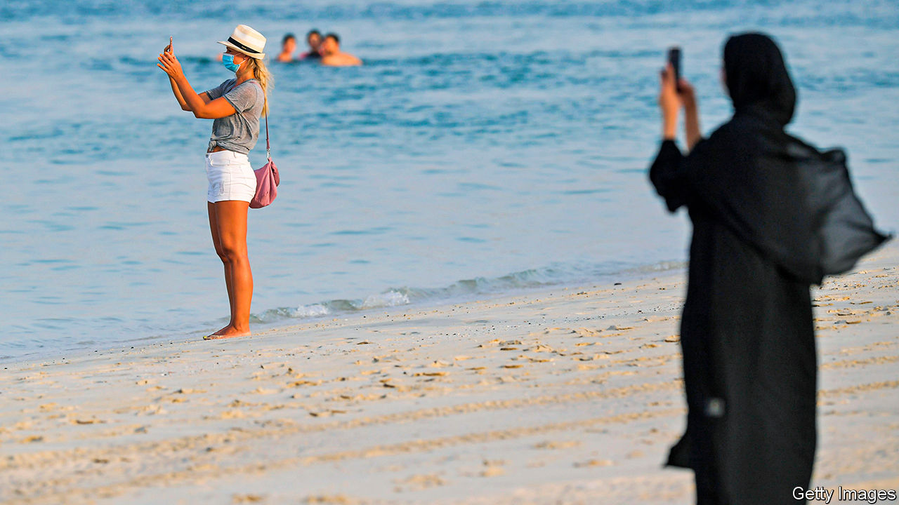

###### Viral vacations

# What it’s like to go on holiday in Dubai during a pandemic 

##### A package deal includes airfare, hotel—and funeral insurance 

 

> Aug 1st 2020 

THE LIFEGUARDS sweating in masks and latex gloves sometimes looked in need of rescue themselves. For much of the week it was 42°C in the midday sun, with the palpable humidity making it seem hotter. One afternoon’s sunbathing was interrupted by a sandstorm that turned the sky grey. “It’s like a dream,” grins a Dutch woman sipping a cocktail by the pool, her ice long since melted.

In normal times jetting off to Dubai in July is an act of masochism. Summer weather is hot enough to bake cookies on a parked car (as YouTube videos prove). Citizens and well-paid expats flee to cooler climes. Five-star hotel rooms that cost 1,000 dirhams ($272) a night in high season go for a third of that.


These are not normal times. Dubai allowed tourists back on July 7th, one of the first destinations to open its doors after covid-19 slammed them shut. Visitors are welcome from anywhere with only a coronavirus test; from August 1st arrivals from hard-hit countries will need two. Officials call it a calculated risk: their economy needs travellers. Last year Dubai took in 17m tourists, whose spending made up 12% of GDP.

Tourists are not exactly flooding in yet. A rental-car clerk at the airport signs up only one customer a day. Most hotel guests are residents on “staycations”. Still, a trickle of foreign visitors desperate for a trip—a diplomat posted in Bangladesh, a group of women from Ukraine—arrived in July to endure the heat.

Masks are mandatory in public, with a 3,000-dirham fine for scofflaws. Some hotels have done away with valet parking, making guests walk (quelle horreur!) to car parks. Diners may be shamed into skipping a fourth round of crab legs at lavish buffets that are no longer self-service. Bars may serve alcohol only with meals, ostensibly to stop people from lingering in high-risk settings (in practice a lonely bowl of edamame can suffice as a “meal”). At the door to a seaside Mexican restaurant, a British couple wondered if their lobster-pink sunburns would trip the infrared thermometers used to check diners’ temperatures.

The United Arab Emirates (UAE), of which Dubai is a part, has logged about 60,000 cases of covid-19. At 6,000 per 1m people it ranks in the top quintile of all countries. But the death toll, at 35 per 1m, is well below most Arab and European countries’. Authorities say 90% of cases are asymptomatic. The number may reflect one of the world’s best testing regimes. As of July 29th the UAE had conducted 4.9m tests, equal to nearly half its population, the highest figure per person bar tiny Luxembourg.

Still, other emirates are less gung-ho about reopening. The airport in Abu Dhabi, the UAE’s capital, is shut to non-residents. But Dubai feels its hospitals can handle any imported cases. Emirates, the national airline, offers free health insurance for travellers who catch covid-19. For holidays that do not quite go to plan, the policy will stump up €1,500 ($1,750) towards funeral costs.

Editor’s note: Some of our covid-19 coverage is free for readers of The Economist Today, our daily . For more stories and our pandemic tracker, see our 

