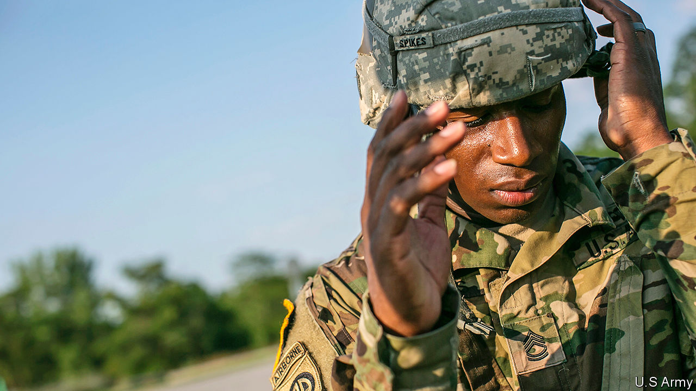

###### Shear-thickening

# A strange material may make protective helmets more so 

##### It absorbs impact energy more effectively 

 

> Aug 1st 2020 

ANYONE WHO has experimented as a child with maize starch and water knows about shear-thickening. A mixture of these substances is easy to stir slowly, but solidifies when you speed the stirring up, only to liquefy again when you stop. It’s fun. But it may also be important. For years, people have been trying to apply the principle to armour. Now, it seems, one group has succeeded. The result will not stop a speeding bullet. But, incorporated into a helmet, it might save the wearer from concussion.

Construction workers, soldiers and sportsmen and women all wear safety helmets that contain impact-absorbing suspension systems based on foam pads or webbing straps. Eric Wetzel of the United States Army Research Laboratory and his colleagues propose replacing these with fabric tubes containing a shear-thickening material that the lab has developed. These tubes, which behave like viscous, speed-sensitive bungee cords, are known as rate-activated tethers, or RATs.


A standard bungee cord’s useful property is its elasticity. This first stores energy as the jumper falls and then releases it as he bounces back up again. A RAT bungee jump, however, would be a one-way trip. RATs absorb energy when stretched in the way that an elastic substance does, but, unlike an elastic, they do not then give it back when released. That would leave a jumper dangling at the bottom.

Dr Wetzel’s team were developing RATs as ankle supports to absorb landing shock for parachutists when they realised that the tethers they were working with had just the qualities required for helmet suspensions: they provide instant strong resistance, which increases with impact speed. Existing military helmets protect in situations like travel over rough terrain, collisions between vehicles and with obstacles, and being thrown around by bomb blasts. RATs offer better protection in all these cases. Current American-army combat helmets are built to withstand impact velocities of three metres a second, with newer models being rated for just over four. Prototype helmets fitted with RAT suspension pass impact tests at five metres a second, which Dr Wetzel says no previous helmet suspension has achieved.

Donal McNally, a specialist in biomechanics at the University of Nottingham, in Britain, says that an ideal helmet would make the best use of the space between shell and head, adjusting its stiffness depending on the speed of impact. The RAT design does just that. However, its success will depend on whether the shear-thickening material can be engineered to have the correct stiffness for both slow and fast impacts. Dr McNally notes also that the suspension will require some clever design because the tethers respond only to tension, not compression, making it hard to cope with impacts from all directions.

Dr Wetzel’s priority at the moment is getting industry to share his excitement about the new technology. Firms selling to civilian customers generally work faster than people on the military side of things, he says, and if consumer applications take off that will generate a manufacturing and design base which can support military ones. To this end, his team has retrofitted an American-football helmet with RAT suspension. Head protection is a huge and increasing concern in gridiron football.

There has been a dramatic fall-off in the number of youngsters taking up the sport because of worries about head injuries. Improved protection might help change that. An independent laboratory tested the helmet and, in the most taxing test, found that it reduced the “severity index” (a measure of the likelihood of a wearer suffering brain injury) from 393 for the helmet’s standard version to 190. One of the laboratory’s operators said he had never seen a result of less than 200 on the test concerned.

Nor are helmets the only possible application for RATs. Dr Wetzel and his team have already tested them as chin straps to hold helmets in place, and as straps for pairs of goggles. RAT-based straps could eventually be useful for everything from hikers’ backpacks to babies’ pushchairs. Whether they will have applications in ships’ ratlines remains to be seen. ■

