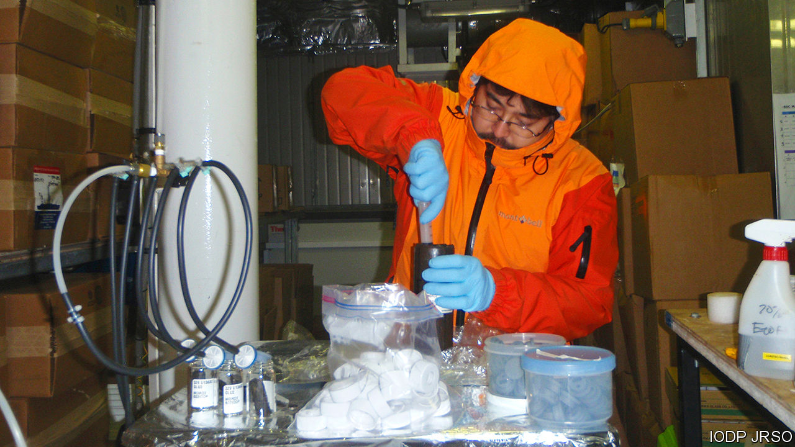

###### Palaeomicrobiology

# Researchers revive bacteria from the era of the dinosaurs 

##### The bugs that time forgot 

 

> Aug 1st 2020 

FAR FROM the life-sustaining light of the sun, the deep sea floor appears barren and desolate. Its appearance, however, belies a thriving bacterial ecosystem that may contain as much as 45% of the world’s biomass of microbes. This ecosystem is fuelled by what is known as marine snow—a steady shower of small, nutrient-rich particles that fall like manna from the ocean layers near the surface, where photosynthesis takes place.

Not all of the snow is digestible, though. And the indigestible parts build up, layer upon layer, burying as they do so the bugs in the layer below. To look at how well these bacteria survive entombment a group of researchers led by Morono Yuki of the Japan Agency for Marine-Earth Science and Technology and Steven D’Hondt of the University of Rhode Island studied samples collected in 2010 by the Integrated Ocean Drilling Programme, a decade-long international expedition of which they were part. Their results, just published in Nature Communications, are extraordinary. They seem to have brought back to life bacteria that have been dormant for over 100m years.


For many microbes, burial is an immediate death sentence. Some, however, are able to enter a state of dormancy—slowing their metabolisms down almost, but not quite, to zero. They can remain in this state for considerable periods. But precisely how long has been a subject of debate.

The samples Dr Morono and Dr D’Hondt chose for examination came from a place in the Pacific Ocean where the sea bed is nearly 6,000 metres below the surface. That made drilling a challenge. But the expedition was able to recover sediment cores stretching all the way down to the underlying rock—a thickness of 100 metres in some cases. The oldest material in these cores dated back 101.5m years, to the middle of the Cretaceous period, the heyday, on land, of the dinosaurs.

Examination of the sediments showed that even the oldest still contained a few bacteria. The question was, were these organisms dead or alive? To find out, the researchers incubated the samples, slowly feeding them compounds rich in carbon and nitrogen in order to coax any still-living microbes out of their dormancy.

The results shocked Dr Morono, “At first I was sceptical, but we found that up to 99.1% of the microbes in sediment deposited 101.5m years ago were still alive.” And there was quite a variety of them, too. The team found representatives of phyla called Actinobacteria, Bacteroidetes, Firmicutes and Proteobacteria, all of which are familiar to microbiologists. In one sample (admittedly from a mere 13.5m years ago) they also discovered representatives of the archaea, a group of organisms that resemble bacteria under a microscope, but have a biochemistry so different that they are regarded as a separate domain of life.

Cretaceous Park

To find such living fossils from as far back as the Cretaceous is extraordinary. It is not possible to be sure, given the length of time involved, that they have undergone no growth and cell division whatsoever. But if they have, it will have been minimal given the lack of nutrients in the ooze they were found in. Nor is it likely that they migrated there from layers above. The ooze in question was sealed off by a bacteria-proof layer of chert-like material called porcellanite.

This discovery will therefore throw interesting light on the evolution of bacteria on Earth. It will also raise the spirits of those who hope to find life elsewhere in the solar system. The sediments that will be examined for signs of biology by Perseverance, an American Mars rover which took off from Cape Canaveral, in Florida, on July 30th, are 35 times older than those studied by Dr Morono and Dr D’Hondt, and have not had the protective shielding from environmental degradation that comes from being buried at the bottom of the sea under many metres of overburden. But future Mars rovers will drill beneath the planet’s surface into strata that have had equivalent levels of protection from rock above them, if not from seawater. And a factor of 35, though large, does not sound insurmountable.■

