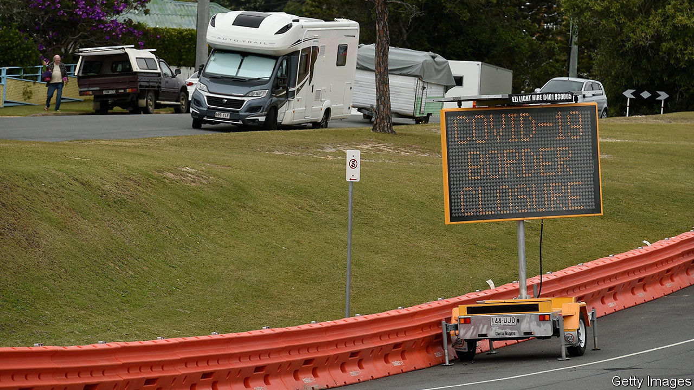
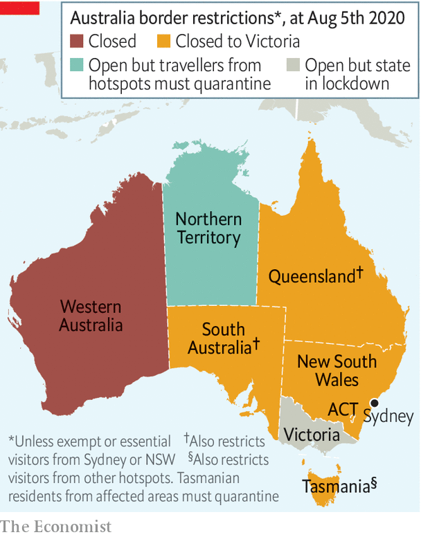

###### Borderline cases

# Australia’s internal travel restrictions are tested in court 

##### Clive Palmer, a mining magnate, thinks they are too severe 

 

> Aug 8th 2020 

TOO MANY roads cross the southern border of the state of Queensland for police to patrol them all. Instead, the authorities have been setting up waist-high plastic barricades to block small streets that lead to neighbouring New South Wales near the sprawling city of Gold Coast. The intention is to prevent people entering Queensland from avoiding police checkpoints. The state, which has only a few active cases of covid-19, is closing itself off to the 15m residents of Victoria, New South Wales and the Australian Capital Territory, in an effort to prevent more from being imported.

Walls of a less visible variety have been erected all over Australia since the pandemic began. All bar one of its eight main states and territories have imposed border controls, either banning certain domestic travellers or forcing them to quarantine in hotels on arrival.

 


Victoria accounts for the vast majority of Australia’s 7,500-odd active cases. Sydney, the capital of New South Wales, has far fewer cases—just a dozen or so each day. But the twitchy governments of other states are nonetheless banning Sydneysiders as well as Victorians (see map).

This has helped to stop the coronavirus spreading to less populated parts of the country. Several states and territories have technically eliminated the disease, meaning that they have no local transmission at all. But imported cases continue to pop up, spurring constant tightening of restrictions on interstate travel.

Tasmania, an island, started making use of its natural fortifications in March, imposing two weeks’ quarantine on all arrivals from other parts of Australia. It had planned to launch a travel “bubble” with other covid-free states on August 7th, but delayed at the last minute. Its borders will be closed until at least the end of the month, and probably longer.

Western Australia, already separated from the rest of the country by a vast desert, shut out all other Australians in April, and has no plans to open back up. Its government makes exceptions only for miners and other “essential” workers.

Australians seem happy to tolerate these fetters to keep the virus at bay. Western Australia’s premier, Mark McGowan, who faces an election next year, hit an approval rating of 89% in a poll conducted shortly after he closed the border. His counterpart in Tasmania fares nearly as well. Annastacia Palaszczuk, Queensland’s leader, who is also approaching an election, boasts that locals stop her in the street “telling me they support our stance when it comes to the borders.”

But the controls have scuppered plans to revive domestic tourism and irritated some businesses. Clive Palmer, a mining magnate from Queensland, was incensed by Western Australia’s refusal to grant him special permission to fly in for business. Mr McGowan, complains Mr Palmer, “has great admiration for countries which have heads of state…with dictatorial powers, but that is not Australia.”

Mr Palmer has sued the government of Western Australia, arguing that the constitution declares that “trade, commerce and intercourse among the states… shall be absolutely free.” The courts have previously ruled that there can be limited exceptions. Mr McGowan believes that a pandemic qualifies. In times like these, he asserts, “constitutional niceties should…go out the window.” But Mr Palmer argues that the state’s sweeping border closure is not proportionate to the threat.

The federal government initially argued for looser restrictions, too. It sent officials to testify in support of Mr Palmer at a hearing late last month. Western Australia’s approach was “indiscriminate” and “uncompromising”, argued Scott Morrison, the prime minister. A more reasonable policy would be to open “in a staged, sensible, jurisdiction-by-jurisdiction way”, suggested the attorney-general, Christian Porter.

But the federal government has since withdrawn its support for Mr Palmer. The prime minister explained that the commonwealth had “taken into account the changed state of the pandemic” and the “high level of concern” about covid-19 in Western Australia. In other words, with infections rising and voters feeling scared, Mr Morrison’s Liberal Party is not planning to go to bat for liberal principles. ■

Editor’s note: Some of our covid-19 coverage is free for readers of The Economist Today, our daily . For more stories and our pandemic tracker, see our 

