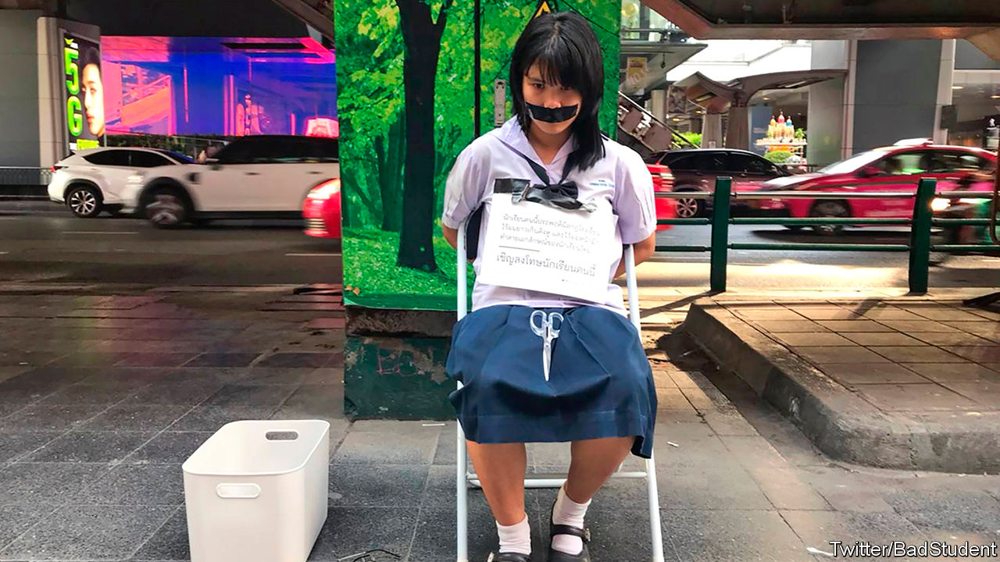

###### Cold cuts

# Thai pupils fight for the right to be hirsute 

##### Protests against strict dress codes in state schools are growing 

 

> Aug 8th 2020 

AT A BUSY intersection in Bangkok 15-year-old Benjamaporn Nivas sits in her school uniform with her hands bound behind her and her mouth taped shut. A sign hanging from her neck reads “This pupil violates school rules by wearing her hair long, past her ears and with a fringe. Please punish her.” On Ms Benjamaporn’s lap lies a large pair of scissors to help passers-by fulfil the request by administering a more suitable hair-do.

When Ms Benjamaporn (pictured) appeared in this way in late June, she was not actually being punished by her school, but rather was trying to draw attention to the humiliating hair-related discipline teachers in Thailand often inflict on students. She was, predictably, punished for doing so, by the police, who forced her to abandon her protest within hours. A week later she and other members of a campaign group called “Bad Student” had submitted more than 300 complaints to the ministry of education on behalf of pupils who had been given haircuts by their teachers over the previous four months alone.


The enforcement of uniform hairstyles—crew-cuts for boys and fringeless bobs for girls—dates to a dress code introduced in 1972 by Thanom Kittikachorn, a military dictator who was later toppled in a student-led uprising. The dress code was subsequently relaxed, and as recently as May the education ministry reiterated that rules on hair and attire are up to schools, but many remain extremely strict.

Teachers often shear pupils ineptly on purpose. Photos and videos of haphazard or lopsided cuts administered by zealous educators abound on social media. A student in Yasothon province in north-east Thailand had a T shaved into his hair as punishment for refusing to cut it shorter. Another in Sisaket had half her locks trimmed in front of the whole school. “One side was long, while the other was short. I was embarrassed,” she told local reporters.

Pupils argue that the issue goes beyond fashion. “It is about having rights over our bodies and reforming an ossified education system. If you do not prostrate yourself or obey the ‘elders’ you are deemed bad,” explains Ms Benjamaporn. Netiwit Chotiphatphaisal, a university student who caused a stir in 2016 by refusing to prostrate himself before the statue of a former king, describes such practices as “oppression resulting from decades under the military disguised as traditions”. In 2018 an official at the education ministry told local papers: “It is to the benefit of the military government and conservative members of the ruling class that young Thais learn a rigid system from an early age.”

Yukti Mukdawijitra of Thammasat University believes that public punishments are a way to embed a culture of unquestioning obedience to authority. Social media, however, have given pupils a way to fight back. The generals who run Thailand have in recent years been clamping down on dissent, banning nettlesome political parties and tightening restrictions on online criticism. But young Thais do not seem to like being told what to do—and some, at least, are not afraid to say so.■

