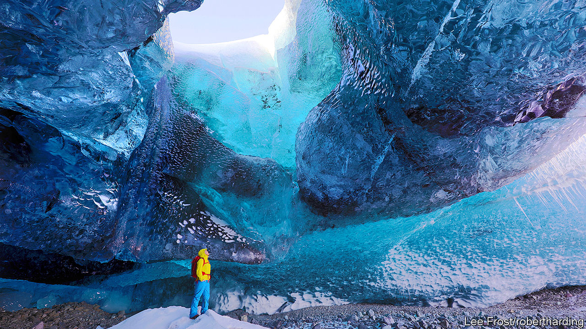

###### A glacier’s pace

# A haunting meditation on climate change in Iceland 

##### “On Time and Water” is part memoir and part scientific analysis 

 

> Aug 8th 2020 

On Time and Water. By Andri Snaer Magnason. Translated by Lytton Smith. Serpent’s Tail; 352 pages; £16.99. To be published in America by Open Letter in March 2021; $26.

IN AUGUST 2019 an extraordinary plaque was unveiled at Borgarfjordur, in western Iceland. It commemorates Okjökull, the first of the country’s glaciers to be completely lost to climate change. Okjökull was declared “dead” in 2014, when it was no longer thick enough to flow across the landscape, as it had done for centuries. Framed as “A letter to the future”, the plaque reads (in Icelandic and English):


Along with the date, the memorial carries the words “415ppm CO”: last summer, atmospheric carbon dioxide was measured at 415 parts per million, higher than at any point since humans have lived on Earth.

The text was written by Andri Snaer Magnason, an Icelandic author. As he notes in his haunting new book, “On Time and Water”, the amount of carbon dioxide in the Earth’s atmosphere has soared at shocking speed. At the beginning of the Industrial Revolution, the ratio was about 280ppm; by 1958 it stood at 315ppm. It is now rising by about two to three parts per million every year.

The author’s aim is to give readers a proper sense of geological time, so that they grasp, at a visceral level, how human activity is damaging the planet. He calls the current transformation “mythological”, affecting “the roots of everything we think, choose, produce and believe. It affects everyone we know, everyone we love.”

These high-speed changes, including the rise of the world’s waters, will alter life irrevocably within a more familiar time frame: “All this will happen during the lifetime of a child who is born today and lives to be my grandmother’s age, 95.”

There are plenty of books about the climate crisis. But Mr Andri Snaer Magnason’s perspective on his country’s environment is unique and compelling. His earlier book, “Dreamland: A Self-Help Manual for a Frightened Nation”, was a hymn to Iceland’s highlands and a critique of the government’s decision to build dams to provide power for aluminium smelting. Now he traces his family’s links to the landscape, notably those of his grandparents Hulda and Arni. They were early stalwarts of the Icelandic Glaciological Society, and spent their honeymoon in 1956 investigating the frozen world of Vatnajökull, an ice cap of 8,000 square kilometres—for now, at least—which was almost entirely unexplored in the mid-20th century. In old age Hulda recalls the indescribable smell of the glacier. “When you’re up on Vatnajökull,” she tells her grandson, “everything disappears; you forget everything. An infinite vastness. An absolute dream.”

“On Time and Water” is part family memoir, part scientific analysis, part meditation on subjects as wide-ranging as the “Poetic Edda”—Iceland’s medieval literary treasury—and the role of the Dalai Lama in 21st-century climate politics. The author tries to understand, and tries to make the reader understand, why the climate crisis is not widely perceived as a distinct, transformative event in the manner of, say, the fall of the Berlin Wall or the attacks of September 11th 2001. The fundamental problem, as this book elucidates, is time. Climate change is a disaster in slow motion, and yet “slow” is a great deal faster than many people seem able to comprehend. ■

For more coverage of climate change, register for The Climate Issue, our fortnightly , or visit our 

