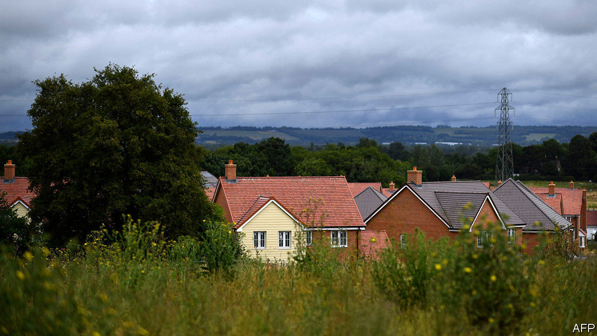

###### Testing, testing

# Boris Johnson’s grand planning reform has weak foundations 

##### It is not the big deal it is cracked up to be 

 

> Aug 8th 2020 

THE TEST of a British government’s radicalism is what it will do to build houses. Successive governments have ducked loosening Britain’s planning system because it means taking on middle-class homeowners who fear spoilt vistas, more traffic and lower house-price growth. David Cameron talked a good game, but watered down his bid to loosen the rules after the Daily Telegraph mounted a vociferous campaign titled “Hands Off Our Land.”

Boris Johnson says he wants to take a wrecking ball to the system. “The time has come to do what too many have for too long lacked the courage to do—tear it down and start again,” he wrote in the foreword to proposals published by the government on August 6th. He has few excuses not to be bold. He has a large majority, an economic crisis, a penchant for construction projects and an office stuffed with self-styled radicals who advocate deregulation as a route to unleashing growth.


The grand plan is to shift from a regime in which councils vet individual houses to an American-style zoning system, which will designate land by type. The government will issue local councils with binding house-building targets, adding up to 300,000 a year nationally and intended to force land onto the market.

“Growth” areas will be earmarked for major development; big projects will get outline approval automatically. “Renewal” areas will be designated for “gentle densification”. And building will be restricted in “protected” areas. Plans should be short and simple, the government says, and stripped of unnecessary assessments that make house-building slower. Section 106 rules, under which councils can haggle for affordable housing or cash from developers, will be replaced by a nationally set tax, which may speed up building.

But the scheme introduces new battle-lines in the system. The big fights will come over how the councils draw up their zones. “Protected” areas could include conservation areas, green spaces or individual gardens, the proposals say. Well-to-do neighbourhoods will lobby to ensure that building happens on the other side of town. “It makes it harder for nimbies to reject houses in the ‘growth areas’, but until the area is designated you haven’t passed Go,” says the boss of a big developer.

What’s more, the government says that the green belt—the tracts of open land that prevent cities such as Oxford, Cambridge and London from expanding—will remain protected. The scheme focuses on local authorities, and doesn’t consider how wide areas such as the arc of land between Oxford and Cambridge should develop.

The proposals would also require new buildings to meet a “beauty” test, with design codes inspired by dinky cottages and Georgian terraces. Roger Scruton, the late conservative philosopher and enemy of much modern architecture, produced a report for the government on these ideas. As now, the communities secretary will be able to intervene to overturn councils’ decisions, and locals will be able to lodge appeals. All this defeats the point of a true zoning system under which “a local authority of Bauhaus-loving modernists would be free to build that,” says Tony Travers of the London School of Economics. “This is an attempt to weld together completely inconsistent ideas…It could end up being more restrictive not less restrictive.” The nimbies aren’t beaten yet. ■

