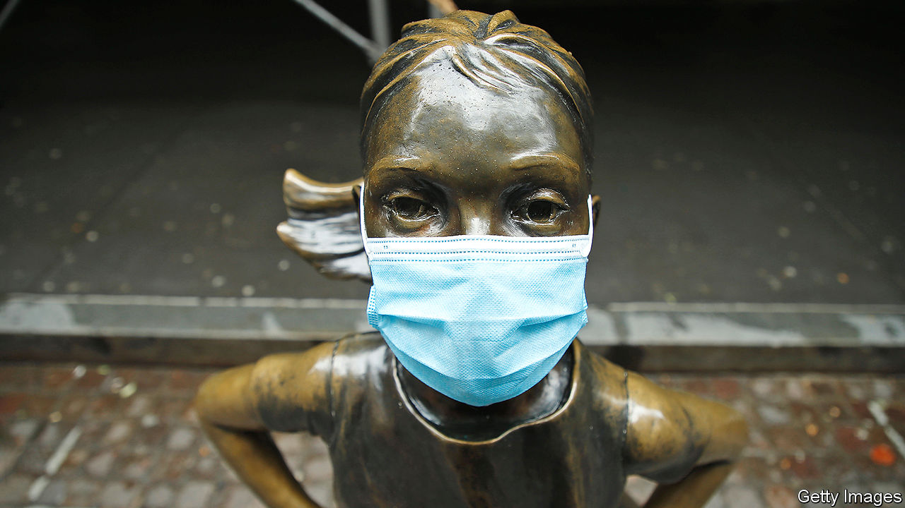
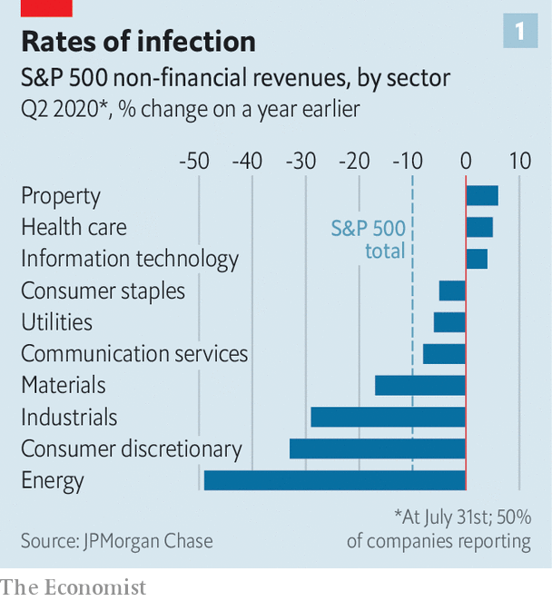
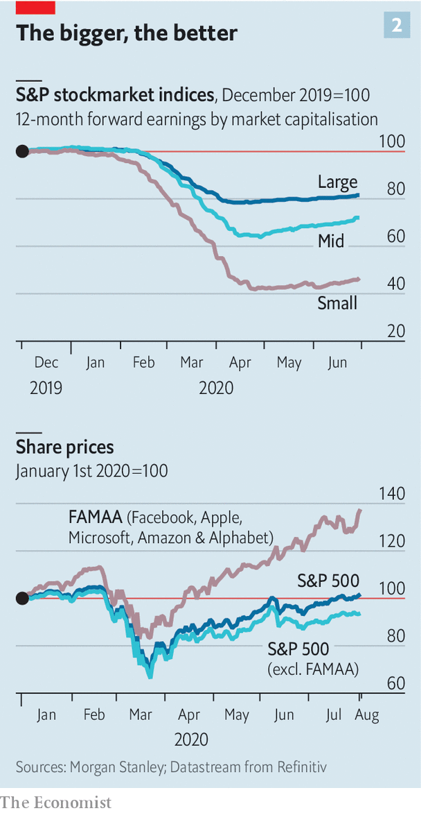
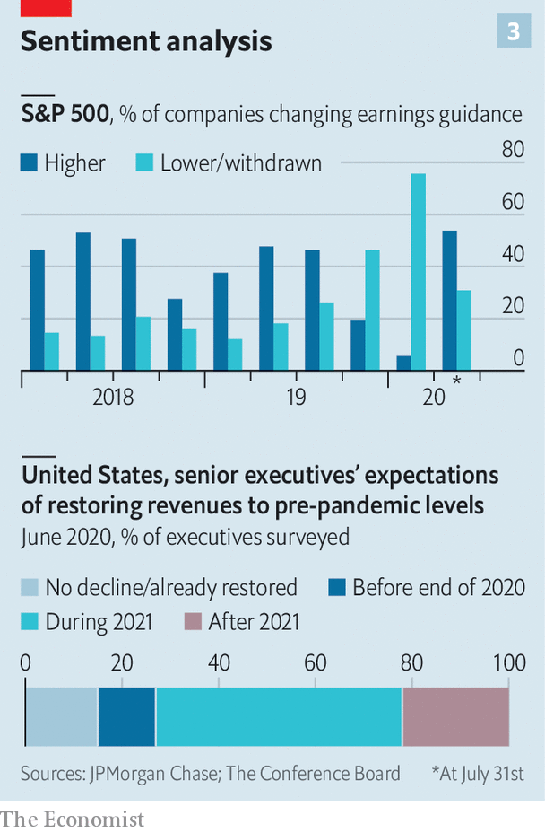

###### The trouble with TINA

# America’s stockmarkets are flying high. Its companies still aren’t 

##### The latest earnings season in America Inc is the weirdest in living memory 

 

> Aug 8th 2020 

Editor’s note: Some of our covid-19 coverage is free for readers of The Economist Today, our daily . For more stories and our pandemic tracker, see our 

BOB CHAPEK, Disney’s boss, sounded a cheerful note as he announced the entertainment giant’s quarterly results on August 4th. Its newish streaming service, Disney+, has acquired over 60m subscribers in less than a year, one-tenth the time it took Netflix to amass such an audience. “Mulan”, an upcoming blockbuster, will be released on Disney+ in September. “Despite the ongoing challenges of the pandemic, we have continued to build on the incredible success of Disney+ as we grow,” Mr Chapek intoned. The company’s share price jumped by 5%.

If you tuned out the first part of Mr Chapek’s statement—and six months’ worth of covid-19 news—you might conclude that Disney just had a bumper quarter. In fact, as its theme parks shut down, cinemas emptied and battered advertisers stinted on commercials on its television networks, the company lost $4.7bn. The reason for the market chirpiness is that things could have been far worse.


Disney’s experience sums up that of America Inc more broadly. Investors have been casting about for any signs of a rebound from the pandemic-induced recession. Real GDP shrank at an annualised rate of nearly 33% in the second quarter. And yet, with interest rates—and thus returns on safe assets like Treasury bonds—close to zero, money has poured into equities. American share prices have risen by more than 40% from their trough in March. The S&amp;P 500 index of big firms is near an all-time high; the tech-heavy Nasdaq market reached it on August 4th. The feeling among investors that “there is no alternative” to stocks is so pervasive that they have dusted off an old acronym: TINA.

In one way, the latest quarterly results justify a degree of optimism. Three months ago the situation was so uncertain that many firms, not just in America, refused to offer their habitual guidance about future earnings—in some cases for the first time ever. Bereft of milestones, analysts slashed profit forecasts. Now it seems they may have erred on the side of gloom. Jonathan Golub of Credit Suisse, a bank, calculates that for those firms which have already reported their results for the most recent quarter—a group representing 84% of the S&amp;P 500’s market capitalisation—earnings have beaten hyper-bearish estimates by a total of 24%.

Bulls see other hopeful signs. After a plunge earlier this year, capital spending grew at its fastest monthly pace since Morgan Stanley, an investment bank, began tracking it in 2004. New orders for factory goods rose by 6.2% in June. JPMorgan Chase, a bank, believes that a global “synchronised cyclical recovery from the covid-19 crash has started”, with manufacturing leading the way. “Recovery is happening,” echoes Michael Wilson of Morgan Stanley, pointing to promising advances in treatments and vaccines for covid-19.

Hang on a minute. The green shoots offer hope and earnings may have beaten expectations. But, as David Kostin of Goldman Sachs, another bank, notes, the bar was very low. By his reckoning, in a typical quarter about 5% of firms produce earnings per share above forecasts. That this quarter’s figure may be closer to 25% is merely “kabuki theatre” of expectation management, he says. If the bottom fell out of the economy in the second quarter, as official statistics imply, then the private sector must be dragging it down.

 


Quarterly sales fell by an average of 10%, year on year, at S&amp;P 500 companies which reported by the end of July. Some industries suffered a bigger hit. Revenues plunged by half at energy firms, a third for producers of durable goods and other non-staples, and by nearly as much at industrial firms (see chart 1). Overall, earnings per share contracted faster at American firms, by a third year on year, than those at historically less profitable European ones, whose profits fell by less than a quarter.

The crunch is worse at smaller firms. Mr Kostin calculates that, as of August 3rd, quarterly earnings for S&amp;P 500 companies were down by about 35% year on year. For those in the Russell 2000 index of smaller firms, they had nearly evaporated entirely.

 


The collective headline numbers for big companies are also flattered by the success of America’s technology giants (see chart 2). Facebook, Apple, Microsoft, Amazon and Alphabet are thriving, by making life possible for remote workers, online shoppers and anyone who seeks solace online. The quintet, which together represent 22% of the S&amp;P 500’s market value, up from 16% a year ago, has generated stockmarket returns of 35% so far this year, against -5% for the other 495 firms in the index.

This dominance has boosted the market—and investor confidence. But it poses a risk for the unwary. Mr Golub says that unlike the flaky internet firms that collapsed when the dotcom bubble burst two decades ago, the five tech titans have solid business models, little debt and strong revenue growth. But should a speedy recovery materialise, money could flow out of tech and into currently unloved sectors such as heavy industry.

Another underappreciated threat to share prices comes from government. Tobias Levkovich of Citigroup, a bank, points out that the “womb to tomb” safety net in Europe provides more generous and longer-lived relief in a downturn than America’s more threadbare benefits. Congress seems poised to reduce stimulus spending that has supported firms keeping furloughed workers on their payrolls and paid unusually plush unemployment benefits, which recipients could spend not just on rent and bills but also on other, less vital things. Mr Levkovich calculates that taxpayers financed between $50bn and $75bn of firms’ labour costs associated with furloughed workers. If such support is withdrawn in the second half of the year, he warns, “we must worry that the upside earnings surprises are not repeatable.”

 


For the time being the market thinks they are. CEOs themselves are partly responsible for this, by tirelessly spinning investors a positive yarn. S&amp;P 500 firms which forecast higher future earnings now outnumber those offering lower or no guidance by two to one (see chart 3). In the previous quarter the coy and pessimistic were 15 times as numerous as the sunny.

Yet when the Conference Board, a research group, recently surveyed hundreds of American bosses anonymously, it encountered much more pessimism about the timing and robustness of economic recovery than among CEOs in Europe and Asia. Whereas 40% of chief executives in China see sales returning to pre-pandemic levels by the end of 2020, only 12% of American bosses do. The Conference Board concludes that a return to pre-coronavirus revenues is “at least a year or more down the road” and that “risk and volatility will remain high for the foreseeable future.” Sooner or later investors seduced by CEOs’ public sweet talk—and by TINA—will come to their senses. Won’t they? ■

