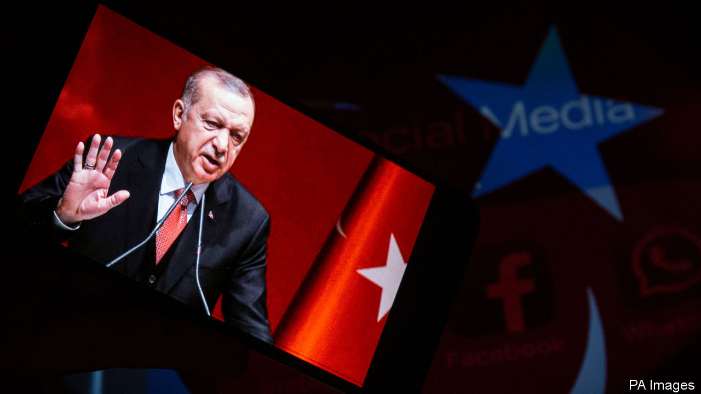

###### Sultan of censorship

# Turkey’s president cracks down on social media 

##### Uppity netizens insulted Recep Tayyip Erdogan and his son-in-law, the finance minister 

 

> Aug 8th 2020 

TURKEY’S PRESIDENT, Recep Tayyip Erdogan, has already neutered the traditional media, putting critical journalists out of work or behind bars and using friendly tycoons to take over the country’s top newspapers and news channels. Now he has taken aim at the internet.

His latest assault came on July 29th when parliament adopted a law designed to force social-media giants to comply with Turkish requests to remove content. Henceforth, companies such as Twitter and Facebook will have to appoint local representatives to process such requests within 48 hours. Those who do not comply will face bans on advertising, fines of up to $6m, and eventually bandwidth cuts of up to 90%, which would make them unusable.


The government says the law will protect social-media users from abuse and disinformation. Critics say it will become a powerful censorship tool. Turkey already blocks at least 400,000 websites, says a report by the Freedom of Expression Association, a rights group, and churns out more Twitter and Reddit content-removal requests than any other country. Armed with the new rules and a pliant court system, the government will lean even harder on such companies to take down politically inconvenient material, including old posts, says Yaman Akdeniz, a lawyer. “Articles will vanish from archives,” he warns. “They will try to delete the past.”

Others are worried about provisions requiring user data to be stored locally. “The law says the government can access these data only when they concern a crime or a national-security issue or similar reasons,” says Ahmet Sabanci, a tech writer, “but in Turkey these kinds of laws are bent easily.”

With most of the mainstream press in Turkey now in the hands of Mr Erdogan’s allies or businessmen who depend on his government for large contracts, social media have been a sanctuary for dissent. Police are now bursting into that sanctuary. Over the past three years, hundreds of people have been detained for criticising Turkish military offensives against Kurdish insurgents in Syria. Dozens have been investigated on charges of attempting to “destabilise the economy” with their tweets. Where targeted bans do not suffice, the government uses blanket ones. Wikipedia was banned between 2017 and this January. “I’m a lot more nervous,” says a popular Twitter commentator, preferring not to be named. “I feel like the frog in the pan when the water is starting to boil.”

For the thin-skinned Mr Erdogan, the motivation seems to be at least partly personal. Tens of thousands of cases have been opened against people accused of “insulting” Turkey’s leader, mostly on social media. (These include a user who compared Mr Erdogan to Gollum, a power-worshipping imp.) At least 11 were detained on July 1st for posting crude comments about the president’s daughter and his son-in-law, Turkey’s finance minister, after the birth of their new child. “This is why we should bring this to our parliament,” a furious Mr Erdogan said, “to remove these social-media networks completely, to control them.” He seems to mean it. ■

