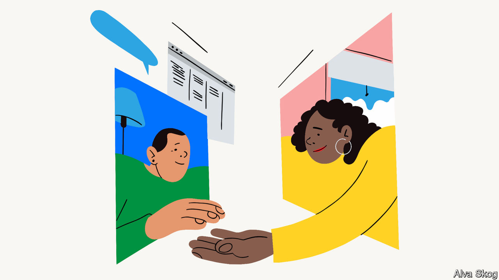

###### The globalisation of gay rights

# As more gay people come out, tolerance will spread 

##### Though in some countries to be open is still to risk death 

 

> Aug 8th 2020 

PHILIP LARKIN was only half-wrong. Sex didn’t begin in 1963, as the poet joked; for a hefty minority of Britons it was four years later—legally, at least—when Parliament nixed the law prohibiting gay sex. In this age of rainbow flags and pride parades, it is easy to forget how few lesbians and gays could be open about their sexuality until relatively recently. One who was, the journalist Peter Wildeblood, was “no more proud of my condition than I would be of having a glass eye or a hare lip”. Two years after decriminalisation in England and Wales, the Stonewall riots in New York popularised a term for this: coming out.

Since then, the closet has burst open. Actors and the characters they play are openly gay. Leo Varadkar, prime minister of Ireland until June, has a male partner; Serbia’s prime minister is a lesbian, as are the mayors of Chicago and Bogotá, the Colombian capital. Yet coming out remains a pivotal moment of self-recognition for gay teenagers. Thanks to the internet, they are finding the means and the confidence to do so in more places than ever before, and at a younger age than in previous generations (see ).


Yet there are plenty of places where being gay remains taboo. Even in liberal countries, gay members of some religious and ethnic minorities have a tough time. Gay sex is still illegal in 68 countries, and punishable by death in a dozen. Lesbian, gay, bisexual and transgender (LGBT) folk are subject to extra-judicial violence in many places, from beatings in bars to the gang-rape of lesbians by men who imagine that this might, as they see it, “cure” their sinful orientation. It would be reckless to encourage people to come out where to do so is to court injury or death. In all but the most repressive places, though, people are opening up. The International Lesbian, Gay, Bisexual, Trans and Intersex Association, a lobby group, has members in 164 countries. Pride parades march in China, Paraguay and the Faroe Islands.

Urbanisation helps. In big cities, every tribe has its place. You can play bingo with drag queens in Moscow, dance in gay bars in Nairobi (where gay sex is still illegal) and use gay hook-up apps in Beijing (where until 1997 gay people were jailed for “hooliganism”). Even in remote places, smartphones help teenagers discover that they are not alone. And that knowledge gives more of them the courage to come out. In 1985 barely a fifth of Americans had an openly gay relative, friend or colleague. Now 87% say they know someone gay or lesbian.

LGBT people coming out brings the extra advantage of spreading tolerance. Not always, of course. But sceptics and bigots are likeliest to change their minds when they realise that someone they know is gay. Familiarity reveals that homosexuals are just as human—and humdrum—as heterosexuals. It is easy to demonise the imaginary gay people depicted in a brimstone sermon; but much harder to fear the lesbian actuaries next door, or the gay dads cheering their daughter’s softball team. Pride parades, with their loud floats and copious flesh, are lots of fun. But learning that a sober-suited colleague happens to be gay is more likely to win over a conservative. One of the founders of Stonewall, a British gay-rights charity, said the name initially helped secure meetings with government ministers. To gays, it meant a riot; to the uninformed, it sounded like a firm of architects.

In 2002 about half of Americans said they tolerated homosexuality; now nearly three-quarters do. One study found that support for same-sex marriage increased rapidly in 2006-10 among Americans with a gay or lesbian friend, but fell among those with none. Even in countries where a majority remains hostile, change is coming. The proportion of Indians who said that gay people should be accepted rose from 15% in 2013 to 37% last year. Though an attempt to overturn Kenya’s gay-sex ban failed last year, the publicity it generated persuaded more locals to come out. That helps explain why over the same period the share of Kenyans who tolerate homosexuality nearly doubled, to 14%. In most places the young are more gay-friendly than the old, so discrimination will surely dwindle as the prejudiced pass away.

From Iran to Uganda, autocrats often caricature homosexuality as a foreign vice. Some even claim that there are no gay people in their country. In such places the most effective campaigners are, therefore, local gay people. The best thing liberals elsewhere can do is to provide financial and legal support to gay-rights groups and grant asylum to those who flee persecution.

Got to let it show

Mr Wildeblood’s motivation for writing a book in 1955 in which he baldly stated “I am a homosexual” was, he said, “to turn on more lights, revealing, in place of the blurred and shadowy figure of the newspaper photographs, a man differing from other men only in one respect.” The rest of those lights are coming on, one by one. ■

