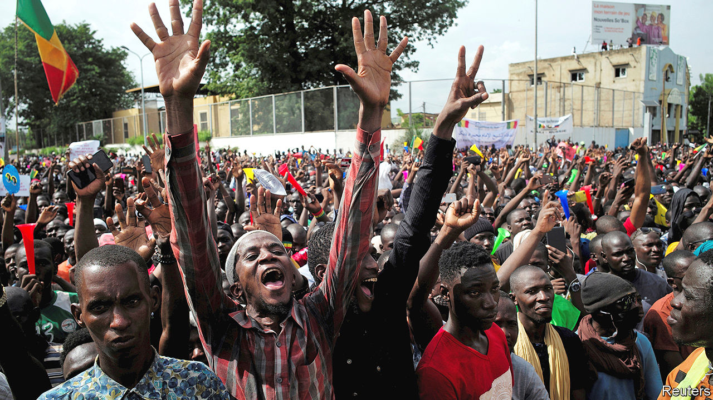

###### Fear and loathing in the Sahel

# The challenge of mediation in Mali 

##### A short-term political deal may store up more trouble 

 

> Aug 8th 2020 

“WE ARE PROTESTING for Mali,” says Cheick Oumar Kanté on the streets of Bamako, the capital, “because Mali is on the road to extinction.” Since June 5th tens of thousands have taken part in demonstrations organised by a group of opposition leaders called the M5-RFP and bolstered by the moral authority of a charismatic imam, Mahmoud Dicko. The protesters have been complaining angrily about the growing jihadist insurgency, Mali’s dire economy and recent dodgy elections. “Nothing works in this country any more,” says Ousmane Dembele, a demonstrator. Their main demand is for President Ibrahim Boubacar Keïta to resign.

The government’s response has lurched between concessions and violence. The protests had been largely peaceful until the weekend of July 10th, when security forces fired on the crowds, killing at least 11 people and wounding 85. Protesters lit fires in the National Assembly building and occupied the state television premises. After a truce for the Muslim holiday of Eid al-Adha, protests have been starting up again.


Western governments are nervous too, since Mali is at the core of Europe’s fight against jihadists in the Sahel. France has 5,100 troops in this fragile region; in 2012 it intervened when jihadists almost toppled Mali’s government. France’s allies, including America, Britain and Germany, have also sent forces, some in a contingent of 15,000 UN peacekeepers. EU troops are also training local soldiers. Yet if Mali’s government is shown to lack legitimacy, Western efforts are more likely to fail.

Dodgy legislative elections in March and April triggered the protests. The poll, which had been delayed for 17 months, was rushed through as the covid-19 pandemic began to spread. Turnout was only 35%. When the results were first announced, the ruling party got 41 of 147 seats, and lost almost all its seats in Bamako. A week later the constitutional court awarded it another ten seats, smoothing the path to a ruling coalition and reinstating close allies of Mr Keïta, one of whom has now been elected president of the national assembly. Though the questionable election provided the spark, it was “neither the principal cause nor the motor of the protests”, says Ibrahim Maïga, who is based in Bamako for the Institute for Security Studies.

Much of the anger stems from the government’s inability to stop the violence. In the first six months of this year more than 1,800 people were killed in fights involving jihadist groups and ethnic militias, about as many as were killed in the whole of last year. On March 25th the main leader of the opposition, Soumaïla Cissé, was seized by gunmen, probably jihadists. He has not been seen since. To make matters worse, the French intervention itself is unpopular. One survey found that almost 60% of Malians think that the French forces are in cahoots with the insurgents.

Malians are fed up with corruption, while the economy goes from bad to worse. Karim Keïta, the president’s son, who heads parliament’s defence committee, is a particular target of derision. He resigned from his post after videos circulated on social media showing him cavorting in Spain with scantily clad women.

Yet President Keïta does not fit the mould of those ousted by protests in other parts of the region. He did not come to power through the barrel of a gun. He has been president since 2013 and is not expected to run for a third term in 2023. The main charge against him is that he is out of touch and incompetent. In normal circumstances he would be voted out.

Some now worry that Mr Dicko will use his growing power to push Mali in a more Islamist direction. In 2009 he campaigned successfully against amending a law that compels married women to obey their husbands. He has inveighed against racy Mexican telenovelas broadcast during Ramadan and against sex education in schools.

Other leaders in the Sahel may be more worried that the crisis could spill over into their countries. In late July five presidents from the region flew to Bamako to mediate. They proposed a reform of the constitutional court, a government of national unity, an inquiry into the deaths of protesters, and new elections for 31 seats in parliament that are still disputed. But the MPs who would have to run again rejected the idea. So has the M5-RFP.

The gap between the parties is still wide. Mr Dicko has suggested there may be a way out without the president having to step down. But the M5-RFP still demands he leaves. There are few good options. Most Malian institutions are in trouble. The constitutional court was dissolved in July. The prime minister’s cabinet has only six ministers. The composition of the national assembly is disputed. If the president were to resign, it would mark “a big jump into the void”, says Ibrahim Yahaya Ibrahim, who is based in Dakar for the International Crisis Group, a conflict-prevention NGO. Yet if Mr Keïta were to stay on, violence in the streets might worsen, he adds.

The truce is over. Some protests resumed on August 3rd. Mr Keïta could still seek to forge a compromise with the protest leaders by sacking his prime minister, Boubou Cissé. After all, he is already on his sixth prime minister in seven years. Yet if he merely plays musical chairs among the elite and ignores deeper problems, says Mr Maïga, “it will only delay the next bomb, the next explosion.” And next time the protests could be led by firebrands far more radical than Mr Dicko. ■

