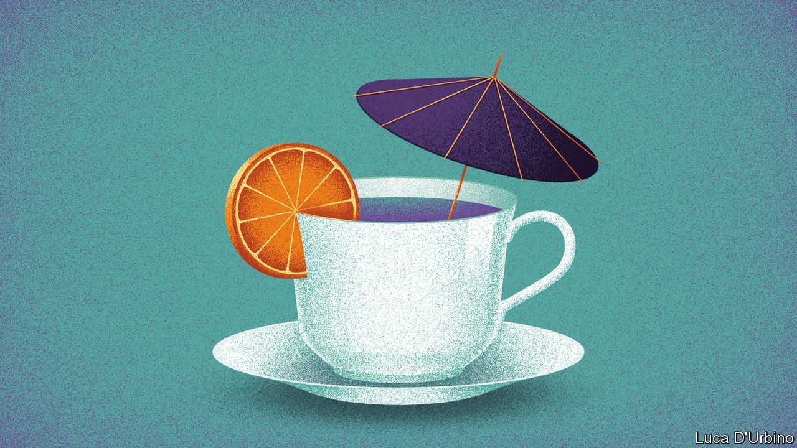

###### Prohibition in a pandemic

# Why Johannesburg restaurants are full of teapots 

##### Clue: it’s not about the rooibos 

 

> Aug 8th 2020 

UPON ARRIVAL at an expensive restaurant near Sandton, Johannesburg’s financial district, nothing feels unusual, at least in this age of covid-19. The maître-d’ zaps a temperature gun at patrons’ masked faces and spritzes their hands with sanitiser. Only when ushered into the dining room does something seem odd: every table has a pot of tea.

South Africans like their rooibos, but the liquid in many tea-cups is a darker red—claret, even. On other tables there are cans of tonic next to teapots. Reality dawns when two young women are given shot glasses of Jägermeister inside their tea-cups.


South Africa banned alcohol sales for the second time this year on July 12th, so as to prevent drunks from taking up precious space in hospitals. But restaurants, which are struggling to stay afloat, are open and customers are thirsty. “Are you serving special teas?” your correspondent hesitantly asks a waiter. “Yes”, he replies, the ripple of a smile just visible from the edges of his mask.

An unscientific sample of local establishments suggests the patchiness of prohibition. A steak house in an affluent suburb also uses teapots for red wine, and puts cans of fizzy apple juice next to glasses of beer. Other joints are more brazen. At a café popular with families, parents keep one eye on their children ricocheting inside a bouncy castle and the other on their ice bucket.

The willingness of South Africans to flout the booze rules is a sign that bans rarely work. It shows that the police are unwilling or unable to enforce them—at least in rich areas. But it also reflects how many South Africans are reluctant to obey laws set by a ruling party that itself shows little respect for propriety.

In recent weeks local journalists have revealed how members of the African National Congress and their families have won juicy contracts for supplying personal protective equipment, despite having little experience in medical kit. Cronyism has been rife for years, but the sight of “tenderpreneurs” coining it is especially galling when thousands are dying. On August 3rd President Cyril Ramaphosa compared such people to hyenas circling wounded prey.

Yet he has done too little to stop the scavengers. More than two years after he took office, South Africans are waiting for prosecutions to be brought against those accused of wrongdoing during the reign of his predecessor, Jacob Zuma. Meanwhile the former president continues to stall his own trial over an arms deal cut more than 20 years ago. It is enough to make one order a cup of tea.

