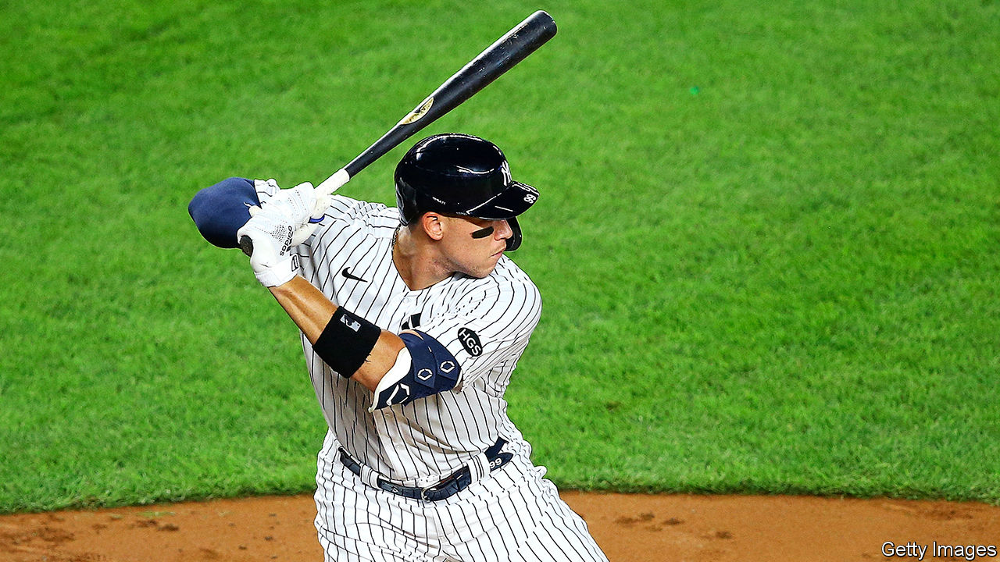

###### Strike two

# Baseball’s faltering restart 

##### America’s favourite pastime is struggling with covid-19 

 

> Aug 8th 2020 

THE CRACK of the bat made an abnormal baseball season feel fleetingly familiar. On August 2nd Aaron Judge, the Yankee right-fielder, hit his second home-run of the game, his sixth in five straight games. The eight-inning moon shot broke a 7-7 tie against the Boston Red Sox, the Yankees’ bitter rival. As the ball soared 468 feet into the stand, the commentators went wild. Your correspondent leapt from her sofa. It was exciting, but weird. No scrum of fans chased the ball in the bleachers, which were devoid of Bleacher Creatures. There were no fans. The crowd cheering was a recording.

Baseball’s season began on July 23rd, four months late because of the pandemic. After just three games, the Miami Marlins’ games were temporarily suspended after 18 players—more than half the roster—and some backroom staff tested positive for covid-19. Five games into its season the St Louis Cardinals were hit by an unrelated outbreak. Seven players and six team staffers tested positive. Rob Manfred, Major League Baseball’s (MLB) commissioner, threatened to shut down the season unless the sport improved its handling of the virus, but he later backtracked. It is hard to imagine the season continuing if a third team has an outbreak. “It’s a little bit of three strikes and you’re out,” says Zachary Binney, an epidemiologist who focuses on sports at Oxford College at Emory University in Atlanta.


MLB has a 113-page protocol manual designed to keep teams virus-free, yet players and staff are still spitting and giving high-fives and fist-bumps. Bob Geren, a Los Angeles Dodgers’ coach, was caught on camera pulling down his mask to cough. Protocols are being tightened and each team must have a compliance officer. Many players and around a dozen umpires are opting out of the season. David Price, a pitcher with the Dodgers, recently tweeted, “Part of the reason I’m at home right now is because players’ health wasn’t being put first. I can see that hasn’t changed.”

Perhaps MLB should have followed the professional basketball and hockey leagues’ bubble model. The National Basketball Association’s teams are living and playing their games, without fans, in Disney World in Florida, while the National Hockey League’s teams are playing in two bubble sites in Canada, which has managed to flatten its curve, unlike its neighbour. Neither league has had a coronavirus case since the bubbles were put in place.

The National Football League, which begins its season in September, is keeping an eye on the MLB’s performance. The nature of football, with its large rosters, contact on every play and huddles, puts its players at risk of covid-19. The time of year it is played, in the autumn and winter, when there might be a second wave, may also prove challenging. The NFL gets a disproportionate amount of its income from television, so it is especially keen for the season to last to the end of the playoffs and the Super Bowl.

Editor’s note: Some of our covid-19 coverage is free for readers of The Economist Today, our daily . For more stories and our pandemic tracker, see our 

