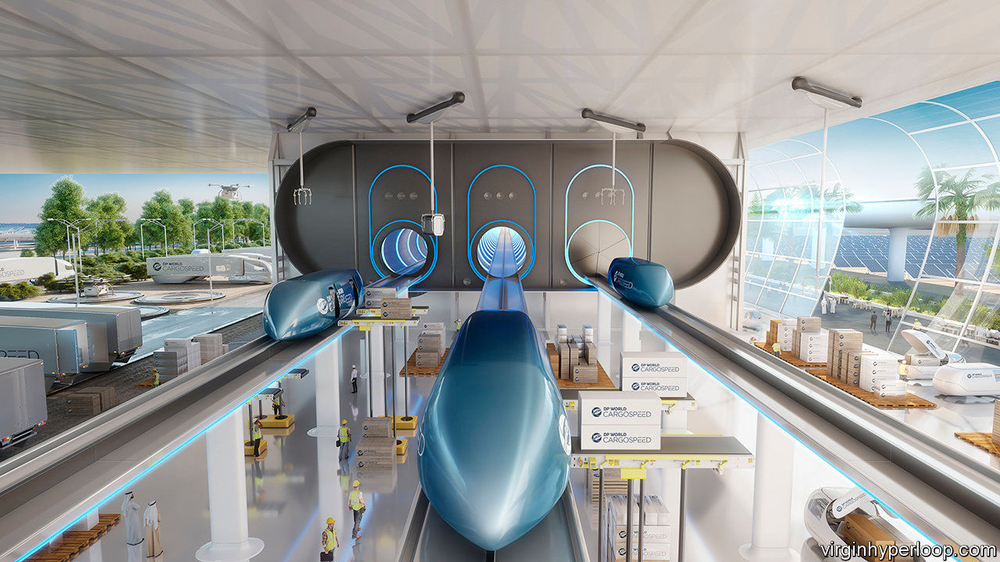

###### Pipes of fancy

# Could dawdling America lead the world in a new form of transport? 

##### Some urban planners in the Midwest think so 

 

> Aug 8th 2020 

FOR DECADES not much has changed in how Americans shift themselves and their goods about. They mostly still rely on cars, lorries, trains and planes that would look familiar to someone visiting from the mid-20th century. Now, various companies are pushing for the regulation of (and public support for) schemes to create public intercity transport within depressurised pipes. A mention of the method, in a House infrastructure bill passed last month, has spurred excitement that these pipe-dreams could become reality.

A hyperloop system involves passengers or freight transported by pods elevated by magnets, which travel within raised pipes. The pods can be propelled at 620mph (1,000kph), says Jay Walder, boss of Virgin Hyperloop One, one of the firms pushing the idea. At that pace “you could move between Columbus and Chicago in 40 minutes”, he says, so covering the 460 miles many hours quicker than by driving and at a cost (and overall carbon impact) that he says would be lower than flying.


His firm runs an experimental centre near Las Vegas, where engineers—including some who worked on the Mars Rover programme—have run over 400 tests using a 500-metre-long pipe. So far they have sent pods flying at 240mph, though slowing down can be tricky. “We’ve shown it can work,” he says. He hopes next to build a 15km pipe to test the higher speeds, possibly near Columbus, Ohio, though Missouri and parts of some western states are also interested. Requirements include flat topography, empty space and no corners.

These schemes are sufficiently advanced for some state and local-government officials to take them seriously. Thea Ewing, of Ohio’s transport commission, says a recent feasibility study showed it could be done. The population is booming in Columbus, which lost all its rail services in 1979, so there is plenty of demand for new transport—for example, to Chicago and Pittsburgh. She says the pipes could come up on state-owned land beside motorways or (where they exist) railways. Another route being considered would link Kansas City and St Louis, both in Missouri.

Why do it? “We see it as something to help convert the region,” she says. Looking ahead to projects that would not be completed until mid-century is common practice for transport planners. A hyperloop could allow spouses to work in different cities while still living together, or Ohioans to pop to Chicago’s fancy restaurants or concert venues for an evening.

In reality, though, such schemes would only be viable if they were useful for transporting goods, too. “Mostly this would be for freight,” says Mark Patton, who oversees transport plans for the Columbus region. Paul Judge, who runs a thriving plastics manufacturer, Axium, in the city, says he would welcome it if it meant he could run a big factory, cheaply, in one spot and ship his billions of units of shampoo bottles, hand-sanitisers and the like to markets in the region.

Who would pay for it? Both private and public funds would be needed. Some public help would come from providing the land, but investors hope for more. Mr Walder says he expects America will eventually see a $2trn national infrastructure plan to help restart the economy. Part of that might throw the Midwest a loop. ■

