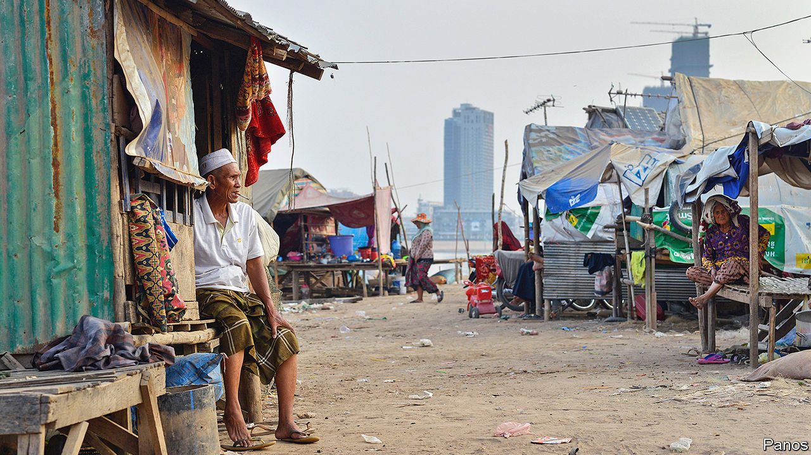

###### Service economy

# Cambodians are bingeing on microfinance loans 

##### The downturn brought on by covid-19 will test the industry 

 

> Aug 15th 2020 

BANGLADESH MAY be the homeland of microcredit, but no country is keener on it than Cambodia. According to its central bank, there were some 160,000 branches of microfinance institutions around the country in 2016—one for almost every square kilometre of Cambodian territory. Almost 2.2m of Cambodia’s 10m-odd adults have a microcredit loan outstanding, according to the Cambodian Microfinance Association (CMA), an industry group. The average debt is $3,320—roughly twice the country’s annual GDP per person. Credit is growing by 40% a year.

The microfinance boom has brought many benefits. An obvious one is a decline in the use of loan sharks. Between 2004 and 2017 the share of households borrowing from formal sources jumped from 8% to 30% while the proportion using informal moneylenders dropped from 32% to less than 6%, according to research published last year by the World Bank. The shift saved people money. The interest rates charged by formal lenders are lower and have been falling for more than a decade, even though some microcredit outfits are purely commercial operations.


All this has made it possible for many Cambodians to fund a new business, obtain an education or pay for urgent medical care. The CMA links growing access to credit to falling levels of poverty. The share of Cambodians living below the national poverty line (earning less than $0.93 a day) dropped from almost 48% in 2007 to less than 14% in 2014—although the main reason for the improvement was Cambodia’s rapid economic growth over that period. Academic research suggests microfinance may have helped improve farming methods and boost living standards for the poorest Cambodians.

But the industry’s breakneck growth may not be sustainable. Household debt has swollen as the size of loans has ballooned. According to the World Bank, the average loan grew “more than tenfold” over the past five years. Larger debts have led to longer repayment periods. “[Cambodia] probably should have had a crisis by now,” admits Daniel Rozas, an adviser to the CMA, “but somehow it hasn’t.”

That may be in part thanks to the efforts of the National Bank of Cambodia, the central bank, to tame the industry. It has raised capital requirements and obliged lenders to maintain hotlines so customers can get in touch directly, if needed, with complaints. It has also introduced rules about how loans should be marketed. The CMA has instituted guidelines for its members, too. And Cambodia has a well-functioning credit bureau.

Some regulations, however, may be exacerbating the industry’s excesses. The central bank’s introduction of an interest-rate cap of 18% a year in 2017 seems to have backfired. Because of the cap, the CMA says, microfinance institutions can turn a profit only by lending more than $2,000. The number of loans of $500 or less declined by 48% after the rule’s introduction, the World Bank estimates. Some fees rose, too.

The CMA says defaults are minimal, with only 1% of loans in serious arrears at the beginning of the year. But there are hints that borrowers are getting into difficulty. The typical loan uses land as collateral, according to a forthcoming paper by W. Nathan Green of the National University of Singapore and Maryann Bylander of Lewis &amp; Clark College in America. Lenders seldom take borrowers to court to repossess land; it is not worth the time and expense for a loan of just a few thousand dollars. But many conscientious borrowers appear to sell their land voluntarily to pay up. Government surveys show that the proportion of people who are landless rose from 32% in 2009 to 51% in 2016. Among the many reasons given for selling land, one of the most common was to repay debts. Given that the government does little to monitor the conduct of lenders, and many land sales are informal, it is hard to tell how voluntary such transactions really are.

Whatever the true state of Cambodians’ finances, they are about to get worse. The garment industry, which until recently employed some 740,000 people, has been particularly badly hit by the covid-19 pandemic, as orders from America and Europe have plunged. Perhaps a third of garment factories have stopped work. Research suggests that each worker in the factories supports three other people, so the effects will ripple across the country. Cambodia’s second-biggest industry, tourism, has been hit even harder.

A farmer in Battambang province gives a sense of the problem. He says that between the downturn brought on by the coronavirus and a recent drought, he is struggling to repay a $600 loan that he took out last year to buy poultry. He relies on a daughter sending part of her wages as a garment-worker to keep making payments—money that is now in doubt.

The government is not blind to the problem. In June Hun Sen, the prime minister, promised to spend about $25m a month to help some 600,000 poor families. The National Bank has encouraged lenders to reschedule or defer payments. The CMA says its members have restructured almost 245,000 loans.

But the few remaining critics of the authorities in Cambodia, which Mr Hun Sen has run for 35 years with ever-increasing repressiveness, clearly consider the growth of debt a weak spot for the government. In April activists called for loan payments and interest accrual to be suspended for three months. In May Sam Rainsy, an opposition politician living abroad, said Cambodians struggling to pay debts should not sell their homes or land. Mr Hun Sen’s advice to lenders was blunt: “Confiscate properties of those who follow the opposition’s appeal not to pay back the loans.” ■

