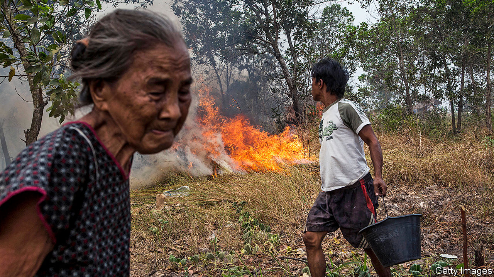

###### For peat’s sake

# Indonesia risks repeating an environmental disaster 

##### A new agricultural scheme may add to the emissions already billowed out by forest fires 

 

> Aug 15th 2020 

AS THE PRESIDENT’S helicopter flew above the swamp forests of Central Kalimantan, a province in the Indonesian part of Borneo, older residents may have felt a sense of déjà vu. Joko Widodo, popularly known as Jokowi, had arrived on July 9th to inspect the site of a new agricultural zone of 1,650 square kilometres—more than twice the size of New York City. Twenty-three years earlier, President Suharto, the strongman who ruled from 1966 to 1998, travelled by chopper to the same area to admire the 10,000 square kilometres of peat forest being converted into rice paddies. Like Jokowi, he worried about being able to feed his people, so set about turning Central Kalimantan into Indonesia’s “granary”. 

The Mega-Rice Project (MRP) was a mega-failure. It produced hardly any rice; the peaty soil, it turns out, lacks the requisite minerals. Instead of spurring farming, the draining of the waterlogged forest with a 6,000km network of canals fuelled fire. A few months after Suharto’s visit, the dried peat burst into flames. It was the biggest environmental disaster in Indonesia’s history. A study published in 2002 found that burning peat in 1997 on Kalimantan and the nearby island of Sumatra generated the equivalent of 13-40% of the average annual global emissions from fossil fuels. The MRP was abandoned in 1999 but its legacy endures in the infernos that have ravaged Kalimantan almost every year since. 


As work begins on the new plantation, is history poised to repeat itself? The government says it has learned from the past. Nazir Foead of the Peatland Restoration Agency says that tractors will steer clear of what remains of Central Kalimantan’s pristine peatlands. Just over half of the land earmarked for farming is already used to grow rice; the rest is covered in “shallow peat”, no more than 50cm deep, and so can be cultivated without cataclysm, he says.

Environmentalists are not convinced. The government has yet to confirm the exact location and size of the new plantation or publish any environmental assessments. The planning ministry says the details will not be finalised until September. The deputy defence minister says it could be as big as 8,000 square kilometres. Estimates of its cost range from 5trn rupiah ($340m) to 68trn. Iola Abas of the Peat Monitoring Network, an NGO, worries that peatland may be a casualty of rushed, shambolic planning and a lack of transparency. Even if farmers do steer clear of the peat, she worries that if they drain the land they will lower the water table, leaching moisture from nearby peatland. 

“Once peat is drained, it remains a high fire risk,” says Kiki Taufik of Greenpeace, an environmental NGO. Smouldering swamps belch vast amounts of carbon. The government reckons that over a fifth of national emissions are from peat fires. Last year the fires that swept Indonesia emitted 22% more carbon than the conflagration in the Amazon rainforest did. In 2016 Indonesia was the world’s fifth-biggest emitter of greenhouses gases, largely because of deforestation, says the World Resources Institute (WRI), another NGO.

But the government argues it must go ahead with the plantation, and quickly, in case covid-19 brings about food shortages. There is no sign of that happening, says Rainer Heufers of the Centre for Indonesian Policy Studies, a think-tank. Even if it does, the new plantation would not help much. The land is not terribly fecund, as the MRP showed. And topping up the country’s silos is pointless unless the rice is brought to market and sold to the hungriest at affordable prices, says Tezza Napitupulu of the WRI. If the government really cared about hunger, says Mr Heufer, it would concentrate on boosting local yields, which are low by international standards, and make it easier to import food.

The government is unlikely to do so. For decades the political elites “have been chasing this ideal of food self-sufficiency”, says Jenny Goldstein of Cornell University. Prabowo Subianto, the defence minister, is one of its greatest champions. In July Jokowi put him in charge of the plantation as part of his new duty to safeguard “strategic national food reserves”—a task that has little to do with defence. One must hope Mr Prabowo is as keen to defend Kalimantan’s peat as Indonesia’s food security. ■

