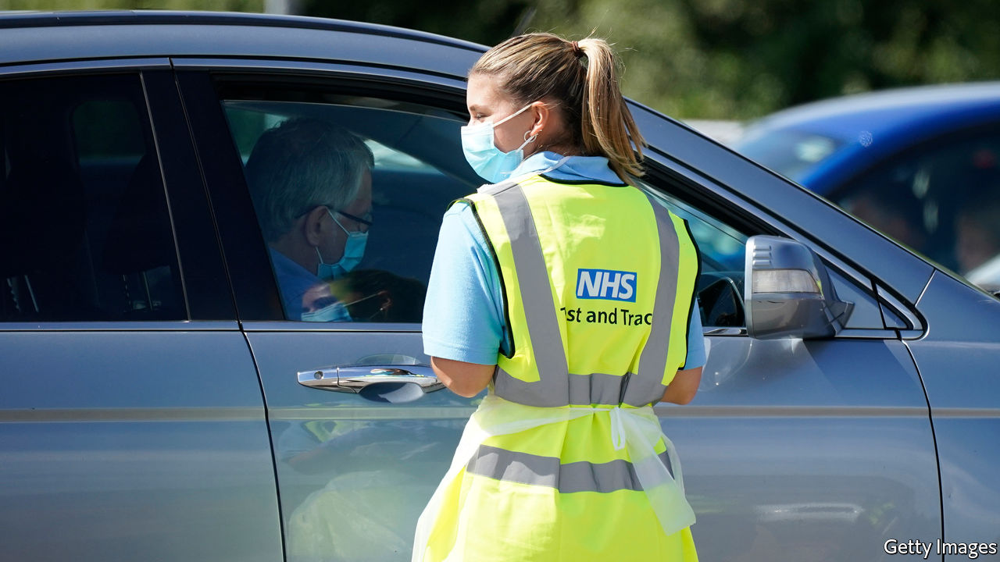

###### Fighting covid-19

# England’s contact-tracing system (finally) gets parochial 

##### Local experiments have shown the value of hitting the streets 

 

> Aug 15th 2020 

LEICESTER HAS become an unlikely hotbed of covid experimentation. In June the East Midlands city, home to 355,000, was the first to return to lockdown, as the government played “whack-a-mole” with the virus. Since July 17th it has pioneered a more sophisticated approach. The local council has created a team of 21 staff to hunt down cases beyond the reach of the national contact-tracing system. For the most recalcitrant, this involves multiple home visits in full PPE. The effort has been worthwhile: the council says it has found 89% of those whose details they have been passed.

Public-health experts have long argued that contact tracing in England needs to make more use of local knowledge—to find stubborn cases, to work with local leaders, to persuade people to isolate. On August 10th the government tacitly admitted they may have a point. It announced the national test-and-trace system would be rewired, with local public-health teams taking the lead. Some 6,000 of the 18,000 centrally employed contact tracers would be let go. The rest would support local efforts.


Many of the 18,000 have had little to do in recent weeks. Tests are mostly reserved for those with symptoms, meaning asymptomatic cases are rarely caught. Whereas the Office for National Statistics estimates that around 28,000 people had covid-19 in the week to August 2nd, just fewer than 5,000 actually tested positive for it in an overlapping week. According to a senior official, the ability to look for asymptomatic cases is limited both by the availability of antigen tests and concerns about false results when the national case-count is low.

The test-and-trace system has improved since its launch at the end of May. Test results are speedier, for instance, and the government has continued to publish timely data on its effectiveness. Yet there has been little rise in the proportion of those whom contact tracers reach, with the figure remaining just below 80%. That is not disastrous, but the hope is it will now climb.

To be effective, central and local government will need to work hand in glove, something that is rare in England. Indeed, some of the experimentation that proved local teams could hunt down cases—in Blackburn and Sandwell, for example—was driven by unhappiness with the national system, which was failing to do the job in their areas. Local officials have also been unhappy with the quality of the data they have received from the centre, although the situation has now improved.

They are now waiting to see how the changes play out. If those in charge of the national system “really sit down and co-design with us, this could actually be a game changer,” says one director of public health. “If this is just another way of avoiding criticism, without listening to the local level about how the system is working, it won’t deliver.” An effective system would allow the government to push harder on its ambition of getting life back closer to normal, whether that is adults returning to offices or children returning to schools. So ministers have plenty of incentive to get this right.

Editor’s note: Some of our covid-19 coverage is free for readers of The Economist Today, our daily . For more stories and our pandemic tracker, see our 

