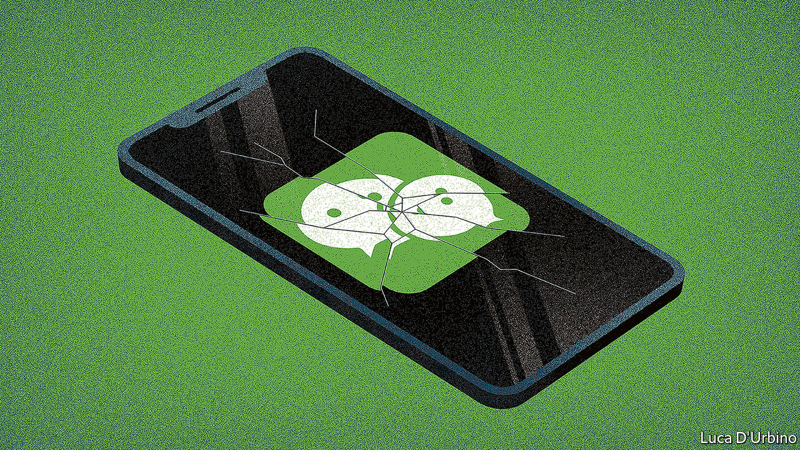

###### The big unfriending

# Donald Trump has caused panic among millions of WeChat users 

##### For all its sinister aspects, its loss to Chinese in America would be sorely felt 

 

> Aug 13th 2020 

WHEN NEWS broke on August 6th of an order from President Donald Trump that could result in the shutdown of WeChat in America, panic broke out among users of the super-app that is the digital bedrock of Chinese society. They shared and reposted step-by-step guides about how to download records of their WeChat conversations and of pictures and videos they had shared through the platform lest they suddenly become inaccessible.

Mr Trump’s vaguely worded ban on “transactions” with WeChat, citing national-security concerns, will affect fewer people in America than his similar move against TikTok, a hugely popular video-sharing app. But for WeChat’s millions of users in America—mainly ethnic Chinese who depend on it to communicate with family and friends in China—the consequences of Mr Trump’s efforts to contain the WeChat “threat” could be devastating. It would also be a blow to many businesspeople who use it for dealings with counterparts in China.


That is because the Chinese government has left them with few other options. Popular communication tools in America such as WhatsApp, Gmail and Facebook Messenger are blocked by the “great firewall”. In China WeChat is by far the most commonly used social-media platform. It is used not only for messaging, but for reading news, shopping, ordering taxis, booking flights, paying bills, making appointments with a doctor and donating to charity. In effect, it is WhatsApp, Facebook, Amazon, Uber, Instagram, PayPal, Expedia and others, all rolled into one.

Among the 1.2bn monthly users of WeChat, only a small fraction are in America—estimates range from fewer than 1.5m to nearly 20m (TikTok, which is also Chinese-owned, boasts 100m there). Its functions are also more limited—American retail, travel and other businesses rarely make provision for WeChat users. Dylan Zhao, a Chinese graduate student in America, says the biggest cost of a WeChat shutdown would be the loss of the vast networks of connections that users commonly maintain through the platform, both with individuals and groups. “It is very difficult to migrate social networks onto other platforms,” says Ms Zhao. She and her mother also use Signal, an American messaging app that works in China. But she worries she will lose touch with her grandparents there, who only know how to use WeChat.

In America most users of WeChat are first-generation Chinese-Americans as well as migrants and students who are still Chinese citizens. Mr Trump is right to be wary of its impact. WeChat in China vigorously censors content that might embarrass the Communist Party and saturates discussion of current affairs with pro-party propaganda. It is also used by police to monitor political dissidents and other people who grumble about the government. A man in China who shared news in a WeChat group about anti-government protests in Hong Kong was sentenced last month to more than a year in prison.

The owner of WeChat, Tencent, is a Hong Kong-listed firm that is not directly controlled by the state. But it has cosy ties to the party. Ma Huateng (also known as Pony Ma), the company’s founder and chief executive, is a delegate to the national legislature. Like all of China’s tech giants, the firm bends to the party’s will.

The app is somewhat different outside China, but not entirely so. Many users in America have WeChat accounts that were originally registered using a mainland Chinese phone number. Even if they later link their account to an American phone number, they are still subject to the same degree of censorship that users are in China. That allows the party to extend its efforts to stifle free speech onto American campuses, where many of the 370,000 Chinese students retain the WeChat habits they grew up with, including self-censorship.

News providers on WeChat are also cautious. Ke Yan is the founder of Houston Online, a popular Chinese-language WeChat account in Texas. With more than 60,000 followers, it focuses on breaking news and lifestyle stories that steer clear of anything that might offend the party. “If you don’t know what the rules are, the only thing you can do is self-censor,” Ms Ke explains.

Even those who download the app outside China and use a non-Chinese phone number to set up their accounts are not immune. Their conversations through WeChat are not so strictly censored, but the news they can read on it is the same. Citizen Lab, a research group at the University of Toronto, says WeChat communications between users who set up their accounts in America are used to refine censorship of users with accounts linked to Chinese phone numbers. To evade such controls, WeChat users in America, like their counterparts in China, use slang, codewords and cryptic images.

Some American businesses in China depend heavily on WeChat. Firms such as McDonald’s, Nike, Starbucks, Walmart and KFC use its e-commerce platforms to connect with customers. They may be hard hit by Mr Trump’s order. So too might Apple, which could have to drop WeChat from its app store in China. If forced to choose between their iPhones and WeChat, more than 90% of 850,000 people surveyed this week on Weibo, a Chinese Twitter-like platform, said they would buy a new, WeChat-enabled, phone.

Foreigners in China have long relied on virtual private networks (VPNs) to jump the great firewall. Now, Oscar Li, a postgraduate in Colorado, plans to do the reverse. After his mother in China heard the news about a possible WeChat ban, she called him, frantic with worry. He reassured her that he would download a VPN to circumvent the new great firewall of America. ■

