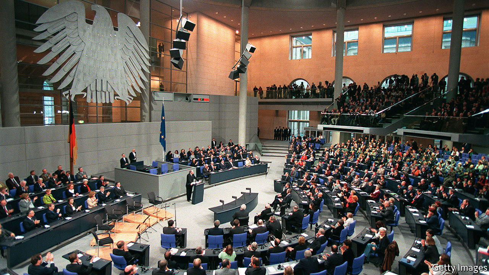
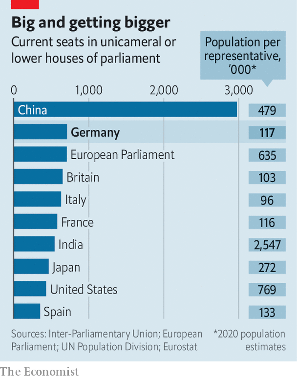

###### The XXL Bundestag

# Germany’s parliament is bursting at the seams. It may get bigger 

##### Mathematicians have been asked to help devise a better voting system, but MPs can’t agree on change 

 

> Aug 15th 2020 

NO VOTING SYSTEM is flawless, as any political-science student can tell you. Britain’s first-past-the-post method can give a thumping majority to a party that wins far less than half the vote. Ultra-proportional systems, as in the Netherlands, lead to fragmented chambers full of fringe parties, with no local links, devoted to animal rights or the elderly. Germany’s “mixed-member proportional” system is supposed to offer the best of both worlds. Unfortunately its size has begun to matter.

Of the 598 seats Germany’s electoral law reserves to the Bundestag (the upper-house Bundesrat comprises state politicians), half are for directly elected constituency MPs, and the rest are for candidates taken from party lists along proportional lines. At general elections Germans therefore cast two votes: one for a local MP, and one for a party. The second vote determines the relative strength of parties in parliament. If some win more constituency seats than their share of that vote would entitle them to, to preserve proportionality others are compensated with party-list seats. This means the size of the Bundestag can go only one way: up.


The problem has grown acute as Germany’s party system has fragmented. For big parties, the gap between their number of constituency seats and their shrinking overall vote share has grown, meaning more compensatory seats are needed. The result is what Germans call an “XXL Bundestag”. The 709 MPs yielded at the last election, in 2017, make the Bundestag the world’s largest elected chamber (outnumbered only by China’s rubber-stamp congress and Britain’s appointed House of Lords). Some fear next year’s vote could produce close to 800. Adjusted for population, the number looks less dramatic. But in a federal country like Germany MPs have less to do; the 16 state parliaments have a further 1,868 members between them.

 


All this squeezes office space, as well as the Bundestag’s budget, which may exceed €1bn ($1.2bn) this year. Parliamentary committees have grown unwieldy. Citizens struggle to understand the link between their vote and their outsize parliament. The problems will grow “severe” if the chamber has to accommodate more than 750 members next year, warns Stephan Thomae, an MP for the liberal Free Democrats who has pushed for a change to Germany’s electoral law in response.

Many have tried. Constitutional lawyers, non-profits and even mathematicians have been drafted to provide solutions. Yet every attempt to shrink the Bundestag has gone nowhere, for every party fears it stands to lose from one or other possible remedy. The most recent plan, pushed by opposition parties, flopped before the summer recess. Attempts to revise the law before next year’s election now look doomed. An XXXL Bundestag looms. ■

