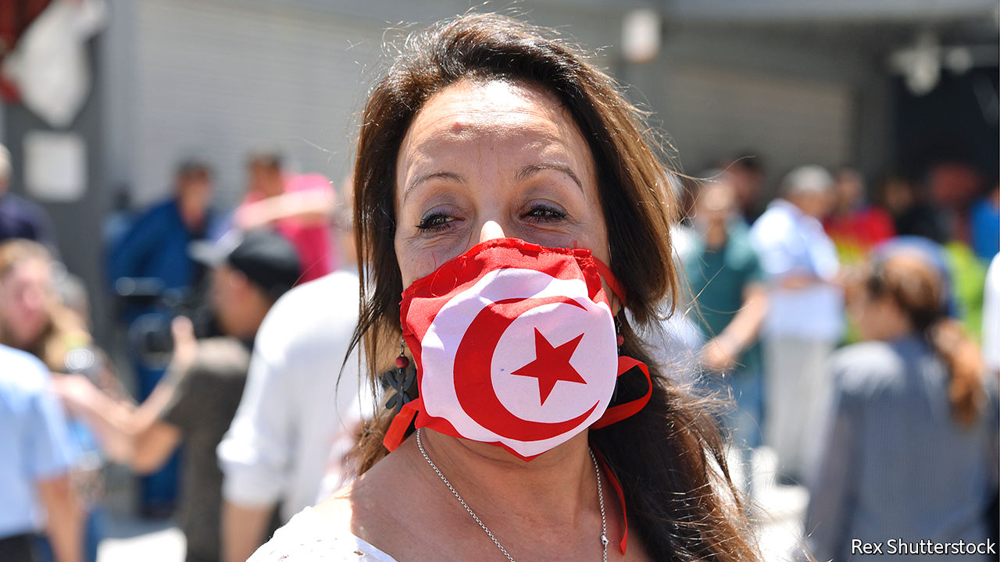

###### Democracy’s growing pains

# In Tunisia, cradle of the Arab spring, protesters want jobs 

##### Nostalgia for the old dictatorship is growing 

 

> Aug 13th 2020 

IN DECEMBER IT will have been ten years since Muhammad Bouazizi, a Tunisian street peddler, set himself on fire. He was protesting against harassment by local police, who often demanded bribes to let him carry on earning his modest living. His death inspired the Arab spring: a series of popular uprisings that toppled autocrats, Tunisia’s included, across the Middle East.

Yet in Bouazizi’s hometown of Sidi Bouzid, deep in the hinterland, few people plan to commemorate him. “He escaped to his maker and left us with this misery,” says Haroun Zawawi, one of several young jobless men sitting near the roundabout where Bouazizi lit the match. On a nearby wall someone has mockingly scrawled “revolution” upside down. “People don’t feel it has improved their lives,” says the city’s MP, Naoufel ElJammali. “There’s nostalgia for dictatorship.”


Tunisia is often praised for being the first Arab country to throw off the yoke of autocracy, and the only one where genuine democracy survives. Elections are still held, the secret police are relatively docile and women participate extensively in public life. But most Tunisians judge the revolution based on the performance of the economy, which has not improved under the new dispensation. Incomes have fallen by a fifth over the past decade; unemployment has been stuck above 15% for years. Powerful unions block reforms. Illegal migration to Europe is up fourfold on last year. Bickering politicians give people little reason to stay.

Tunisia is one of the few countries where more educated people are less likely to find work. So parliament recently passed a law granting jobs to graduates who have been unemployed for a decade. It could not afford to keep that promise, even before covid-19 forced it to lock down the country from March until May. The coronavirus has disrupted important sources of revenue, such as remittances, trade and tourism. The government expects the budget deficit to widen to about 7% of GDP because of the pandemic; the economy is expected to shrink by 6.5% this year.

Tunisia had been in talks with the IMF about a loan, but those were suspended in July, when the prime minister, Elyes Fakhfakh, resigned over allegations of a conflict of interest. His replacement, Hichem Mechichi (Tunisia’s eighth prime minister in ten years), wants to form a technocratic government without political parties. That is, in part, because the parties cannot agree on much. The largest is Ennahda, which is Islamist. Its leader, Rachid Ghannouchi, who is the speaker of parliament, has feuded with Kais Saied, the president, over nominees and power. Mr Ghannouchi himself narrowly survived a confidence vote last month after being accused of exceeding his authority.

Nine years ago Ennahda won Tunisia’s first free election, promising something new. Now its members look tired. Asked what is his biggest achievement, Mr Ghannouchi replies: “Jalusna” (We’re sitting here). Whereas Islamist movements elsewhere have been crushed, Ennahda is still at the forefront of Tunisia’s politics. But critics say it has acquired the traits of the region’s old patriarchies. Mr Ghannouchi, who is 79, has led Ennahda (or its precursor) for 50 years. In 2012 the party decided that he would serve only two more terms as leader, ending this year. Now he wants to change the rules. “He preaches Muslim democracy but rules like a traditional Arab,” says Abdelhamid Jlassi, a former deputy leader of Ennahda who quit in March. The disillusion is spreading. In parliamentary elections last October the party mustered only a third of the votes it won in 2011.

In a presidential election the same month Mr Saied won in a landslide, attracting a huge share of the youth vote. A stiff law lecturer and political outsider, he promised to stamp out corruption. But he also appears hungry for power. The president is in charge of the army, security forces and foreign policy. Mr Saied also wants more say over domestic policy, which parliament claims as its turf. He sparred with Mr Ghannouchi over who should pick the prime minister before choosing Mr Mechichi, a loyal bureaucrat. In the long term Mr Saied would like to move to a system of indirect elections for parliament, with local councils holding more power.

There are some in parliament who seem inclined to do away with democracy altogether. Abir Moussi was a high-ranking official in the party of Zine el-Abidine Ben Ali, the old dictator, and she is nostalgic for the old days. She calls the Arab spring “a spring of ruin”, blaming Ennahda for the upheaval. Like Mr Saied, she is openly homophobic. She now heads the Free Destourian party, which won 16 seats (out of 217) in last year’s elections and led the challenge to Mr Ghannouchi. Members of the middle class who fared better under Ben Ali like her calls to restore the order of pre-revolutionary Tunisia (when Ennahda was outlawed). According to recent polls, she is the country’s most popular politician.

Western diplomats say Tunisia’s democracy has proven surprisingly resilient. Its politics are broadly rooted. Its Islamists have been restrained and conciliatory. There has been very little of the bloodshed that characterised the clash between old and new systems elsewhere in the Arab world. But many Tunisians are less sanguine. Protesters demand jobs—yet make matters worse by blocking oil and phosphate exports. Voter turnout is trending down. Even in the capital of Tunis no big events are planned to mark Bouazizi’s death. Politicians play down the anniversary or, like Ms Moussi, curse it. ■

