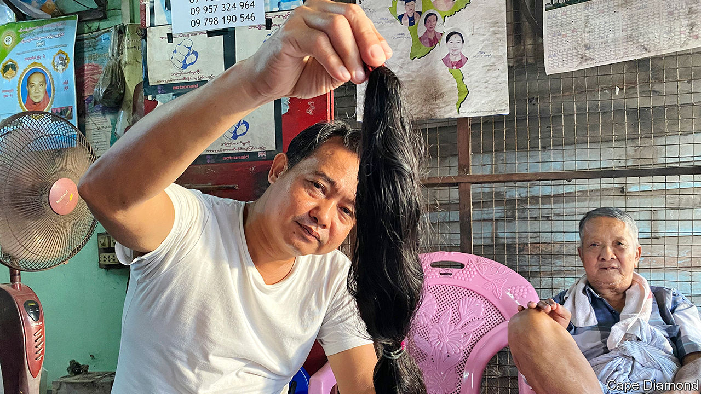

###### Thatcherism

# Nigeria’s demand for fancy wigs fuels a global trade 

##### Hair from everywhere adorns Nigerian heads. The posh prefer Peruvian 

 

> Aug 15th 2020 

“MY OUTFIT FOR the day determines what hair I will be wearing,” says Olayinka Titilope, a Nigerian wigmaker. She has a different peruke for each day of the month. The weather also influences her choice. On cooler days she might opt for long, thick locks. During the summer she tends towards lighter bob-cuts. Ms Titilope hopes her hairdos will inspire the customers who visit her wig gallery in downtown Lagos, Nigeria’s commercial capital. She sells wigs for between $60 and $800. Those at the top end are made of human hair from Cambodia, she says.

Some African feminists argue that to wear a long, straight-haired wig or hair extension is to grovel to Western ideals of beauty. Yet wig-buyers in Nigeria seem to enjoy variety. Sellers advertise hair from everywhere. Brazilian is praised for its sheen and durability; Vietnamese, for its bounce; Mongolian, because it is easy to curl. One seller in Lagos offers “Italian posh hair” which is supposedly odour-free. Whatever the label says, much of the hair really comes from elsewhere, often China, a source some buyers deem downmarket.


It is hard even for the most conscientious hair-traders to trace where their wares came from. Most of the hair that reaches Africa travels via factories in China, where it is sorted and often treated, dyed or curled. Bundles of human hair may be bulked up with horse mane or goat thatch. Chinese locks are sometimes packed into boxes labelled “Peruvian hair”, which is coveted in Nigeria. Responsible shopkeepers must pick a good supplier and hope for the best. Those with fewer scruples rebrand the hair once it arrives.

Demand in Nigeria is huge, but not everyone wants to pay Nigerian tariffs. Benin, a popular route for goods smuggled into its much bigger neighbour, sucked in 11% of the world’s fake-hair imports in 2018—some 50 times what might be expected, given its tiny population. Nigeria itself shipped in more than 3,600 tonnes of hair (including human, animal and synthetic hair, as well as ready-made hair pieces). If even half of that was from human scalps, it would amount to the waist-length locks of more than 10m people. “The demand for hair generally exceeds supply, fuelling an almost constant sense of scarcity,” writes Emma Tarlo in her book “Entanglement: The Secret Lives of Hair”.

In the past decade Myanmar has quadrupled the volume of hair it ships out and is now the world’s fourth-largest exporter. Nay Lin, a hair-trader in the former capital, Yangon, says he knows when the economy is bad because more women turn up at his shop to sell their tresses. “Today I have had ten heads so far,” he says, a lot for one day. A pile of dark bunches glistens on the floor beside him. Clients earn around $18 for their hair, though prices vary according to weight. Most of it gets shipped to China, but he is unsure where it goes after that. Mr Lin exported duck feathers until he discovered that hair was more lucrative.

Some 500km north of Yangon, in the town of Pyawbwe, farmers who once harvested onions and chillies now spend their days unpicking hairballs. These are often gathered by door-to-door collectors, who buy hair from people’s combs and bathroom plugs. Some hairballs arrive in sacks from India and Bangladesh. Workers in Pyawbwe (which has earned the nickname “Hair City”) make about $1.20 a day untangling them and removing lice or white strands. This hair is so common in Chinese factories that it is referred to as “standard hair”. It costs more than the fake stuff, but less than locks cut straight from a head.

“We call that stuff factory trash,” scoffs Ms Titilope, who insists that none of it goes into her products. She does not like using Indian hair, either, because much of it is shorn off pilgrims and some customers think it is cursed. Most Hindus will have their heads shaved at a temple at least once as a symbol of surrendering their egos to Vishnu, a god. The temples sell the tresses. But in Nigeria some believe that snakes have slithered over the hair.

On the streets of Lagos, wigs reflect wealth. Women with silky locks tumbling down their backs stroll past others with coarse, synthetic threads. One of the market’s cheapest wigs resembles a furry black hat. At least those wearing it do not have to fret about where it came from. ■

