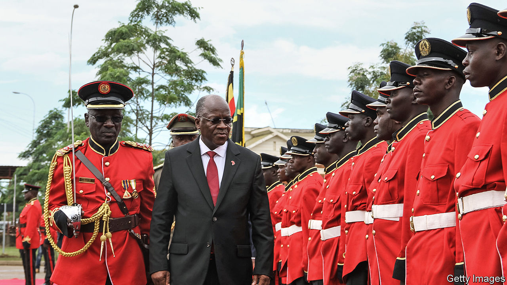

###### Courting the big man

# Some Tanzanian judges are bravely ruling against the government 

##### Others seem happy to protect executive power 

 

> Aug 15th 2020 

FROM THE parade of politicians and journalists passing through, one might think that the Kisutu Resident Magistrate Court is a high-society haunt. But instead of being offered cocktails and gossip, they are here to be tried (or, at least, denied bail) by a judiciary that looks increasingly like the strong arm of Tanzania’s government.

John Magufuli, Tanzania’s president (pictured), has never been one for democratic niceties such as the separation of powers between the executive, parliament and courts. Since taking office in 2015 he has made it clear that all three should bend to his will. In particular he has attacked the judiciary’s independence, threatening to “take action” against judges who acquitted those accused of crimes (when, at least in his mind, there is clear evidence of guilt).


Parliament, controlled by Mr Magufuli’s CCM party, has limited citizens’ ability to sue over allegedly unconstitutional laws or policies. And last year Tanzania in effect withdrew from the African Court on Human and People’s Rights—an important guardian, with more cases on its docket against Tanzania than any other country.

Given how hard he has tried to control the judiciary, Mr Magufuli must have been gratified when, on August 5th, Tanzania’s highest court gave the constitutional stamp of approval to one of his favourite tactics: charging opponents with offences for which they cannot post bail. Once arrested, defendants pinball endlessly between prison and court, being told at each court appearance that the case against them is not quite ready. Many eventually plead guilty to end the torment. The tactic is used not only against political rivals or critical journalists, but also against executives of companies accused of tax evasion who are ordered to pay arbitrary sums. Fatma Karume, a former head of the Tanganyika Law Society who was suspended from practising law after acting as counsel in a suit against Mr Magufuli, argues that this is legalised extortion. “These people are acting like Henry VII,” she says, referring to a notoriously grabby English king.

Some judges have taken a stand against this repressive tactic. In May the High Court declared that it was unconstitutional to deny people bail automatically, simply because they had been charged with, for instance, money-laundering. The judges said this law impinged on judicial discretion and denied people freedom. But on August 5th the government found a more sympathetic ear at the Court of Appeal, which overturned the ruling.

Demagogues the world over try to control judges. This is made easier in countries such as Tanzania, where the president chooses who sits on the bench. But it is not just the power to appoint judges that matters to Mr Magufuli; he also wants to control the officials who oversee elections.

With Tanzania going to the polls in October, the impartiality of those who will count the votes is particularly important if the result is to be seen as credible. Tanzania’s High Court thought so too last year, when it struck down a law that allowed Mr Magufuli to appoint party hacks as election officials, arguing that it compromised the independence of the electoral commission. Once again Mr Magufuli’s government turned to the Court of Appeal, whose learned judges overturned the ruling, saying that it was “speculative and based on apprehension” to suppose that officers picked by the president might be partisan. Perish the thought. ■

