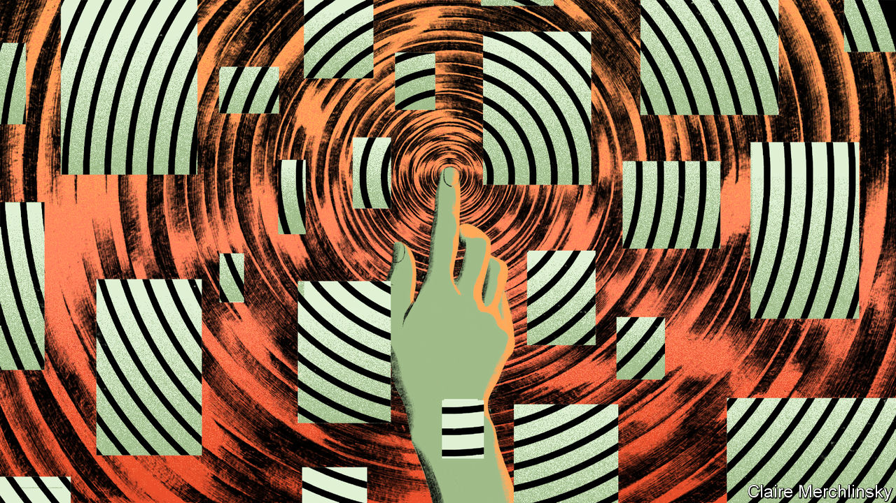

###### Self-healing physics

# Quantum mechanics is immune to the butterfly effect 

##### That could help with the design of quantum computers 

 

> Aug 15th 2020 

IN RAY BRADBURY’s science-fiction story “A Sound of Thunder”, a character time-travels far into the past and inadvertently crushes a butterfly underfoot. The consequences of that minuscule change ripple through reality such that, upon the time-traveller’s return, the present has been dramatically changed.

The “butterfly effect” describes the high sensitivity of many systems to tiny changes in their starting conditions. But while it is a feature of classical physics, it has been unclear whether it also applies to quantum mechanics, which governs the interactions of tiny objects like atoms and fundamental particles. Bin Yan and Nikolai Sinitsyn, a pair of physicists at Los Alamos National Laboratory, decided to find out. As they report in Physical Review Letters, quantum-mechanical systems seem to be more resilient than classical ones. Strangely, they seem to have the capacity to repair damage done in the past as time unfolds.


To perform their experiment, Drs Yan and Sinitsyn ran simulations on a small quantum computer made by IBM. They constructed a simple quantum system consisting of “qubits”—the quantum analogue of the familiar one-or-zero bits used by classical computers. Like an ordinary bit, a qubit can be either one or zero. But it can also exist in “superposition”, a chimerical mix of both states at once.

Having established the system, the authors prepared a particular qubit by setting its state to zero. That qubit was then allowed to interact with the others in a process called “quantum scrambling” which, in this case, mimics the effect of evolving a quantum system backwards in time. Once this virtual foray into the past was completed, the authors disturbed the chosen qubit, destroying its local information and its correlations with the other qubits. Finally, the authors performed a reversed scrambling process on the now-damaged system. This was analogous to running the quantum system all the way forwards in time to where it all began.

They then checked to see how similar the final state of the chosen qubit was to the zero-state it had been assigned at the beginning of the experiment. The classical butterfly effect suggests that the researchers’ meddling should have changed it quite drastically. In the event, the qubit’s original state had been almost entirely recovered. Its state was not quite zero, but it was, in quantum-mechanical terms, 98.3% of the way there, a difference that was deemed insignificant. “The final output state after the ‘forward evolution’ is essentially the same as the input state before ‘backward evolution’,” says Dr Sinitsyn. “It can be viewed as the same input state plus some small background noise.” Oddest of all was the fact that the further back in simulated time the damage was done, the greater the rate of recovery—as if the quantum system was repairing itself with time.

The mechanism behind all this is known as “entanglement”. As quantum objects interact, their states become highly correlated—“entangled”—in a way that serves to diffuse localised information about the state of one quantum object across the system as a whole. Damage to one part of the system does not destroy information in the same way as it would with a classical system. Instead of losing your work when your laptop crashes, having a highly entangled system is a bit like having back-ups stashed in every room of the house. Even though the information held in the disturbed qubit is lost, its links with the other qubits in the system can act to restore it.

The upshot is that the butterfly effect seems not to apply to quantum systems. Besides making life safe for tiny time-travellers, that may have implications for quantum computing, too, a field into which companies and countries are investing billions of dollars. “We think of quantum systems, especially in quantum computing, as very fragile,” says Natalia Ares, a physicist at the University of Oxford. “That this result demonstrates that quantum systems can in fact be unexpectedly robust is an encouraging finding, and bodes well for potential future advances in the field.” ■

