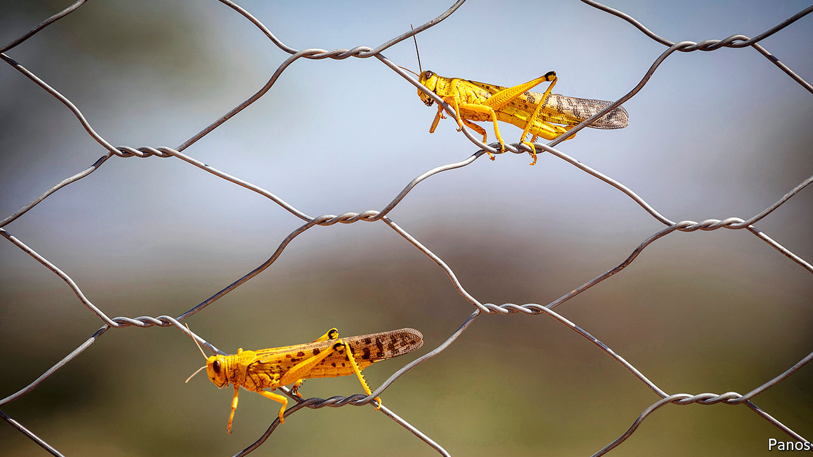

###### A plague of insects

# Why locusts swarm 

##### A new discovery could offer novel ways of controlling the insects 

 

> Aug 15th 2020 

IN SOME PARTS of the world, covid-19 is not the only plague that 2020 has brought. In parts of Asia and east Africa, swarms of locusts have stripped fields. The UN reckons the swarms in India and Pakistan are the largest for a quarter of a century, and that the numbers in Kenya are the highest for 70 years. One swarm in northern Kenya was estimated to be 25 miles (40km) long and 37 miles wide.

Locusts are usually inoffensive, solitary creatures that do not stray far from the place that they were born. But under the right circumstances—namely heavy rain, and a subsequent boom in plant growth—they can become “gregarious”. When that happens the insects change colour and gather in ravenous swarms which can fly more than 100km in a day.


In a paper published in Nature, Xiaojiao Guo, of the Institute of Zoology in Beijing, and a group of other researchers, shed light on part of the biochemical machinery that drives that transformation. They think they have identified the specific pheromone that attracts the insects to each other, and thus causes them to swarm.

Dr Guo and her colleagues collected 35 chemicals collected from the bodies and faeces of the migratory locust, the most widespread species. Six of those showed significantly higher production among gregarious locusts than among solitary ones. When tested, gregarious locusts were strongly attracted to just one, a chemical called 4-vinylanisole (4VA). That attraction was strong for immature and mature locusts alike, and for both males and females. And locusts in the solitary phase of their existence found it just as attractive as gregarious ones did.

Scientists already know that swarming is a response to overcrowding, and Dr Guo and her colleagues found that 4VA production rose with population density. Intriguingly, concentrations began to increase when just four or five individuals were present. Further investigation pinpointed the odour receptor on the insect’s antennae that is sensitive to the compound. Disabling the gene responsible for that receptor yielded locusts for whom 4VA held no particular interest. And all this lab work was double-checked with a field trial, in which sticky traps spiked with 4VA attracted significantly more locusts than traps without it.

Dr Guo’s results could be of more than academic interest. Humans have tried everything from insecticides to flame-throwers to deal with locust swarms, with mixed results. Pheromones offer new angles of attack. Synthetic versions of 4VA might be used to bait traps. If a chemical could be developed that blocks the receptor, the insects might be made deaf to its call.

The first task will be to determine how widely applicable the results are. The insects plaguing India and Africa are desert locusts, a different species from those studied by Dr Guo. But the sensory apparatus of the two insects is similar. If 4VA turns out to be a language that all locusts understand, then it may help humans persuade them to abandon their gregarious ways, and return to a life of peaceable solitude.

