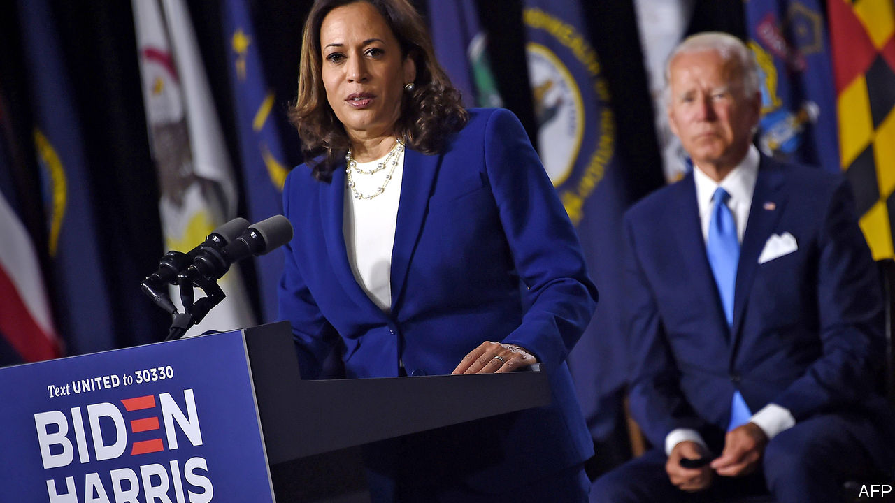
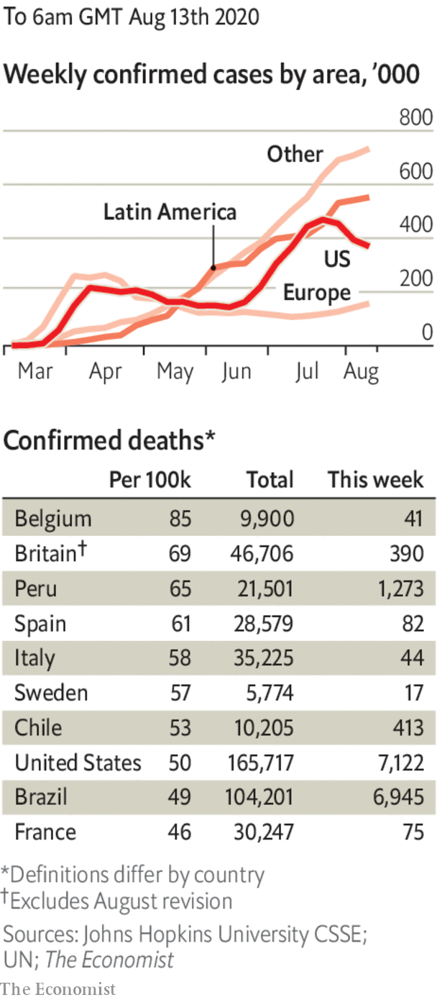

###### 

# Politics this week 

#####  

 

> Aug 13th 2020 

Joe Biden named Kamala Harris, a senator from California, as his running-mate. The daughter of a Jamaican-American economist and an Indian-American cancer researcher, she is the first black woman or Asian-American on a major-party presidential ticket. Democrats largely praised her as a safe, charismatic choice, though some queried her respect for civil liberties, noting her record as a tough-on-crime prosecutor. See .

The director of America’s counter-intelligence service warned that Russia was using a “range of measures” to undermine Mr Biden’s campaign, primarily because of his support for Ukraine.


Chicago endured a night of looting, after police officers shot and injured a black man who they said was firing a gun at them. Bridges were raised to stop looters roaming. See .

Seattle’s council voted to slash the police budget and refocus the city’s force on “public safety”. The police chief, Carmen Best, said she would resign, decrying an “overarching lack of respect” for her officers. She was the first black woman to hold the job.

The Milne ice shelf, the last one that was intact in the Canadian Arctic, split apart during a heatwave. The breakaway piece made up 40% of the ice shelf’s surface area. See .

Protests by allies of Bolivia’s former president, Evo Morales, over the postponement of an election due to covid-19, have blocked roads and exacerbated shortages of oxygen. The interim government, led by Jeanine Áñez, a conservative, says 30 people have died as a result. A new election, in which Ms Áñez is running and Mr Morales is not, is scheduled for October 18th. See .

Mexican prosecutors began a corruption investigation into a former president, Enrique Peña Nieto. They are looking into claims that before he became president Mr Peña used bribes from Odebrecht, a Brazilian construction firm, to help finance the election campaign in 2012, and that during his presidency he paid legislators to vote for a big energy reform.

Alexander Lukashenko claimed a sixth election victory in Belarus, with 80% of the vote. Huge crowds protested, saying the count was rigged and the real victor was Svetlana Tikhanovskaya, an ex-teacher. Police arrested and beat thousands. Ms Tikhanovskaya, who had promised to free political prisoners and hold a fair election, fled the country after a long involuntary interview with the security services. Her supporters assume she was threatened. Her husband, who was barred from standing, remains in jail. See .

Tanzania banned the broadcasting of news produced by foreign media without the government’s permission. Local journalists working for foreign media or with foreign correspondents must now be accompanied by an official minder, as in North Korea.

Rebels in northern Mozambique captured the port city of Mocímboa da Praia, killing dozens of soldiers and sinking a navy patrol boat. The jihadist insurgency threatens the development of offshore gasfields, Africa’s biggest energy project.

The government of Lebanon resigned in the wake of a devastating explosion in Beirut. The outgoing prime minister, Hassan Diab, blamed a “system of corruption” for bankrupting the country and crippling basic services. Tens of thousands of people protested. World leaders and international organisations pledged nearly $300m to help those affected by the blast. See .

America imposed sanctions on 11 Chinese officials, including Hong Kong’s leader Carrie Lam, for their role in suppressing dissent in the territory. In retaliation, China announced sanctions against 11 Americans, including lawmakers. Hong Kong police arrested Jimmy Lai, a newspaper tycoon, alleging that he “colluded” with a foreign power. Mr Lai, the owner of Apple Daily, has often suggested that America should support democracy in Hong Kong. See .

China eased sweeping restrictions on entry to the country by foreigners, which it imposed in March in response to covid-19. Citizens of 36 countries, including Britain, France and Germany, who already hold a Chinese residence permit will be allowed to apply for visas. They will still have to be tested and endure 14 days of quarantine. 

Alex Azar, America’s secretary of health, became the highest-ranking American official to visit Taiwan since America established formal diplomatic relations with China in 1979, and ended them with Taiwan.

Mahathir Mohamad, a two-time prime minister of Malaysia who was ousted from power earlier this year after a rift within his coalition, founded a new political party that says it will champion ethnic Malays and fight corruption. Dr Mahathir, who is 95, says his previous party, Bersatu, which is now led by the incumbent prime minister, Muhyiddin Yassin, has been hijacked by defenders of kleptocracy.

After a special consultative congress gave the go-ahead, the Afghan government said it would release a further 400 Taliban prisoners, in addition to the 4,600 it has recently freed. The decision paves the way for a peace conference.

Coronavirus briefs

 


The number of cases in the United States passed 5m. Brazil reached over 100,000 deaths in total.

New Zealand investigated the possibility that its first infections for 102 days had come from freight. The people involved had not travelled. Auckland was locked down.

Masks became compulsory outdoors in Paris and Brussels.

Russia said that it had approved a vaccine against the coronavirus. Scientists elsewhere had doubts. The drug, named Sputnik V, appears simply to have skipped all but the first stages of testing for safety and efficacy.

The estimated death toll in England was reduced by 5,377, or 12%. A review found that anyone who had died following a positive test was being included in the tally, regardless of how, or when, they died.

